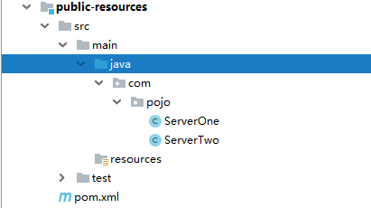
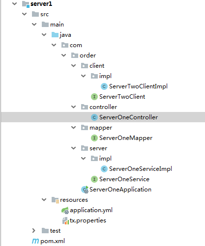
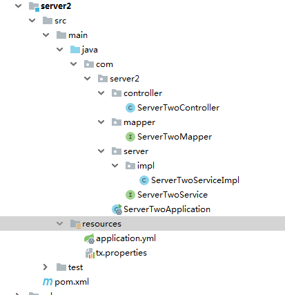
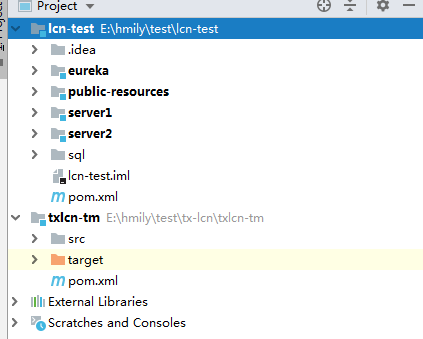

# 一、Lcn案例编写

>一、上个文章里面已经启动了事务协调者  现在我们来开发一个demo来测试一下协调者是否生效了吧！

## 一、编写数据库

>分别在两个不同的库中创建两张表

```sql
CREATE DATABASE /*!32312 IF NOT EXISTS*/`server1` /*!40100 DEFAULT CHARACTER SET utf8mb4 COLLATE utf8mb4_bin */;

USE `server1`;

SET FOREIGN_KEY_CHECKS = 0;

-- ----------------------------
-- Table structure for server1
-- ----------------------------
DROP TABLE IF EXISTS `server1`;
CREATE TABLE `server1`  (
  `id` varchar(255) CHARACTER SET utf8 COLLATE utf8_general_ci NOT NULL,
  `name` varchar(255) CHARACTER SET utf8 COLLATE utf8_general_ci NULL DEFAULT NULL,
  PRIMARY KEY (`id`) USING BTREE
) ENGINE = InnoDB CHARACTER SET = utf8 COLLATE = utf8_general_ci ROW_FORMAT = Dynamic;

SET FOREIGN_KEY_CHECKS = 1;

SET NAMES utf8mb4;
SET FOREIGN_KEY_CHECKS = 0;


CREATE DATABASE /*!32312 IF NOT EXISTS*/`server2` /*!40100 DEFAULT CHARACTER SET utf8mb4 COLLATE utf8mb4_bin */;

USE `server2`;
-- ----------------------------
-- Table structure for server2
-- ----------------------------
DROP TABLE IF EXISTS `server2`;
CREATE TABLE `server2`  (
  `id` varchar(255) CHARACTER SET utf8 COLLATE utf8_general_ci NOT NULL,
  `name` varchar(255) CHARACTER SET utf8 COLLATE utf8_general_ci NULL DEFAULT NULL,
  PRIMARY KEY (`id`) USING BTREE
) ENGINE = InnoDB CHARACTER SET = utf8 COLLATE = utf8_general_ci ROW_FORMAT = Dynamic;

SET FOREIGN_KEY_CHECKS = 1;
```

## 二、父项目pom

> pom文件

```xml
<?xml version="1.0" encoding="UTF-8"?>
<project xmlns="http://maven.apache.org/POM/4.0.0"
         xmlns:xsi="http://www.w3.org/2001/XMLSchema-instance"
         xsi:schemaLocation="http://maven.apache.org/POM/4.0.0 http://maven.apache.org/xsd/maven-4.0.0.xsd">
    <modelVersion>4.0.0</modelVersion>

    <groupId>com.lcn</groupId>
    <artifactId>lcn-test</artifactId>
    <packaging>pom</packaging>
    <version>1.0-SNAPSHOT</version>
    <modules>
        <module>server1</module>
        <module>public-resources</module>
        <module>server2</module>
        <module>eureka</module>
    </modules>


    <parent>
        <groupId>org.springframework.boot</groupId>
        <artifactId>spring-boot-starter-parent</artifactId>
        <version>2.1.1.RELEASE</version>
    </parent>

    <dependencyManagement>
        <dependencies>
            <dependency>
                <groupId>org.springframework.cloud</groupId>
                <artifactId>spring-cloud-dependencies</artifactId>
                <version>Finchley.RELEASE</version>
                <type>pom</type>
                <scope>import</scope>
            </dependency>

        </dependencies>
    </dependencyManagement>

    <dependencies>

        <dependency>
            <groupId>org.projectlombok</groupId>
            <artifactId>lombok</artifactId>
        </dependency>

        <!--spring boot的核心启动器-->
        <dependency>
            <groupId>org.springframework.boot</groupId>
            <artifactId>spring-boot-starter-web</artifactId>
        </dependency>

    </dependencies>
</project>
```


## 三、Eureka编写

> pom文件

```xml
<?xml version="1.0" encoding="UTF-8"?>
<project xmlns="http://maven.apache.org/POM/4.0.0"
         xmlns:xsi="http://www.w3.org/2001/XMLSchema-instance"
         xsi:schemaLocation="http://maven.apache.org/POM/4.0.0 http://maven.apache.org/xsd/maven-4.0.0.xsd">
    <parent>
        <artifactId>lcn-test</artifactId>
        <groupId>com.lcn</groupId>
        <version>1.0-SNAPSHOT</version>
    </parent>
    <modelVersion>4.0.0</modelVersion>

    <groupId>com.lcn</groupId>
    <artifactId>eureka</artifactId>


    <dependencies>
        <dependency>
            <groupId>org.springframework.cloud</groupId>
            <artifactId>spring-cloud-starter-netflix-eureka-server</artifactId>
        </dependency>
    </dependencies>

</project>
```

> 配置文件  application.yml

```yaml
server:
  port: 8761
spring:
  application:
    name: eureka-server

eureka:
  server:
    peer-eureka-nodes-update-interval-ms: 60000
    enable-self-preservation: false
    eviction-interval-timer-in-ms: 5000
  client:
    service-url:
      defaultZone: http://localhost:8761/eureka/
    register-with-eureka: false
    fetch-registry: true


```

> 启动类

```java
package com.eureka.server;

import org.springframework.boot.autoconfigure.SpringBootApplication;
import org.springframework.boot.builder.SpringApplicationBuilder;
import org.springframework.cloud.netflix.eureka.server.EnableEurekaServer;

/**
 * @author huangfu
 */
@SpringBootApplication
@EnableEurekaServer
public class EurekaServer {
    public static void main(String[] args) {
        new SpringApplicationBuilder(EurekaServer.class).run(args);
    }
}

```

## 四、创建公共资源 module(public-resources)

> 创建serve1实体类

```java
package com.pojo;

import lombok.Data;

/**
 * @author huangfu
 */
@Data
public class ServerOne {
    private String id;
    private String name;

    public ServerOne() {
    }

    public ServerOne(String id, String name) {
        this.id = id;
        this.name = name;
    }
}
```

> 创建server2

```java
package com.pojo;

import lombok.Data;

/**
 * @author huangfu
 */
@Data
public class ServerTwo {
    private String id;
    private String name;

    public ServerTwo() {
    }

    public ServerTwo(String id, String name) {
        this.id = id;
        this.name = name;
    }
}

```

> 项目结构




## 五、Server1开发

> 配置文件 appplication.yml

```yaml
server:
  port: 8080

spring:
  application:
    name: server1
  main:
    allow-bean-definition-overriding: true
  datasource:
    driver-class-name:  com.mysql.jdbc.Driver
    url: jdbc:mysql://localhost:3306/lcn-server1?useUnicode=true&characterEncoding=utf8
    username: root
    password: root

eureka:
  client:
    service-url:
      defaultZone: http://localhost:8761/eureka/
  instance:
    prefer-ip-address: true


feign:
  hystrix:
    enabled : true
    # 在feign中开启hystrix功能，默认情况下feign不开启hystrix功能

mybatis:
  configuration:
    map-underscore-to-camel-case: true
```

> `tx.properties`  **注意：必须添加，用来指定事务协调者的访问位置**

```properties
# 默认之配置为TM的本机默认端口
tx-lcn.client.manager-address=127.0.0.1:8070 
```

> 启动类  **注意：启动类必须添加` @EnableDistributedTransaction `注解  启动分布式事务**

```java
package com.order;

import com.codingapi.txlcn.tc.config.EnableDistributedTransaction;
import org.mybatis.spring.annotation.MapperScan;
import org.springframework.boot.SpringApplication;
import org.springframework.boot.autoconfigure.SpringBootApplication;
import org.springframework.cloud.netflix.eureka.EnableEurekaClient;
import org.springframework.cloud.openfeign.EnableFeignClients;

/**
 * @author huangfu
 */
@EnableEurekaClient
@SpringBootApplication
@EnableFeignClients
@MapperScan("com.order.mapper")
@EnableDistributedTransaction
public class ServerOneApplication {
    public static void main(String[] args) {
        SpringApplication.run(ServerOneApplicatin.class);
    }
}

```

> Mapper类 开发

```java
package com.order.mapper;


import com.pojo.ServerOne;
import org.apache.ibatis.annotations.Insert;

/**
 * @author huangfu
 */
public interface ServerOneMapper {
    /**
     * 插入数据
     * @param serverOne
     */
    @Insert("insert into server1 values(#{id},#{name})")
    void insertData(ServerOne serverOne);
}

```

> service类开发

```java
package com.order.server;

import com.pojo.ServerOne;

/**
 * @author huangfu
 */
public interface ServerOneService {
    /**
     * 插入数据
     * @param serverOne
     */
    void insertData(ServerOne serverOne,String id);
}

```


> 注意：涉及到分布式事务的一定要添加    **`@LcnTransaction`**  注解

```java
package com.order.server.impl;

import com.codingapi.txlcn.tc.annotation.LcnTransaction;
import com.order.client.ServerTwoClient;
import com.order.mapper.ServerOneMapper;
import com.order.server.ServerOneService;
import com.pojo.ServerOne;
import com.pojo.ServerTwo;
import org.springframework.beans.factory.annotation.Autowired;
import org.springframework.stereotype.Service;
import org.springframework.transaction.annotation.Transactional;

/**
 * @author huangfu
 */
@Service
@SuppressWarnings("all")
public class ServerOneServiceImpl implements ServerOneService {
    @Autowired
    private ServerOneMapper serverOneMapper;
    @Autowired
    private ServerTwoClient serverTwoClient;

    @Override
    @LcnTransaction
    @Transactional(rollbackFor = Exception.class)
    public void insertData(ServerOne serverOne,String id) {
        serverOneMapper.insertData(serverOne);
        ServerTwo serverTwo = new ServerTwo(serverOne.getId(),serverOne.getName());
        serverTwoClient.addData2(serverTwo);
        if("1".equals(id)){
            throw new RuntimeException("自定义异常");
        }
        System.out.println("---------------服务一执行完成---------------");
    }
}
```

> feign远程调用Server2服务

```java
package com.order.client;

import com.codingapi.txlcn.tc.annotation.LcnTransaction;
import com.pojo.ServerTwo;
import org.springframework.cloud.openfeign.FeignClient;
import org.springframework.web.bind.annotation.RequestBody;
import org.springframework.web.bind.annotation.RequestMapping;
import org.springframework.web.bind.annotation.RequestMethod;

/**
 * @author huangfu
 */
@FeignClient(value = "server2")
public interface ServerTwoClient {

    @RequestMapping(value = "/addData2",method = RequestMethod.POST)
    public void addData2(@RequestBody ServerTwo serverTwo);
}

```

```java
package com.order.client.impl;

import com.order.client.ServerTwoClient;
import com.pojo.ServerTwo;
import org.springframework.stereotype.Component;

/**
 * @author huangfu
 */
@Component
public class ServerTwoClientImpl implements ServerTwoClient {
    @Override
    public void addData2(ServerTwo serverTwo) {
        System.out.println("------断路器-------------");
    }
}

```

> 开发Controller

```java
package com.order.controller;

import com.order.server.ServerOneService;
import com.pojo.ServerOne;
import org.springframework.beans.factory.annotation.Autowired;
import org.springframework.web.bind.annotation.RequestMapping;
import org.springframework.web.bind.annotation.RequestParam;
import org.springframework.web.bind.annotation.RestController;

import java.util.UUID;

/**
 * @author huangfu
 */
@RestController
public class ServerOneController {

    private final ServerOneService serverOneService;

    @Autowired
    public ServerOneController(ServerOneService serverOneService) {
        this.serverOneService = serverOneService;
    }


    @RequestMapping("addDataOne")
    public String addDataOne(String id){
        ServerOne serverOne = new ServerOne();
        serverOne.setId(UUID.randomUUID().toString());
        serverOne.setName("张三");
        serverOneService.insertData(serverOne,id);
        return "success";
    }
}

```

> 项目结构



## 六、Server2开发

> 配置文件 appplication.yml

```yaml
server:
  port: 8080

spring:
  application:
    name: server2
  main:
    allow-bean-definition-overriding: true
  datasource:
    driver-class-name:  com.mysql.jdbc.Driver
    url: jdbc:mysql://localhost:3306/lcn-server2?useUnicode=true&characterEncoding=utf8
    username: root
    password: root

eureka:
  client:
    service-url:
      defaultZone: http://localhost:8761/eureka/
  instance:
    prefer-ip-address: true


feign:
  hystrix:
    enabled : true
    # 在feign中开启hystrix功能，默认情况下feign不开启hystrix功能

mybatis:
  configuration:
    map-underscore-to-camel-case: true
```

> `tx.properties`  **注意：必须添加，用来指定事务协调者的访问位置**

```properties
# 默认之配置为TM的本机默认端口
tx-lcn.client.manager-address=127.0.0.1:8070 
```

> 启动类  **注意：启动类必须添加` @EnableDistributedTransaction `注解  启动分布式事务**

```java
package com.server2;

import com.codingapi.txlcn.tc.config.EnableDistributedTransaction;
import org.mybatis.spring.annotation.MapperScan;
import org.springframework.boot.SpringApplication;
import org.springframework.boot.autoconfigure.SpringBootApplication;
import org.springframework.cloud.netflix.eureka.EnableEurekaClient;
import org.springframework.cloud.openfeign.EnableFeignClients;

/**
 * @author huangfu
 */
@EnableEurekaClient
@SpringBootApplication
@EnableFeignClients
@MapperScan("com.server2.mapper")
@EnableDistributedTransaction
public class ServerTwoApplication {
    public static void main(String[] args) {
        SpringApplication.run(ServerTwoApplication.class);
    }
}

```

> mapper

```java
package com.server2.mapper;


import com.pojo.ServerOne;
import com.pojo.ServerTwo;
import org.apache.ibatis.annotations.Insert;

/**
 * @author huangfu
 */
public interface ServerTwoMapper {
    /**
     * 插入数据
     * @param serverTwo
     */
    @Insert("insert into server2 values(#{id},#{name})")
    void insertData(ServerTwo serverTwo);
}

```

> service类开发

```java
package com.server2.server;

import com.pojo.ServerOne;
import com.pojo.ServerTwo;

/**
 * @author huangfu
 */
public interface ServerTwoService {
    /**
     * 插入数据
     * @param serverTwo
     */
    void insertData(ServerTwo serverTwo);
}

```


> 注意：涉及到分布式事务的一定要添加    **`@LcnTransaction`**  注解

```java
package com.server2.server.impl;

import com.codingapi.txlcn.tc.annotation.LcnTransaction;
import com.pojo.ServerOne;
import com.pojo.ServerTwo;
import com.server2.mapper.ServerTwoMapper;
import com.server2.server.ServerTwoService;
import org.springframework.beans.factory.annotation.Autowired;
import org.springframework.stereotype.Service;
import org.springframework.transaction.annotation.Transactional;

/**
 * @author huangfu
 */
@Service
@SuppressWarnings("all")
public class ServerTwoServiceImpl implements ServerTwoService {
    @Autowired
    private ServerTwoMapper serverTwoMapper;

    @Override
    @LcnTransaction
    @Transactional(rollbackFor = Exception.class)
    public void insertData(ServerTwo serverTwo) {
        serverTwoMapper.insertData(serverTwo);
        System.out.println("---------------服务二执行完成---------------");
    }

}
```

> Controller开发

```java
package com.server2.controller;

import com.pojo.ServerTwo;
import com.server2.server.ServerTwoService;
import org.springframework.beans.factory.annotation.Autowired;
import org.springframework.web.bind.annotation.PostMapping;
import org.springframework.web.bind.annotation.RequestBody;
import org.springframework.web.bind.annotation.RequestMapping;
import org.springframework.web.bind.annotation.RestController;

/**
 * @author huangfu
 */
@RestController
public class ServerTwoController {

    @Autowired
    private ServerTwoService serverTwoService;

    @PostMapping("addData2")
    public void addData(@RequestBody ServerTwo serverTwo){
        serverTwoService.insertData(serverTwo);
    }
}
```

> server2项目结构



## 七、浏览器访问

> http://localhost:8080/addDataOne?id=2      **当id=1时出现异常，测试各数据库是否回滚**

## 八、整体项目结构

