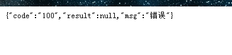

#                       SpringBoot对全局异常的处理封装

## 一、全局异常处理的简介

springMvc为我们提供的全局异常处理很好的解决了我们在开发中对于异常的捕获与控制，他能够监控所有的@Controller注解类，并提供异常捕捉与处理！

> `@RestControllerAdvice`:此注解加在异常捕获的类上
>
> `@ExceptionHandler`：此注解能够捕获所有额异常

是否对这个有所期待呢？

## 二、前端提出需求

某日，小黄正在双目无神，死盯电脑代码，其实内心神游，疯狂摸鱼的时候！前端来了，因为测试测出BUG，经前端定位在后台代码上有错误，前端因为没有处理，所以无法提示正确信息！

于是，前端提出需求！***`后端报错，或者后端抛出异常的时候，需要给前端返回错误信息和错误码`***，小黄拍脑袋灵光一闪，给每一个Controller里面的方法都加上一个try块就轻松解决了！

吃完午饭，回来准备执行上午的想法，但是突然想到，万一以后要改........   小黄不寒而栗，于是正襟危坐，计上心来！

## 三、代码实现

### 1.定义统一返回类

```java
package com.demo.comm;

/**
 * @author huangfu
 */
public class ResponseResult<T> {

    private String code;
    private T result;
    private String msg;

    public ResponseResult(String code, T result, String msg) {
        this.code = code;
        this.result = result;
        this.msg = msg;
    }

    @Override
    public String toString() {
        return "ResponseResult{" +
                "code='" + code + '\'' +
                ", result=" + result +
                ", msg='" + msg + '\'' +
                '}';
    }

    public String getCode() {
        return code;
    }

    public void setCode(String code) {
        this.code = code;
    }

    public T getResult() {
        return result;
    }

    public void setResult(T result) {
        this.result = result;
    }

    public String getMsg() {
        return msg;
    }

    public void setMsg(String msg) {
        this.msg = msg;
    }

    public ResponseResult() {
    }
}
```

### 2.定义返回结果的工具类方便实用

```java
package com.demo.util;

import com.demo.comm.ResponseResult;
import com.demo.enums.IEnum;

/**
 * @author huangfu
 */
public class ResponseResultUtil<T> {
    /**
     * 成功
     * @param t
     * @param <T>
     * @return
     */
    public static<T> ResponseResult<T> ok(T t){
        ResponseResult<T> tResponseResult = new ResponseResult<>();
        tResponseResult.setCode("0000000");
        tResponseResult.setMsg("成功");
        tResponseResult.setResult(t);
        return tResponseResult;
    }

    /**
     * 错误
     * @param iEnum
     * @param <T>
     * @return
     */
    public static<T> ResponseResult<T> error(IEnum iEnum){
        ResponseResult<T> tResponseResult = new ResponseResult<>();
        tResponseResult.setCode(iEnum.getCode());
        tResponseResult.setMsg(iEnum.getMessage());
        return tResponseResult;
    }

    /**
     * 错误
     * @param msg
     * @param <T>
     * @return
     */
    public static<T> ResponseResult<T> error(String msg){
        ResponseResult<T> tResponseResult = new ResponseResult<>();
        tResponseResult.setMsg(msg);
        return tResponseResult;
    }
}

```

### 3.定义枚举父接口

> 用于全局异常接口回调错误信息和错误码

```java
package com.demo.enums;

public interface IEnum {
    /**
     * 返回错误代码
     * @return
     */
    String getCode();

    /**
     * 返回错误信息
     * @return
     */
    String getMessage();
}
```

### 4.定义错误枚举类

```java
package com.demo.enums;

/**
 * @author huangfu
 */

public enum CodeEnum implements IEnum {
    ERROR("100","错误");

    private String code;
    private String msg;

    CodeEnum(String code, String msg) {
        this.code = code;
        this.msg = msg;
    }
    @Override
    public String getCode() {
        return code;
    }

    @Override
    public String getMessage() {
        return msg;
    }
}
```

### 5.定义异常父类

> 用于返回当前异常使用的枚举

```java
package com.demo.exception;

import com.demo.enums.IEnum;

/**
 * @author huangfu
 */
public interface IException {
    /**
     * 返回错误枚举
     * @return
     */
    IEnum getIEnum();
}
```

### 6.定义自定义异常

```java
package com.demo.exception;

import com.demo.enums.IEnum;

/**
 * @author huangfu
 */
public class BaseException extends RuntimeException implements IException {
    private IEnum iEnum;

    public BaseException() {
    }

    /**
     * 给枚举赋值
     * @param e
     * @param <E>
     */
    public <E extends IEnum> BaseException(E e) {
        super(e.getMessage());
        this.iEnum = e;
    }

    /**
     * 返回当前错误的枚举
     * @return
     */
    @Override
    public IEnum getIEnum() {
        return this.iEnum;
    }
}
```

### 7.大功告成，定义全局异常处理

```java
package com.demo.comm;

import com.demo.enums.IEnum;
import com.demo.exception.IException;
import com.demo.util.ResponseResultUtil;
import org.springframework.web.bind.annotation.ExceptionHandler;
import org.springframework.web.bind.annotation.RestControllerAdvice;

/**
 * 全局异常处理
 * @author huangfu
 */
@RestControllerAdvice
public class MyControllerAdvice {
    /**
     * 全局异常捕捉
     * @param e
     * @return
     */
    @ExceptionHandler(value = {Exception.class})
    public ResponseResult requestException(Exception e){
        e.printStackTrace();
        if(e instanceof IException){
            return error(e);
        }
        return ResponseResultUtil.error("未知错误");
    }

    /**
     * 处理全局异常处理，将错误枚举传入当前封装结果集
     * @param e
     * @return
     */
    public ResponseResult error(Exception e){
        IException iException = (IException)e;
        IEnum iEnum = iException.getIEnum();
        ResponseResult<Object> errorResponseResult = ResponseResultUtil.error(iEnum);
        return errorResponseResult;
    }
}

```

### 8.service使用

```java
package com.demo.service.impl;

import com.demo.enums.CodeEnum;
import com.demo.enums.IEnum;
import com.demo.exception.BaseException;
import com.demo.service.ExceptionService;
import org.springframework.stereotype.Service;

/**
 * @author Administrator
 */
@Service
public class ExceptionServiceImpl implements ExceptionService {
    @Override
    public String getData(int data) {
        if(data == 0){
            //抛出自定义异常
            throw new BaseException(CodeEnum.ERROR);
        }else if(data == 1){
            //抛出系统异常
            throw new RuntimeException("...");
        }
        return "hello";
    }
}
```

### 9.controller使用

```java
package com.demo.controller;

import com.demo.service.ExceptionService;
import org.springframework.beans.factory.annotation.Autowired;
import org.springframework.web.bind.annotation.CrossOrigin;
import org.springframework.web.bind.annotation.RequestMapping;
import org.springframework.web.bind.annotation.RestController;

/**
 * @author huangfu
 */
@RestController
public class FilterController {

    @Autowired
    private ExceptionService service;

    @RequestMapping("hello")
    public String hello(int data){
        return service.getData(data);
    }
}
```

## 四、结果

### 1.访问自定义异常

> 访问 http://localhost:8080/hello?data=0



### 2.访问系统异常

> 访问 http://localhost:8080/hello?data=1


## 五、搞定下班

小黄，蹦蹦跳跳的下班了