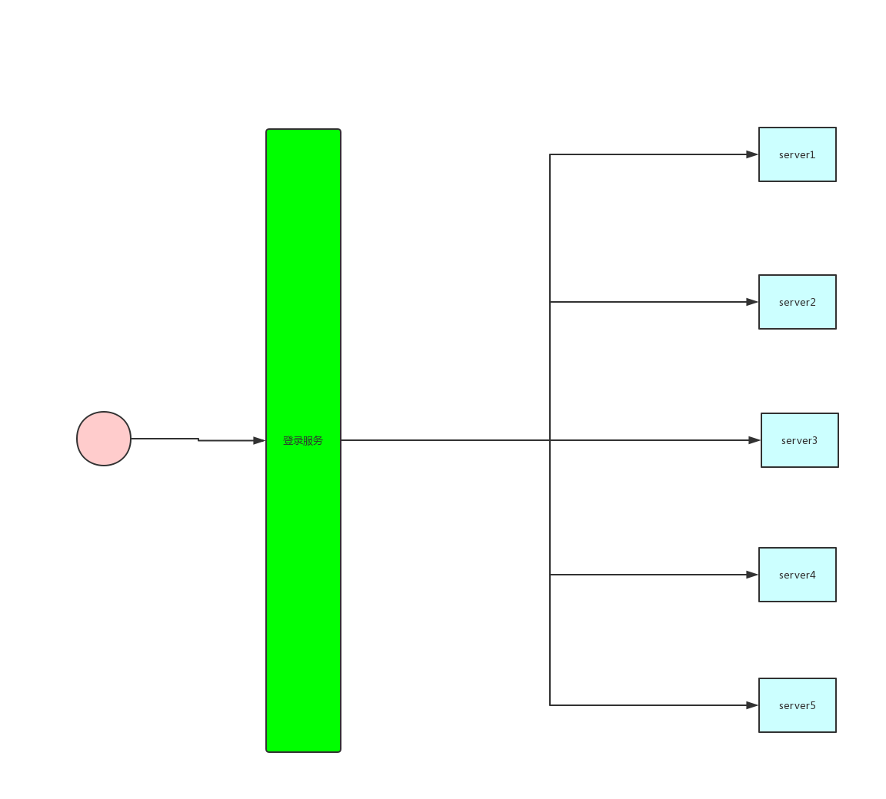
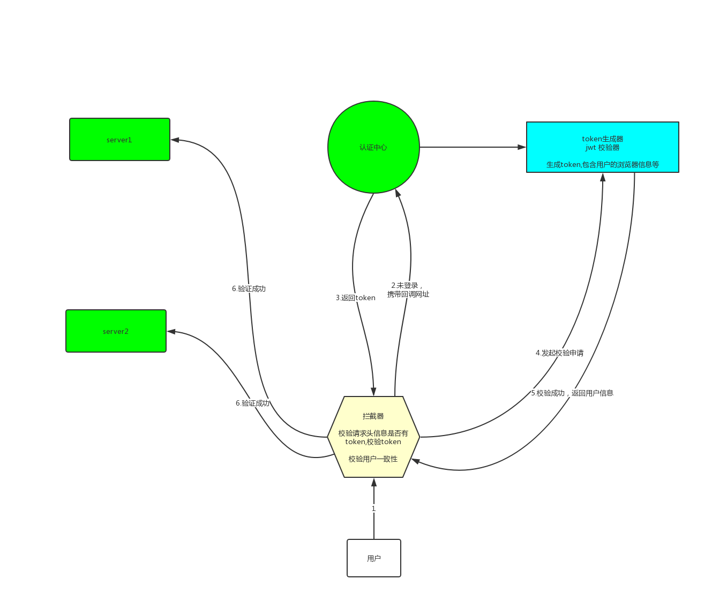

# 单点登录

## 一、什么是单点登录

我不会去说网上那些概念式的东西，就简单说一下我对单点登录的了解！

### 1. 为什么要有单点登录？

​	以前公司小，特别小！所以我就一个产品--《皇甫来了》,所以你要玩皇甫来了就只需要注册一次，登陆一次！后来公司赚到了钱，就又开发了一个服务《皇甫跑路》，这个时候你要玩他们两个就需要注册两遍，登录两次！没关系，游戏好玩，两遍什么的，根本不在意！

​	公司通过前两个游戏赚了100个亿，老板膨胀了，又开发了100个游戏！于是用户不买账了，因为他们每切换一次都需要登陆一次，老板开始召开大会！提出方案，能不能就只登陆一次，所有的游戏都能玩，不需要登录？`至此，单点登录被开发出来！`

### 2.单点登录真面目

​		为了解决这个问题，就需要不登录这个东西，抽取出来，所有的服务都走这一个登录服务！所以出现了下图

**最显而易见的一个例子！天猫和淘宝，你任意登录一个，另外一个就可以直接使用，这就是单点登录**

### 3. 单点登录的好处

1. 减少用户在不同系统中登录耗费的时间，减少用户登录出错的可能性

2. 实现安全的同时避免了处理和保存多套系统用户的认证信息

3. 减少了系统管理员增加、删除用户和修改用户权限的时间

4. 增加了安全性：系统管理员有了更好的方法管理用户，包括可以通过直接禁止和删除用户来取消该用户对所有系统资源的访问权限

## 二、实现一个自己的单点登录

> 项目的路径 https://github.com/huangfusuper/sso-demo.git  这里只讲思路

### 1.思路图

能够看出来，整个架构的核心在拦截器！拦截器首先要拦截到用户所有的请求，验证cookie是否存在（`图中是请求头，画图的时候搞错了`），存在的话向认账中心发送验证请求，成功就放行！不存在就重定向带认证中心，同时`携带本次请求路径`,以便于登录成功后还跳回原来的路径！

### 2.认证中心

认证中心登录成功后，需要向本地Cookie内写一个token  使用jwt生成