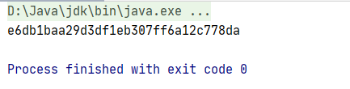

# 天啦噜，项目上使用InputStream，我被坑了一把！

本文目的是为了记录，项目开发时的一个小BUG，如果你是大佬，或者对InputStream十分熟悉，那么可以忽略！

今天开发项目的时候遇见了一个小BUG，该功能如下：

1. 读取指定FTP服务器里面的文件数据，并计算md5签名
2. 推送到备份FTP服务器

以上功能涉及到公司项目功能实现，不能详细多说，大致功能就是这样，读取一个MD5同步到另外一个服务器，期间我遇到什么问题了呢？先看一个模拟的代码实现！

```java
package com.inputstreams;

import org.apache.commons.codec.digest.DigestUtils;

import java.io.ByteArrayInputStream;
import java.io.IOException;

/**
 * @author huangfu
 */
public class TestInputStream {

    public static void main(String[] args) throws IOException {
        //从源FTP服务器获取一个InputStream流信息
        ByteArrayInputStream byteArrayInputStream = 
            						new ByteArrayInputStream("12312312312".getBytes());

        byte[] bytes = new byte[1024];
        int index = 0;
        //计算MD5值
        String fileMd5 = DigestUtils.md5Hex(byteArrayInputStream);
        System.out.println(fileMd5);

        //模拟推送方法读取InputStream
        while ((index = byteArrayInputStream.read(bytes)) != -1) {
            System.out.println("业务操作"+index);
            //。。。。业务操作
        }

        byteArrayInputStream.close();
    }
}
```

结果：



该代码的结果如图所示，MD5被计算了出来，但是却没有打印业务代码！

项目的的最后结果也是我在FTP服务器上看到了，我同步的文件，就认为我同步上去了，也就没有管他！中午吃完饭，无聊期间，在目标FTP服务器上执行`cat xxx.txt`命令，惊奇的发现，里面居然没有内容，这引起了我极大的好奇，一开始我认为是我在源FTP服务器上压根就没获取到`InputStream`流信息，所以推送的时候没有推送上去！

但是经过`Debug`后发现，MD5值被完整的算了出来，这就证明了一点Input流是有值的，事实证明，确实是有值的！

于是我进入到获取MD5值方法的源码里面看：

```java
public static MessageDigest updateDigest(final MessageDigest digest, 
                                   final InputStream inputStream)throws IOException {
    //构建一个字节数组
    final byte[] buffer = new byte[STREAM_BUFFER_LENGTH];
    int read = inputStream.read(buffer, 0, STREAM_BUFFER_LENGTH);
	//循环读取流里面的数据，放入到byte数组，返回！
    while (read > -1) {
        digest.update(buffer, 0, read);
        read = inputStream.read(buffer, 0, STREAM_BUFFER_LENGTH);
    }

    return digest;
}
```

原来，我调用的方法是基于字节数组来计算的，此时我突然想到，NIO的`ByteBuffer`在读取数据时，是由一个指针的概念的，每次读取一个数据，指针都会后移，直到与缓冲区长度重叠为止，再想重复读取，就需要调用`reset()`方法，来恢复指针位置，那么InputStream是不是这样呢，我不禁进入他的源码查看，果然不出我所料我看到`ByteArrayInputStream`里面的`read(byte b[], int off, int len)`方法有这样一段逻辑：

**1. 构建`ByteArrayInputStream`时：**

```java
public ByteArrayInputStream(byte buf[]) {
    this.buf = buf;
    this.pos = 0;
    this.count = buf.length;
}
```

我们看到，他将该数组记录下来，而且还额外的初始化了`pos`和`count`属性

**2.读取数据时：**

```java
public synchronized int read(byte b[], int off, int len) {
    //检查参数
    if (b == null) {
        throw new NullPointerException();
    } else if (off < 0 || len < 0 || len > b.length - off) {
        throw new IndexOutOfBoundsException();
    }
	
    //★检查当前指针位置是否大于数据长度，是的话就证明已经读取完毕，返回-1
    if (pos >= count) {
        return -1;
    }

    //计算有效数据也就是可读数据长度
    int avail = count - pos;
    //如果给定读取的长度尚有冗余，那么强制赋值为有效长度，避免空间的浪费
    if (len > avail) {
        len = avail;
    }
    //若读取长度小于0,那么直接不读取
    if (len <= 0) {
        return 0;
    }
    //执行数组的复制，将初始化时传递的数组，根据设置的长度复制到给定的字节数组！
    //将 buf 从pos指向的位置开始 复制到 b数组的off位置  复制 len个字节
    System.arraycopy(buf, pos, b, off, len);
    //将 pos指针指向下一次将要读取的位置
    pos += len;
    return len;
}
```

关键点就在`pos`指针身上，他决定着数据到底能被复制多少，想到此我不仅恍然大悟，原来在进行md5计算的时候，计算md5的方法会读取一遍，导致`pos`指针后移到最后一位，指针位置与长度相同，导致上述代码标星★位置判断成立，返回-1，最终导致了，第二次读取的时候，因为返回长度为-1就不读取了！

看到这里茅塞顿开，突然回想到`ByteBuffer`中是存在一个恢复指针的方法的，那么在`ByteArrayInputStream`中是否也存在一个类似的方法呢？大概看了一下源码，果然让我找到了：

```java
public synchronized void reset() {
    //将指针位置恢复到标记位置
    pos = mark;
}
```

什么是标记位置呢？`ByteArrayInputStream`为了记录一次实例读取中的初始位置，故而增加的方法，`mark`属性默认为 0 代码如下：

```java
protected int mark = 0;
```

当然，不是一直为0 ，当我们在构造`ByteArrayInputStream`对象时，指定了初始位置，那么`mark`属性也会随之改变：

```java
public ByteArrayInputStream(byte buf[], int offset, int length) {
    this.buf = buf;
    this.pos = offset;
    this.count = Math.min(offset + length, buf.length);
    this.mark = offset;
}
```

好了，最终问题圆满解决，最终的使用方式为:

```java
public static void main(String[] args) throws IOException {
    //从源FTP服务器获取一个InputStream流信息
    ByteArrayInputStream byteArrayInputStream = 
        							new ByteArrayInputStream("12312312312".getBytes());

    byte[] bytes = new byte[1024];
    int index = 0;
    //计算MD5值
    String fileMd5 = DigestUtils.md5Hex(byteArrayInputStream);
    //★ 重置读指针位置，方便复用
    byteArrayInputStream.reset();
    System.out.println(fileMd5);

    //模拟推送方法读取InputStream
    while ((index = byteArrayInputStream.read(bytes)) != -1) {
        System.out.println("业务操作"+index);
        //。。。。业务操作
    }

    byteArrayInputStream.close();
}
```

这个问题，不是一个大问题，但是却是平常开发中需要注意的小细节！遇见此类错误时，不要心急，一步一步找总能解决问题的！

