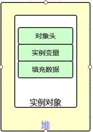
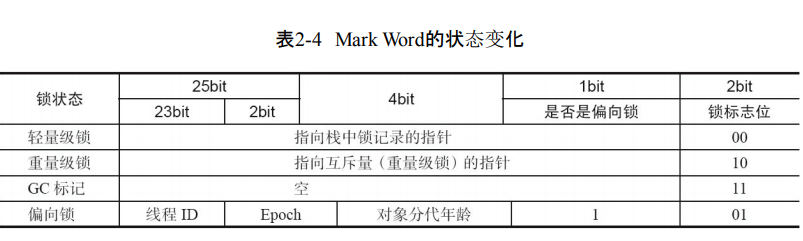
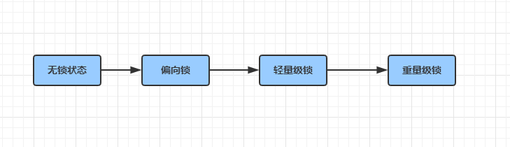

# 你真的了解synchronized吗？

在多线程并发编程中synchronized一直是元老级角色，很多人都会称呼它为重量级锁。但是，随着Java SE 1.6对synchronized进行了各种优化之后，有些情况下它就并不那么重了。本文详细介绍java1.6中为了减少 synchronized 获取锁和释放锁锁带来的严重的性能消耗而引入的偏向锁和轻量级锁，以及锁膨胀的过程！

## 一、synchronized实现锁的表现形式

1. 修饰实例方法，对于普通同步方法，锁是当前的实例对象
2. 修饰静态方法，对于静态同步方法，锁是当前的Class对象
3. 修饰方法代码块，对于同步方法块，锁是synchronized括号里面配置的对象！

当一个线程试图访问同步代码块的时候，就必须得到所，完成后(或者出现异常)，就必须释放锁。那么锁究竟存在什么地方呢？我们一块来探究！

不过，相信，既然大家能够找到这篇文章，相信大家对他的使用早已了熟于心，我们对于使用，以及为什么多线程情况下，数据会出现错乱情况，不做详细的解释！只把他的几种使用方式列出，供参考！

### ①修饰实例方法

>修饰实例方法，对于普通同步方法，锁是当前的实例对象

这个没得说，使用的同一个实例，添加上synchronized后，线程需要排队，完成一个原子操作，但是注意前提是`使用的同一个实例`，他才会生效！

正例：

```java
/**
 * @author huangfu
 */
public class ExploringSynchronized implements Runnable {
    /**
     * 共享资源(临界资源)
     */
    static int i=0;
    public synchronized void add(){
        i++;
    }

    @Override
    public void run() {
        for (int j = 0; j < 100000; j++) {
            add();
        }
    }

    public static void main(String[] args) throws InterruptedException {
        ExploringSynchronized exploringSynchronized = new ExploringSynchronized();
        Thread t1 = new Thread(exploringSynchronized);
        Thread t2 = new Thread(exploringSynchronized);
        t1.start();
        t2.start();
        //join 主线程需要等待子线程完成后在结束
        t1.join();
        t2.join();
        System.out.println(i);

    }
}
```

反例：

```java
/**
 * @author huangfu
 */
public class ExploringSynchronized implements Runnable {
    /**
     * 共享资源(临界资源)
     */
    static int i=0;
    public synchronized void add(){
        i++;
    }

    @Override
    public void run() {
        for (int j = 0; j < 100000; j++) {
            add();
        }
    }

    public static void main(String[] args) throws InterruptedException {
        Thread t1 = new Thread(new ExploringSynchronized());
        Thread t2 = new Thread(new ExploringSynchronized());
        t1.start();
        t2.start();
        //join 主线程需要等待子线程完成后在结束
        t1.join();
        t2.join();
        System.out.println(i);

    }
}
```

这种，即使你再方法上加上了synchronized也无济于事，因为，对于普通同步方法，锁是当前的实例对象！实例对象都不一样了，那么他们之间的锁自然也就不是同一个！

### ②修饰静态方法

> 修饰静态方法，对于静态同步方法，锁是当前的Class对象

从定义上可以看出来，他的锁是类对象，那么也就是说，一上面那个类为例：普通方法的锁对象是 `new ExploringSynchronized()`而静态方法对应的锁对象是`ExploringSynchronized.class`所以对于静态方法添加同步锁，即使你重新创建一个实例，它拿到的锁还是同一个！

```java
package com.byit.test;

/**
 * @author huangfu
 */
public class ExploringSynchronized implements Runnable {
    /**
     * 共享资源(临界资源)
     */
    static int i=0;
    public synchronized static void add(){
        i++;
    }

    @Override
    public void run() {
        for (int j = 0; j < 100000; j++) {
            add();
        }
    }

    public static void main(String[] args) throws InterruptedException {
        Thread t1 = new Thread(new ExploringSynchronized());
        Thread t2 = new Thread(new ExploringSynchronized());
        t1.start();
        t2.start();
        //join 主线程需要等待子线程完成后在结束
        t1.join();
        t2.join();
        System.out.println(i);

    }
}
```

当然，结果是我们期待的  200000

### ③修饰方法代码块

> 修饰方法代码块，对于同步方法块，锁是synchronized括号里面配置的对象！

```JAVA
package com.byit.test;

/**
 * @author huangfu
 */
public class ExploringSynchronized implements Runnable {
    /**
     * 锁标记
     */
    private static final String LOCK_MARK = "LOCK_MARK";
    /**
     * 共享资源(临界资源)
     */
    static int i=0;
    public void add(){
        synchronized (LOCK_MARK){
            i++;
        }
    }

    @Override
    public void run() {
        for (int j = 0; j < 100000; j++) {
            add();
        }
    }

    public static void main(String[] args) throws InterruptedException {
        Thread t1 = new Thread(new ExploringSynchronized());
        Thread t2 = new Thread(new ExploringSynchronized());
        t1.start();
        t2.start();
        //join 主线程需要等待子线程完成后在结束
        t1.join();
        t2.join();
        System.out.println(i);

    }
}
```

对于同步代码块，括号里面是什么，锁对象就是什么，里面可以使this  字符串  对象等等！

## 二、synchronized的底层实现

java中`synchronized`的实现是基于进入和退出的 `Monitor`对象实现的，无论是显式同步（修饰代码块，有明确的`monitorenter `和 `monitorexit `指令）还是隐式同步(修饰方法体)！

需要注意的是，只有修饰代码块的时候，才是基于`monitorenter `和 `monitorexit `指令来实现的；修饰方法的时候，是通过另一种方式实现的！我会放到后面去说！

在了解整个实现底层之前，我还是希望你能够大致了解一下对象在内存中的结构详情！



- 实例变量：存放类的属性数据信息，包括父类的属性信息，如果是数组的实例部分还包括数组的长度，这部分内存按4字节对齐。
- 填充数据：由于虚拟机要求对象起始地址必须是8字节的整数倍。填充数据不是必须存在的，仅仅是为了字节对齐，这点了解即可。

这两个概念，我们简单理解就好！我们今天并不去探究对象的构成原理！我们着重探究一下对象头，他对我们理解锁尤为重要！

一般而言，`synchronized`使用的锁存在于对象头里面！如果是数组对象，则虚拟机使用3个字宽存储对象，如果是非数组对象，则使用两个字宽存储对象头！字虚拟机里面1字宽等于4字节！主要结构是 `Mark Word` 和 `Class Metadata Address `组成,结构如下：

|   虚拟机位数   |       头对象结构       |                        说明                        |
| :------------: | :--------------------: | :------------------------------------------------: |
|    32/64bit    |       Mark Word        | 存储对象的hashCode、锁信息或分代年龄或GC标志等信息 |
|    32/64bit    | Class Metadata Address |              存储到队形类型数据的指针              |
| 32/64bit(数组) |     Aarray length      |                     数组的长度                     |

通过上述表格能够看出  `锁信息` 存在于 `Mark Word`  内，那么 Mark Word 内又是如何组成的呢？

|  锁状态  |     25bit      |      4bit      | 1bit是否是偏向锁 | 2bit锁标志位 |
| :------: | :------------: | :------------: | :--------------: | :----------: |
| 无锁状态 | 对象的hashcode | 对象的分代年龄 |        0         |      01      |

在运行起见，mark Word 里存储的数据会随着锁的标志位的变化而变化。mark Word可能变化为存储一下四种数据



Java SE 1.6为了减少获得锁和释放锁带来的消耗，引入了`偏向锁`和`轻量级锁`，从之前上来就是重量级锁到1.6之后，锁膨胀升级的优化，极大地提高了`synchronized`的效率；

锁一共有4中状态，级别从低到高：



这几个状态会随着锁的竞争，逐渐升级。锁可以升级，但是不能降级，其根本的原因就是为了提高获取锁和释放锁的效率！

那么，synchronized是又如何保证的线程安全的呢？或许我们需要从字节码寻找答案！

```java
package com.byit.test;

/**
 * @author Administrator
 */
public class SynText {
    private static String A = "a";
    public int i ;

    public void add(){
        synchronized (A){
            i++;
        }

    }
}
```

反编译的字节码

```tex
Compiled from "SynText.java"
public class com.byit.test.SynText {
  public int i;

  public com.byit.test.SynText();
    Code:
       0: aload_0
       1: invokespecial #1                  // Method java/lang/Object."<init>":()V
       4: return

  public void add();
    Code:
       0: getstatic     #2                  // Field A:Ljava/lang/String;
       3: dup
       4: astore_1
       5: monitorenter
       6: aload_0
       7: dup
       8: getfield      #3                  // Field i:I
      11: iconst_1
      12: iadd
      13: putfield      #3                  // Field i:I
      16: aload_1
      17: monitorexit
      18: goto          26
      21: astore_2
      22: aload_1
      23: monitorexit
      24: aload_2
      25: athrow
      26: return
    Exception table:
       from    to  target type
           6    18    21   any
          21    24    21   any

  static {};
    Code:
       0: ldc           #4                  // String a
       2: putstatic     #2                  // Field A:Ljava/lang/String;
       5: return
}

```

省去不必要的，简化在简化

```txt
	   5: monitorenter
      ...
      17: monitorexit
      ...
      23: monitorexit
```

从字节码中可知同步语句块的实现使用的是`monitorenter `和 `monitorexit `指令，其中`monitorenter`指令指向同步代码块的开始位置，`monitorexit`指令则指明同步代码块的结束位置,当执行`monitorenter`指令的时候，线程将试图获取对象所所对应的`monitor`特权，当monitor的的计数器为0的时候，线程就可以获取`monitor`,并将计数器设置为1.去锁成功！如果当前线程已经拥有monitor特权，则可以直接进入方法（可重入锁），计数器+1；如果其他线程已经拥有了monitor特权，那么本县城将会阻塞！

拥有monitor特权的线程执行完成后释放monitor，并将计数器设置为0；同时执行`monitorexit`指令；不要担心出现异常无法执行`monitorexit`指令；为了保证在方法异常完成时 monitorenter 和 monitorexit 指令依然可以正确配对执行，编译器会自动产生一个异常处理器，这个异常处理器声明可处理所有的异常，它的目的就是用来执行 monitorexit 指令。从字节码中也可以看出多了一个monitorexit指令，它就是异常结束时被执行的释放monitor 的指令。

> *同步代码块的原理了解了，那么同步方法如何解释？*不急，我们不妨来反编译一下同步方法的状态！

```shell
javap -verbose -p SynText > 3.txt
```

代码

```java
package com.byit.test;

/**
 * @author huangfu
 */
public class SynText {
    public int i ;

    public synchronized void add(){
        i++;

    }
}
```

**字节码**

```tex
Classfile /D:/2020project/byit-myth-job/demo-client/byit-demo-client/target/classes/com/byit/test/SynText.class
  Last modified 2020-1-6; size 382 bytes
  MD5 checksum e06926a20f28772b8377a940b0a4984f
  Compiled from "SynText.java"
public class com.byit.test.SynText
  minor version: 0
  major version: 52
  flags: ACC_PUBLIC, ACC_SUPER
Constant pool:
   #1 = Methodref          #4.#17         // java/lang/Object."<init>":()V
   #2 = Fieldref           #3.#18         // com/byit/test/SynText.i:I
   #3 = Class              #19            // com/byit/test/SynText
   #4 = Class              #20            // java/lang/Object
   #5 = Utf8               i
   #6 = Utf8               I
   #7 = Utf8               <init>
   #8 = Utf8               ()V
   #9 = Utf8               Code
  #10 = Utf8               LineNumberTable
  #11 = Utf8               LocalVariableTable
  #12 = Utf8               this
  #13 = Utf8               Lcom/byit/test/SynText;
  #14 = Utf8               syncTask
  #15 = Utf8               SourceFile
  #16 = Utf8               SynText.java
  #17 = NameAndType        #7:#8          // "<init>":()V
  #18 = NameAndType        #5:#6          // i:I
  #19 = Utf8               com/byit/test/SynText
  #20 = Utf8               java/lang/Object
{
  public int i;
    descriptor: I
    flags: ACC_PUBLIC

  public com.byit.test.SynText();
    descriptor: ()V
    flags: ACC_PUBLIC
    Code:
      stack=1, locals=1, args_size=1
         0: aload_0
         1: invokespecial #1                  // Method java/lang/Object."<init>":()V
         4: return
      LineNumberTable:
        line 6: 0
      LocalVariableTable:
        Start  Length  Slot  Name   Signature
            0       5     0  this   Lcom/byit/test/SynText;

  public synchronized void syncTask();
    descriptor: ()V
    flags: ACC_PUBLIC, ACC_SYNCHRONIZED
    Code:
      stack=3, locals=1, args_size=1
         0: aload_0
         1: dup
         2: getfield      #2                  // Field i:I
         5: iconst_1
         6: iadd
         7: putfield      #2                  // Field i:I
        10: return
      LineNumberTable:
        line 10: 0
        line 11: 10
      LocalVariableTable:
        Start  Length  Slot  Name   Signature
            0      11     0  this   Lcom/byit/test/SynText;
}
SourceFile: "SynText.java"

```

*简化，在简化*

```te
 public synchronized void syncTask();
    descriptor: ()V
    flags: ACC_PUBLIC, ACC_SYNCHRONIZED
    Code:
      stack=3, locals=1, args_size=1
         0: aload_0
         1: dup
```

我们能够看到 `flags: ACC_PUBLIC, ACC_SYNCHRONIZED`这样的一句话

从字节码中可以看出，synchronized修饰的方法并没有monitorenter指令和monitorexit指令，取得代之的确实是ACC_SYNCHRONIZED标识，该标识指明了该方法是一个同步方法，JVM通过该ACC_SYNCHRONIZED访问标志来辨别一个方法是否声明为同步方法，从而执行相应的同步调用。这便是synchronized锁在同步代码块和同步方法上实现的基本原理。

那么在JAVA6之前，为什么`synchronized`会如此的慢？

那是因为，操作系统实现线程之间的切换需要系统内核从用户态切换到核心态!这个状态之间的转换，需要较长的时间，时间成本高！所以这也就是synchronized慢的原因！

## 三、锁膨胀的过程

在这之前，你需要知道什么是锁膨胀！他是JAVA6之后新增的一个概念！是一种针对之前重量级锁的一种性能的优化！他的优化，大部分是基于经验上的一些感官，对锁来进行优化！

### ①偏向锁

研究发现，大多数情况下，锁不仅不存在多线程竞争，而且还总是由一条线程获得！因为为了减少锁申请的次数！引进了偏向锁！在没有锁竞争的情况下，如果一个线程获取到了锁，那么锁就进入偏向锁的模式！当线程再一次请求锁时，无需申请，直接获取锁，进入方法！但是前提是没有锁竞争的情况，存在锁竞争，锁会立即膨胀，膨胀为轻量级锁！

### ②轻量级锁

偏向锁失败，那么锁膨胀为轻量级锁！此时锁机构变为轻量级锁结构！他的经验依据是：“绝大多数情况下，在整个同步周期内，不会存在锁的竞争”，故而，轻量级锁适合，线程交替进行的场景！如果在同一时间出现两条线程对同一把锁的竞争，那么此时轻量级锁就不会生效了！但是，jdk官方为了是锁的优化性能更好，轻量级锁失效后，并不会立即膨胀为重量级锁！而是将锁转换为自旋锁状态！

### ③自旋锁

轻量级锁失败后，为了是避免线程挂起，引起内核态的切换！为了优化，此时线程会进入自选状态！他可能会进行几十次，上百次的空轮训！为什么呢？又是经验之谈！他们认为，大多数情况下，线程持有锁的时间都不会太长！做几次空轮训，就能大概率的等待到锁！事实证明，这种优化方式确实有效！最后如果实在等不到锁！没办法，才会彻底升级为重量级锁！

### ④锁消除

jvm在进行代码编译时，会基于上下文扫描；将一些不可能存在资源竞争的的锁给消除掉！这也是JVM对于锁的一种优化方式！不得不感叹，jdk官方的脑子！举个例子！在方法体类的局部变量对象，他永远也不可能会发生锁竞争，例如：

```java
/**
 * @author huangfu
 */
public class SynText {
    public static void add(String name1 ,String name2){
        StringBuffer sb = new StringBuffer();
        sb.append(name1).append(name2);
    }

    public static void main(String[] args) {
        for (int i = 0; i < 10000000; i++) {
            add("w"+i,"q"+i);
        }
    }
}
```

不能否认，`StringBuffer`是线程安全的！但是他永远也不会被其他线程引用！故而，锁失效！故而，被消除掉！