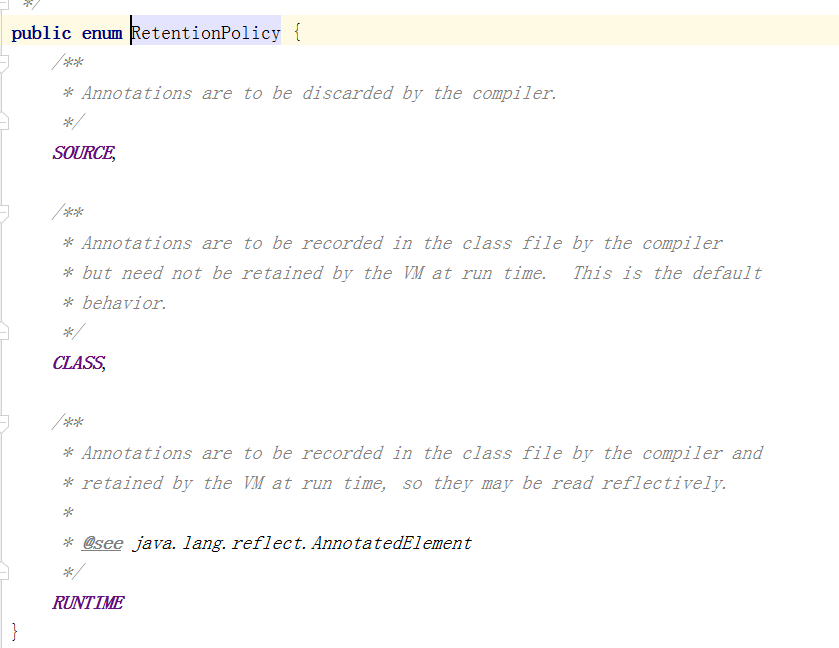
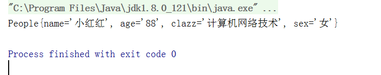
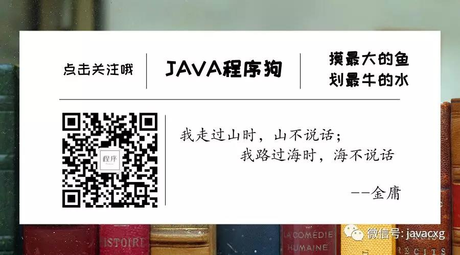

#                                                JAVA自定义注解

> 作者：皇甫

## 一.名词解释

> Java 注解用于为 Java 代码提供元数据。作为元数据，注解不直接影响你的代码执行，但也有一些类型的注解实际上可以用于这一目的。Java 注解是从 Java5 开始添加到 Java 的。

但是这种解释方式，貌似不太容易理解！用名词解释名词，这就是扯淡！所以不妨用下面的一种方式，来更好的解释这个名词的意思！

> 可以把JAVA注解理解为`标签`  什么是标签？就是一个标记！比如   吃的，这就是一个标签 ，在你想到 老婆饼的时候，脑子里的第一个印象就是  吃的！那么吃的就是这个老婆饼的标签！

## 二、注解能够干什么呢？

> 注解能够解决很多场景下的 冗余代码的编写   简化各类配置文件  等等，他通常都是和JAVA反射机制一起使用，两者能够实现开发中很多功能，使很多冗余的代码结构变的更加简单明了！
>
> 注解比较常用的场景：开发一个工具类、记录操作日志、自定义鉴权操作、需要某类型的对象，做一些固定的事....等等

## 三、自定义注解的定义

```java
import java.lang.annotation.*;

/**
 * @program: byit-myth-job->MyAnnotation
 * @description: 自定义注解
 * @author: huangfu
 * @date: 2019/12/2 10:01
 **/
@Documented
@Retention(RetentionPolicy.RUNTIME)
@Target(ElementType.FIELD)
public @interface MyAnnotation {
    String value() default "";
}
```

大概描述一下里面各种用意：

1. `@Documented`这个加不加都无所谓，默认情况下,javadoc是不包括注解的. 但如果声明注解时指定了 @Documented,则它会被 javadoc 之类的工具处理, 所以注解类型信息也会被包括在生成的文档中，是一个标记注解，没有成员。`加不加都行，没有影响`

2. `@Retention(RetentionPolicy.RUNTIME)`:这个注解就是个重点了，他是指明了当前这个注解在JVM运行时的加载时机，大概看下源码 `RetentionPolicy`不光有``RUNTIME`,他还有两个往下看，我会一一介绍

   

   1. `RetentionPolicy.RUNTIME`:注释将由编译器记录在类文件中，并在运行时由VM保留，以便可以进行反射式读取。这个是最常用的一个，其他两个基本用不着，反正我是没有用到过！官方注释上也说了，可以通过反射获取，前面也说到了，自定义注解通常都是基于反射来实现各种功能的，所以，这个将成为日后生涯中最常用的一个变量！
   2. `RetentionPolicy.CLASS`:注释将由编译器*记录在类文件中，但不必在运行时由VM保留。这是默认的*行为。这个变量是个鸡肋，反正我是没有见过他的用处！
   3. `RetentionPolicy.SOURCE`:这个...嘿嘿嘿！我说没用的话，你可能会干我，但是他确实没用！常用在那呢？JDK内置注解例如，你最熟悉的 `@Override`,开心吗？终于见到一个熟悉的了，看下官方对他的解释`批注将被编译器丢弃。`也就是说，这个注解会在编译时检查你的代码块，做一些检查的操作，比如`@Override`会检查你的方法是不是真的覆盖了父类，成就成了，不成就报错！编译成功之后，丢弃！OK？

3. `@Target(ElementType.TYPE)`:无独有偶，这个也是一个重点、重点、重点。开心吗！你不开心，我能猜出来！

   1. `ElementType.TYPE`:标记此注解能够加在   类，接口（包括注释类型）或枚举类上！

   2. `ElementType.FIELD`：标记此注解能够加在  字段声明（包括枚举常量），字段声明就是成员变量哈！

   3. `ElementType.METHOD`：见名知意思，标记在方法声明上！

   4. `ElementType.PARAMETER`：你猜他是标记加在哪的？对，你猜错了，他是加在方法参数上的  `形式参数声明`

   5. `ElementType.CONSTRUCTOR`：你品，你细品：你猜，你再猜！他是加在``构造函数声明`` 搞辞

   6. `ElementType.LOCAL_VARIABLE`：局部变量声明 加在局部变量上的

   7. `ElementType.ANNOTATION_TYPE`：注释类型声明  加在注解上的

   8. `ElementType.PACKAGE`：加在包上的

   9. `ElementType.TYPE_PARAMETER`：JDK8新增的  类型参数声明

   10. `ElementType.TYPE_USE`： JDK8新增的 使用类型

       > 上面这十种最常用的：ElementType.TYPE、 ElementType.FIELD 、ElementType.METHOD、ElementType.PARAMETER

4. 以上``@Documented``、``@Retention(RetentionPolicy.RUNTIME)``、``@Target(ElementType.TYPE)``三种$元注解$已经全部介绍完毕，对于以后使用自定义注解，掌握这三个元注解，必不可少！
5. 继续解释 `@interface`,他是不是看这很想接口的定义方式，但是却多了一个@，他是注解的定义方式，地位等同于  class、interface、enum
6. `MyAnnotation`:自定义注解的名字  等同于类名  接口名
7. `String value() default "";`这个和就值得考究了，关于用法一会再说，这里只说 `default ""`这个东西，就是日后你在使用的时候不调用，他就会默认使用``default ``后面的参数！如果不加default ，那么在使用时就必须要为其赋值！(`String value();`)

**至此为止，我们对刚刚写的那个做了一个很详细很详细的解释，从此以后，你就学会了如何定义自定义注解了，注意哈，`元注解是必须要加的，不加就没法用`，后续会继续学习如何取使用自定义注解,那么你一定也知道那个注解的作用范围是只能加在成员变量上，对吧！那么如果你想放在方法上又想放在类上，那你这样写 ：**

```java
@Target({ElementType.METHOD,ElementType.TYPE})
```

## 四、自定义注解的使用

哦吼，首先声明，后续代码需要一定的反射基础，不喜勿喷！

### 1.首先定义一个类

> 随便定义，闭着眼睛写，然后定义一个方法，加上咱们的自定义注解

```java
/**
 * @program: byit-myth-job->People
 * @description: 这是一个人的定义，万物皆对象哈
 * @author: huangfu
 * @date: 2019/12/2 10:49
 **/
public class People {
    /**
     * 姓名
     */
    @MyAnnotation(value = "小红红")
    private String name;
    /**
     * 年龄
     */
    @MyAnnotation(value = "88")
    private String age;
    /**
     * 班级
     */
    @MyAnnotation("计算机网络技术")
    private String clazz;
    /**
     * 性别
     */
    @MyAnnotation("女")
    private String sex;

    public People() {
    }

    public People(String name, String age, String clazz, String sex) {
        this.name = name;
        this.age = age;
        this.clazz = clazz;
        this.sex = sex;
    }

    public String getName() {
        return name;
    }

    public void setName(String name) {
        this.name = name;
    }

    public String getAge() {
        return age;
    }

    public void setAge(String age) {
        this.age = age;
    }

    public String getClazz() {
        return clazz;
    }

    public void setClazz(String clazz) {
        this.clazz = clazz;
    }

    public String getSex() {
        return sex;
    }

    public void setSex(String sex) {
        this.sex = sex;
    }

    @Override
    public String toString() {
        return "People{" +
                "name='" + name + '\'' +
                ", age='" + age + '\'' +
                ", clazz='" + clazz + '\'' +
                ", sex='" + sex + '\'' +
                '}';
    }
```

> 上面那个代码是不是写的牛逼爆了，注意我的语法规范，这才是最重要的；可以看到，我在成员变量上加了一些我们自己的东西！我想做的是吧这个我不调用这个类的get\set方法，也不调用构造方法，就是用注解里面的值，为私有变量赋值！也可以称之为，``打破封装``！duang!duang!duang!破了！

### 2.反射及自定义注解的使用

```java
import java.lang.reflect.Field;
import java.util.Arrays;
import java.util.List;

/**
 * @program: byit-myth-job->TestMyAnnotation
 * @description: 测试一下
 * @author: huangfu
 * @date: 2019/12/2 11:07
 **/
public class TestMyAnnotation {
    public static void main(String[] args) {
        People people = getPeople( );
        System.out.println(people);
    }

    /**
     * 不用"构造"，不用get\set哈
     * @return
     */
    public static People getPeople(){
        Object obj = null;
        //反射获取类对象
        try {
            Class<?> aClass = Class.forName("com.byit.ann.People");
            //根据反射创建类对象  这样创建必须要有空构造啊，反射的底层也时寻找的空构造
            obj = aClass.newInstance( );
            /**
             * aClass.getDeclaredFields 他返回的是一个数组 Field[] ,返回所有的成员变量，包括私有的
             * 我不想用数组，就转换成集合了
             * 随你，你想用数组就遍历数组就行
             */
            List<Field> fields = Arrays.asList(aClass.getDeclaredFields( ));
            /**
             * TODO ps：想用java8 但是怕你看不懂，用普通的遍历方法吧
             * 这是遍历这个类里面所有的成员变量
             */
            for (Field field : fields) {
                //获取成员变量上面的自定义注解
                MyAnnotation annotation = field.getAnnotation(MyAnnotation.class);
                /**
                 * 获取自定义注解里面的值,瞅瞅，瞅瞅！调用的是value方法 你自己定义的
                 * 想一下，他在什么时候赋值的？没错是在你写在成员变量的时候赋的值
                 */
                String value = annotation.value( );
                /**
                 * 下面就要吧这个值赋值给对应的变量了，但是因为是私有的，所以我们第一步要打破私有封装
                 * 设置为true就打破了，开心
                 */
                field.setAccessible(true);
                /**
                 * 下面赋值吧
                 * 设置值，需要两个参数，第一个参数是你要把值给谁，也就是目标类的类对象
                 * 第二个值是，你要设置什么值，也就是咱们注解里面取出来的value
                 */
                field.set(obj,value);
            }
        } catch (ClassNotFoundException e) {
            e.printStackTrace( );
        } catch (IllegalAccessException e) {
            e.printStackTrace( );
        } catch (InstantiationException e) {
            e.printStackTrace( );
        }
        return obj instanceof People?(People)obj : null;
    }
}
```

### 3.结果



## 五、总结

本片文章就自定义的注解的定义个使用，介绍的很详细！倒是代码阶段偏向于反射的使用更多一些！实际的生产环境下，反射+自定义注解的使用远比这复杂的多，但是万变不离其宗！通过两者的组合，我们能够实现很多简介高效的代码！

## 六、我忘记了一个极其重要的事

欢迎关注我的公众号！一起吹牛逼啊！

