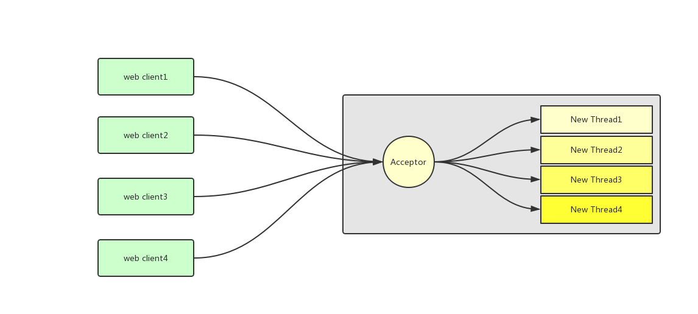

# BIO通信机制及其弊端

## 一、BIO通讯模型

采用BIO通信模型的服务端，通常都会使用一个Acceptor线程负责监听客户端的连接！接收到客户端的连接请求之后，为每一个客户端创建一个新的线程进行链路处理，处理完成之后，通过输出流返回应答给客户端！线程销毁！典型的一请求一应答的通信模型！



> 弊端

该模型的最大问题就是缺乏弹性伸缩的能力，当客户端并发量增加后，服务端的线程数和客户端并发访问数呈1:1的正比关系！当线程数膨胀之后系统的性能将急剧下降，随着并发访问的访问量继续增大，不能对外提供服务！

## 二、模拟时钟服务请求(BIO方式) 伪异步IO操作

### 时间服务器 服务端

```java
package com.netty.bio;

import java.io.BufferedReader;
import java.io.IOException;
import java.io.InputStreamReader;
import java.io.PrintWriter;
import java.net.ServerSocket;
import java.net.Socket;
import java.time.LocalDateTime;
import java.time.format.DateTimeFormatter;
import java.util.concurrent.LinkedBlockingQueue;
import java.util.concurrent.ThreadPoolExecutor;
import java.util.concurrent.TimeUnit;

/**
 * @program: nodes-netty->TimeServer
 * @description: BIO服务端
 * @author: huangfu
 * @date: 2019/11/25 12:40
 **/
public class TimeServer {
    /**
     * 定义一个线程池
     */
    private static final ThreadPoolExecutor fastTriggerPool = new ThreadPoolExecutor(50, 200, 60L, TimeUnit.SECONDS,
            new LinkedBlockingQueue<>(1000),
            r -> new Thread(r, "TimeServer" + r.hashCode()));


    public static void main(String[] args) {
        int port = 8080;

        ServerSocket serverSocket = null;
        try{
            serverSocket = new ServerSocket(port);
            System.out.println("这个时间服务已经启动了，端口是8080");
            Socket socket = null;
            while (true){
                //等待获取连接
                socket = serverSocket.accept();
                fastTriggerPool.execute(new TimeServerHandler(socket));
            }
        }catch (Exception e){
            e.printStackTrace();
        }finally {
            if(serverSocket != null){
                try {
                    serverSocket.close();
                } catch (IOException e) {
                    e.printStackTrace( );
                }
                serverSocket = null;
            }
        }
    }
}

class TimeServerHandler implements Runnable{

    private Socket socket;

    public TimeServerHandler(Socket socket) {
        this.socket = socket;
    }

    @Override
    public void run() {
        BufferedReader in = null;
        PrintWriter out = null;
        try {
            in = new BufferedReader(new InputStreamReader(this.socket.getInputStream()));
            out = new PrintWriter(this.socket.getOutputStream(),true);
            String currentTime = null;
            String body = null;
            while (true){
                body = in.readLine();
                if (body == null){
                    break;
                }
                System.out.println("客户端发送请求:"+body );
                String dateTimeStr = LocalDateTime.now( ).format(DateTimeFormatter.ofPattern("yyyy-MM-dd HH:mm:ss"));
                currentTime = "查询时间".equals(body)?dateTimeStr:"END QUERY";
                out.println(currentTime);
            }
        } catch (IOException e) {
            e.printStackTrace( );
        }finally {
            if(in != null){
                try {
                    in.close();
                    in = null;
                } catch (IOException e) {
                    e.printStackTrace( );
                }
            }

            if(out != null){
                out.close();
                out = null;
            }

            if(socket != null){
                try {
                    this.socket.close();
                } catch (IOException e) {
                    e.printStackTrace( );
                }

                this.socket = null;
            }
        }
    }
}

```

### 时间服务器 客户端

```java
package com.netty.bio;

import java.io.BufferedReader;
import java.io.IOException;
import java.io.InputStreamReader;
import java.io.PrintWriter;
import java.net.Socket;

/**
 * @program: nodes-netty->TimeClient
 * @description: 时间客户端调用
 * @author: huangfu
 * @date: 2019/11/25 13:08
 **/
public class TimeClient {
    public static void main(String[] args) throws IOException {
        Socket socket = null;
        BufferedReader in = null;
        PrintWriter out = null;
        try{
            socket = new Socket("127.0.0.1",8080);
            in = new BufferedReader(new InputStreamReader(socket.getInputStream()));
            out = new PrintWriter(socket.getOutputStream(),true);
            out.println("查询时间");
            String timeDate = in.readLine( );
            System.out.println(timeDate );
        }catch (Exception e){
            e.printStackTrace();
        }finally {
            if(out != null){
                out.close();
            }
            if(in != null){
                try {
                    in.close();
                } catch (IOException e) {
                    e.printStackTrace( );
                }
            }
            if(socket!=null){
                socket.close();
            }
        }
    }
}

```

### 伪异步IO分析

伪异步IO操作五大从根源上解决线程阻塞的问题，我们试着分析一下他的弊端：

>JAVA输入流的弊端

```java
	/**
	* This method blocks until input data is available, end of file is detected, or an exception is thrown.
	**/
    public int read(byte b[]) throws IOException {
        return read(b, 0, b.length);
    }
```

当然为了节省阅读时间，我只摘录出比较重要的一段，有兴趣可以看看java源码`java.io.InputStream#read(byte[])`

这句注释的中文意思是，该方法会一直处于阻塞的状态，除非有三种情况发生

1. 有数据可读
2. 可用数据已经读取完毕
3. 发生异常

这意味着什么？当对方发送的请求或者应答消息过慢时，再或者网络传输慢，读取输入流的一方将被阻塞！知道上面那三种情况发生！

>JAVA输出流的弊端

当调用OutputStream的write方法，写出输出流的时候，他也会被阻塞，知道所有要发送的数据全部写入完毕，或者发生异常。当消息接收方处理缓慢时，不能及时的从TCP缓冲区读取数据，将会导致发送方的TCP window size不断介绍，直到为0.双发处于Keep-Alive状态；消息发送方加个不会向TCP缓冲区写入任何数据，直至windiw size大于0或者发生异常！

> JAVA BIO读写都是同步阻塞的，阻塞的时间依赖于双方IO线程的处理速度和网络速度！网络不可靠，我们无法保证其处理速度，所以即使是伪异步IO线程，也无法保证不发生同步线程阻塞

