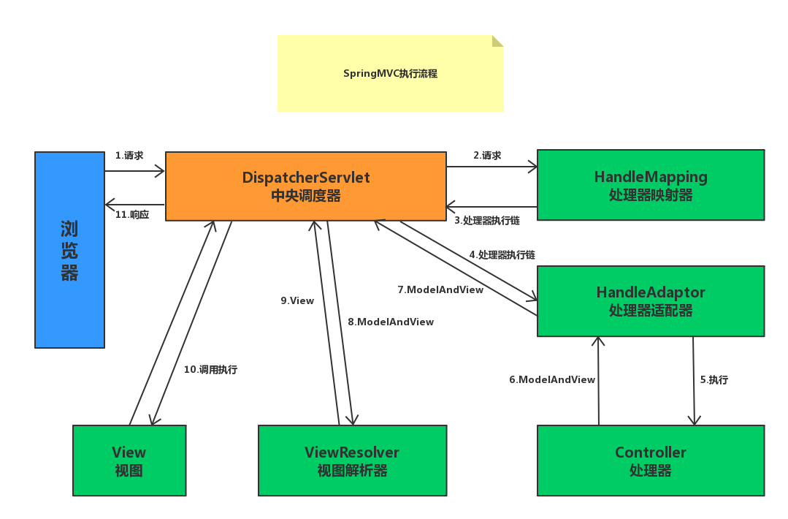

## 一、简介

Spring MVC是一个基于Java的实现了MVC设计模式的请求驱动类型的轻量级Web框架，通过把Model，View，Controller分离，将web层进行职责解耦，把复杂的web应用分成逻辑清晰的几部分，简化开发，减少出错，方便组内开发人员之间的配合。

### 1. Springmvc的优点:

1. 可以支持各种视图技术,而不仅仅局限于JSP；

2. 与Spring框架集成（如IoC容器、AOP等）；

3. 清晰的角色分配：前端控制器(dispatcherServlet) , 请求到处理器映射（handlerMapping), 处理器适配器（HandlerAdapter), 视图解析器（ViewResolver）。

4. 支持各种请求资源的映射策略。

### 2. 请求映射器源码解析

这些优秀的特性使得他在企业级开发中使用率超过98%，如此优秀的框架，你是否疑惑过，在一个请求到达后，是如何被SpringMvc拦截到并处理的？



相信大家对上面的流程图都很熟悉，或多或少无论是在准备面试的时候，还是自己学习的时候，都会接触到这个流程图，我见过很多的人，对着这个图死记硬背！我也面试过一些技术人员，问到这块知识，仰着头闭着眼（夸张一下）把这块知识说出来，再往深了问一点就懵逼，归根到底就是对框架理解不够深刻。


#### I. SpringMVC是如何感知到每个方法对应的url路径的？

>org.springframework.web.servlet.handler.AbstractHandlerMethodMapping 实现 org.springframework.beans.factory.InitializingBean 覆盖 afterPropertiesSet方法，这个方法会在Spring容器初始化的时候回调该方法


> 该方法类定义为

```java
@Override
public void afterPropertiesSet() {
    initHandlerMethods();
}
```

> 调用initHandlerMethods方法，那么initHandlerMethods里面干了什么事情呢？对该方法逐步分析！

```java
/**
 * Scan beans in the ApplicationContext, detect and register handler methods.
 * @see #getCandidateBeanNames()
 * @see #processCandidateBean
 * @see #handlerMethodsInitialized
 */
protected void initHandlerMethods() {
    for (String beanName : getCandidateBeanNames()) {
        if (!beanName.startsWith(SCOPED_TARGET_NAME_PREFIX)) {
            processCandidateBean(beanName);
        }
    }
    handlerMethodsInitialized(getHandlerMethods());
}
```


> 首先 getCandidateBeanNames() 方法，我们看它的定义

```java
/**
 * Determine the names of candidate beans in the application context.
 * @since 5.1
 * @see #setDetectHandlerMethodsInAncestorContexts
 * @see BeanFactoryUtils#beanNamesForTypeIncludingAncestors
 */
protected String[] getCandidateBeanNames() {
    return (this.detectHandlerMethodsInAncestorContexts ?
            BeanFactoryUtils.beanNamesForTypeIncludingAncestors(obtainApplicationContext(), Object.class) :
            obtainApplicationContext().getBeanNamesForType(Object.class));
}
```

- 这个方法本质的目的就是为了从bean容器中，获取所有的bean,为什么是获取全部的 因为他是基于`Object.class`类型来获取的类，故而是全部的类，但是这个方法其实深究起来，知识点很多，因为它涉及到Spring父子容器的知识点，所以我决定，后面花一篇文档单独去讲，这里你只需要知道，这个方法可以获取Spring容器里面所有的bean然后返回！

  

> initHandlerMethods() 获取到所有的bean之后然后循环遍历，我们将目光聚集在循环体内部的`processCandidateBean`方法

```java
protected void processCandidateBean(String beanName) {
    Class<?> beanType = null;
    try {
        beanType = obtainApplicationContext().getType(beanName);
    }
    catch (Throwable ex) {
        // An unresolvable bean type, probably from a lazy bean - let's ignore it.
        if (logger.isTraceEnabled()) {
            logger.trace("Could not resolve type for bean '" + beanName + "'", ex);
        }
    }
    if (beanType != null && isHandler(beanType)) {
        detectHandlerMethods(beanName);
    }
}
```

- beanType = obtainApplicationContext().getType(beanName);

  - 这个方法是基于bean名称获取该类的Class对象

- isHandler(beanType)

  - 这个方法是判断该类是是加注了`Controller`注解或者`RequestMapping`

```java
@Override
protected boolean isHandler(Class<?> beanType) {
return (AnnotatedElementUtils.hasAnnotation(beanType, Controller.class) ||
AnnotatedElementUtils.hasAnnotation(beanType, RequestMapping.class));
}
```

- detectHandlerMethods(Object handler)

```java
Map<Method, T> methods = MethodIntrospector.selectMethods(userType,(MethodIntrospector.MetadataLookup<T>) method -> {
try {
return getMappingForMethod(method, userType);
}
      catch (Throwable ex) {
          throw new IllegalStateException("Invalid mapping on handler class [" +
                                          userType.getName() + "]: " + method, ex);
      }
  });
```

  内部该段逻辑可以遍历某个类下所有的方法

  - getMappingForMethod(method, userType); 这个方法的内部做了什么呢？

    该i方内部读取所有的映射方法的所有定义，具体的逻辑如下

    

     设置了该方法 的映射路径，方法对象，方法参数，设置的方法请求头，消费类型，可接受类型，映射名称等信息封装成RequestMappingInfo对象返回！

  - getPathPrefix(handlerType);

    该方法是处理方法前缀，如果存在和前者方法级别的合并

- 最终返回一个方法与方法描述信息的map映射集合(`Map<Method, RequestMappingInfo>`),循环遍历该集合！

  - Method invocableMethod = AopUtils.selectInvocableMethod(method, userType);找到该方法的代理方法！
  - registerHandlerMethod(handler, invocableMethod, mapping);注册该方法！
    - 我们深入该方法摒弃其他与本文无关的代码，会发现这么一段代码！
     

  

会发现，我们方法上标注的 url会和前面读取的该方法的定义绑定在一个叫做 `urlLookup`的方法里面，请大家记住这个方法，这个方法对我们理解SpringMvc的处理逻辑有大用处！


### 3.请求获取逻辑源码解析

> 现在，整个工程所有对应的@requestMapping的方法已经被缓存，以该方法为例子！

```java
@RestController
public class TestController {

    @RequestMapping("test")
    public String test(){
        return "success";
    }
}
```

现在在``urlLookup``属性里面就有一个 key为`test`,value为`test()`方法详细定义的 k:v键值对:v:

我们看下下面这个类图，`DispatcherServlet`这个关键的中央类，实际上是Servlet的子类，熟悉Servlet的同学都知道，之前在做`Servlet`开发的时候，所有的请求经过配置后都会被内部的doget和dopost方法拦截，至此SpringMvc为什么能够拦截URL也就不难分析了，拦截到url后，进入如下的流程调用链！


请求经由 `org.springframework.web.servlet.FrameworkServlet#doGet`捕获，委托给`org.springframework.web.servlet.FrameworkServlet#processRequest`方法，最后在调用`org.springframework.web.servlet.DispatcherServlet#doService`来处理真正的逻辑！

我们看一下这个方法里面的一些主要逻辑吧！

`org.springframework.web.servlet.DispatcherServlet#doDispatch`调用`org.springframework.web.servlet.DispatcherServlet#getHandler`方法，再次调用`org.springframework.web.servlet.handler.AbstractHandlerMapping#getHandler`经由`org.springframework.web.servlet.handler.AbstractHandlerMethodMapping#getHandlerInternal`方法的`org.springframework.web.servlet.handler.AbstractHandlerMethodMapping#lookupHandlerMethod`的`org.springframework.web.servlet.handler.AbstractHandlerMethodMapping.MappingRegistry#getMappingsByUrl`讲过这么长的调用链是不是懵了，此时我们终于看到了正主！

```java
/**
 * Return matches for the given URL path. Not thread-safe.
 * @see #acquireReadLock()
 */
@Nullable
public List<T> getMappingsByUrl(String urlPath) {
    return this.urlLookup.get(urlPath);
}
```

这段代码是不是熟悉？这就是我们Spring容器在初始化的时候将url和方法定义放置的那个属性，现在Spring容器经由`DispatcherServlet`拦截请求后又重新找到该方法，并且返回！

此时就完成了MVC流程图里面的HandlerMapping处理映射器的部分！

本章关于请求映射器的源码分析到这也就结束了，后续作者会将`处理适配器`，`处理器`,`视图解析器`一一讲明白，其实后续的逻辑也就很简单了，简单来说，拿到方法后反射执行该方法（不一定，一般场景是这样），然后拿到返回值，判断是否有@responseBody注解，判断是否需要转换成json，在通过write写回到页面！大致流程就是这样，详细过程作者后续会写！

经过今天的流程分析，你能否基于Servlet写一个属于自己的SpringMvc呢？