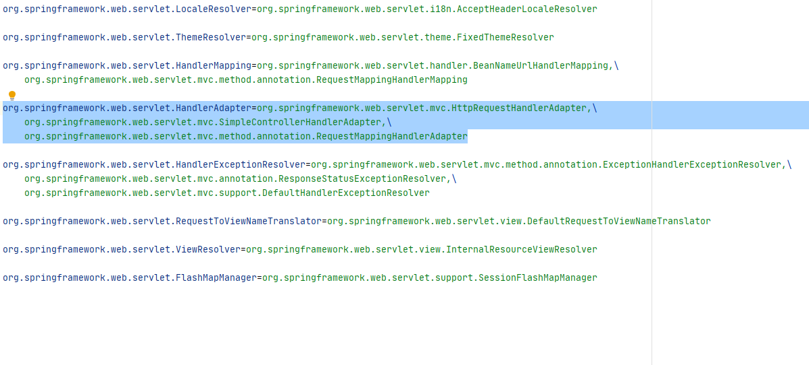
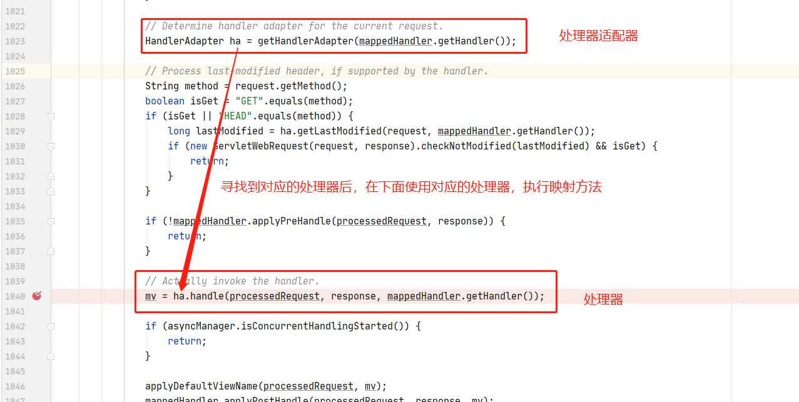
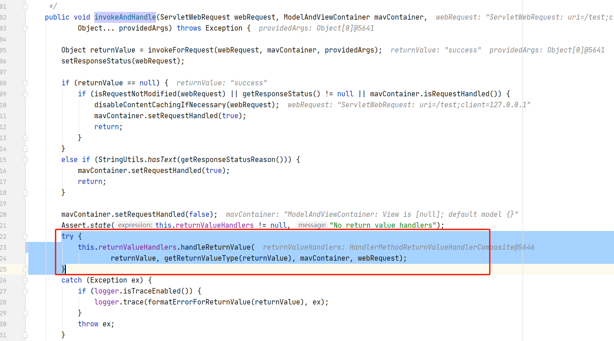
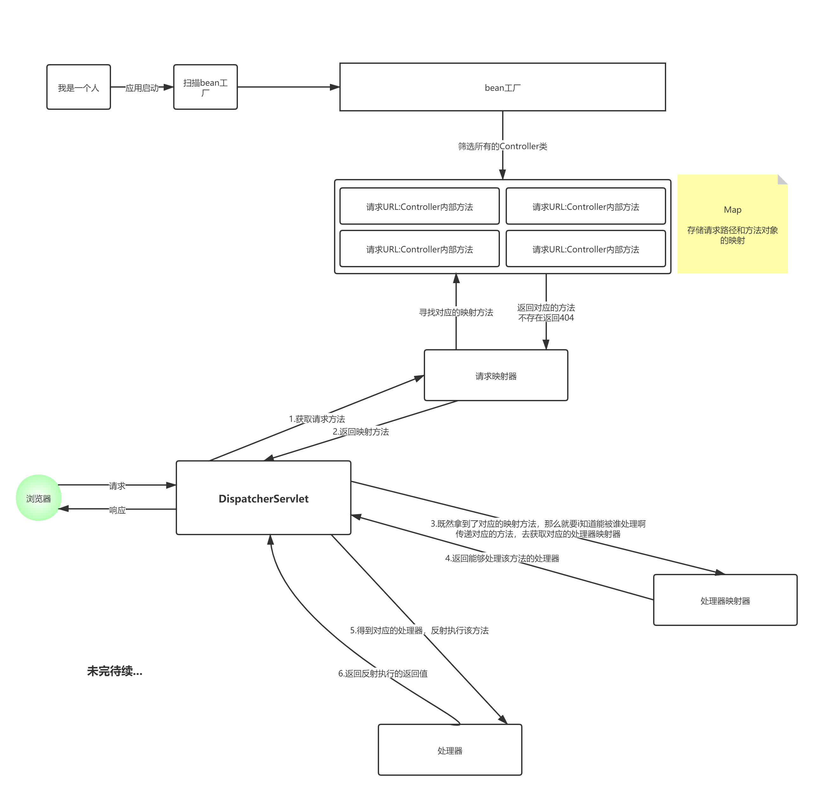

# SpringMVC之请求处理适配器与处理器源码分析

上次的SpringMVC源码分析因为篇幅原因只将请求映射器的源码流程分析完毕，不知道大家对上次的流程分析有什么意见呢？空闲的时候是不是自己追了一遍源码嘞？

先上图：


上一篇文章，我将 Handler处理器映射器做了一个很详细流程分析，那么本篇文章会围绕`处理器适配器`、`处理器`两个流程来分析源码！

## 1. 处理器适配器源码解析

上篇文章其实后面也大概说了一下后面的大概逻辑，但是事实上，SpringMVC作为一个优秀的框架，他所考虑的是很全面的，其实在开发一个`Controller`的方法不止只有一个加上`@Controller`一个方式，还有基于接口来实现的，比如实现`Colltroller`接口、实现`HttpRequestHandler`接口等操作，对于不同的处理方式，那么对于不同的处理方式，SpringMVC是如何感知到的呢？因此，在SpringMVC根据请求路径找到对应的对应的映射方法后如何判断这个方法是根据上面三种那种方式创建出来的呢？此时处理器适配器就派上用场了！看一段代码！

```java
// 根据请求路径获取到映射方法的详细信息
mappedHandler = getHandler(processedRequest);
if (mappedHandler == null) {
    noHandlerFound(processedRequest, response);
    return;
}

// 调用处理器适配器，找到该方法对应的处理器
HandlerAdapter ha = getHandlerAdapter(mappedHandler.getHandler());
```

> 我们进入到处理器适配器里面的逻辑去看一下

```java
protected HandlerAdapter getHandlerAdapter(Object handler) throws ServletException {
    if (this.handlerAdapters != null) {
        for (HandlerAdapter adapter : this.handlerAdapters) {
            if (adapter.supports(handler)) {
                return adapter;
            }
        }
    }
    throw new ServletException("No adapter for handler [" + handler +
                               "]: The DispatcherServlet configuration needs to include a                                HandlerAdapter that supports this handler");
}
```

- 首先他会循环一个叫做 `handlerAdapters` 的属性，那么这个属性是在哪里set的呢？在spring-webmvc.jar目录下有一个叫做`DisPatcherServlet.properties`的文件，在内部定义了三个处理器，为什么是三个处理器呢？因为上面说了，有三种控制器的编码方式，所以会有三种对应的处理器！



- 该方法会循环所有的适配器方案，直到直到合适的处理器，返回，否则就会抛出`ServletException`异常！

## 2. 处理器源码解析

> 当这个处理器返回之后，下一步就是要拿着这个处理器处理我们对应的方法！如何处理呢？我们回到最初的`org.springframework.web.servlet.DispatcherServlet#doDispatch`方法



我们进入到处理器代码逻辑内部`org.springframework.web.servlet.mvc.method.AbstractHandlerMethodAdapter#handle`的

`org.springframework.web.servlet.mvc.method.annotation.RequestMappingHandlerAdapter#handleInternal`方法（注意这里我们以常用的 以`@Controller`方式注册的方式分析）

下面看一段代码

```java
// 查看是否需要走同步块（一般情况下不会设置为同步）
//session 是非线程安全的，如果需要保证用户能够在多次请求中正确的访问同一个 session ，就要将 synchronizeOnSession 设置为 TRUE 。
if (this.synchronizeOnSession) {
    HttpSession session = request.getSession(false);
    if (session != null) {
        Object mutex = WebUtils.getSessionMutex(session);
        synchronized (mutex) {
            mav = invokeHandlerMethod(request, response, handlerMethod);
        }
    }
    else {
        // No HttpSession available -> no mutex necessary
        mav = invokeHandlerMethod(request, response, handlerMethod);
    }
}
else {
    // 我们点进去查看一下这个方法内部的实现
    mav = invokeHandlerMethod(request, response, handlerMethod);
}
```

> invocableMethod.invokeAndHandle(webRequest, mavContainer);方法内部实现！
>
> org.springframework.web.method.support.InvocableHandlerMethod#invokeForReques方法实现

- 我们可以看到有这样一段逻辑代码

```java
@Nullable
public Object invokeForRequest(NativeWebRequest request, 
                               @Nullable ModelAndViewContainer mavContainer,
                               Object... providedArgs) throws Exception {

    Object[] args = getMethodArgumentValues(request, mavContainer, providedArgs);
    if (logger.isTraceEnabled()) {
        logger.trace("Arguments: " + Arrays.toString(args));
    }
    return doInvoke(args);
}
```

- `getMethodArgumentValues`获取方法的参数，以及传递的值

```java
protected Object[] getMethodArgumentValues(NativeWebRequest request, @Nullable ModelAndViewContainer mavContainer,
			Object... providedArgs) throws Exception {
	//获取方法的参数列表（形参列表）
    MethodParameter[] parameters = getMethodParameters();
    if (ObjectUtils.isEmpty(parameters)) {
        return EMPTY_ARGS;
    }
	//构建参数对象数组
    Object[] args = new Object[parameters.length];
    for (int i = 0; i < parameters.length; i++) {
        //拿到参数对象
        MethodParameter parameter = parameters[i];
        parameter.initParameterNameDiscovery(this.parameterNameDiscoverer);
        args[i] = findProvidedArgument(parameter, providedArgs);
        if (args[i] != null) {
            continue;
        }
        if (!this.resolvers.supportsParameter(parameter)) {
            throw new IllegalStateException(formatArgumentError(parameter, "No suitable 										resolver"));
        }
        try {
        //注意这个方法  重点这里是通过方法的参数名称 获取request对象里面对应的参数赋值给对应的参数对象
            args[i] = this.resolvers.resolveArgument(parameter, mavContainer, 
                                                     request, this.dataBinderFactory);
        }
        catch (Exception ex) {
 
            if (logger.isDebugEnabled()) {
                String exMsg = ex.getMessage();
                if (exMsg != null && !exMsg.contains(parameter.getExecutable()
                                                     .toGenericString())) {
                    logger.debug(formatArgumentError(parameter, exMsg));
                }
            }
            throw ex;
        }
    }
    //获取到所有的参数和对应的参数的值之后，返回
    return args;
}
```

> doInvoke(Object... args)

- 处理器开始反射执行该方法，具体的执行的主要逻辑如下：

```java
@Nullable
protected Object doInvoke(Object... args) throws Exception {
    ReflectionUtils.makeAccessible(getBridgedMethod());
    try {
        return getBridgedMethod().invoke(getBean(), args);
    }
    ...忽略..
}
```

得到该方法对象，从Bean工厂中拿到该对象实例，传递参数进行设置行该方法，并获取方法的返回值！

> 拿到返回值之后，逐级返回，回到`org.springframework.web.servlet.mvc.method.annotation.ServletInvocableHandlerMethod#invokeAndHandle`方法




该方法最终调用的是`org.springframework.web.servlet.mvc.method.annotation.RequestResponseBodyMethodProcessor#handleReturnValue`

```java
@Override
public void handleReturnValue(@Nullable Object returnValue, MethodParameter returnType,
                              ModelAndViewContainer mavContainer, NativeWebRequest webRequest)
    throws IOException, HttpMediaTypeNotAcceptableException, HttpMessageNotWritableException {

    mavContainer.setRequestHandled(true);
    ServletServerHttpRequest inputMessage = createInputMessage(webRequest);
    ServletServerHttpResponse outputMessage = createOutputMessage(webRequest);

    // Try even with null return value. ResponseBodyAdvice could get involved.
    writeWithMessageConverters(returnValue, returnType, inputMessage, outputMessage);
}
```

最终通过`writeWithMessageConverters(returnValue, returnType, inputMessage, outputMessage);`将执行结果写到页面（其实之前Servlet开发也是这样的逻辑，只不过SpringMvc进行了层层封装优化了而已）！

不难看出，SpringMvc拦截请求到处理请求映射方法，虽然现在还没有说完，但是可以小小的总结一下：

