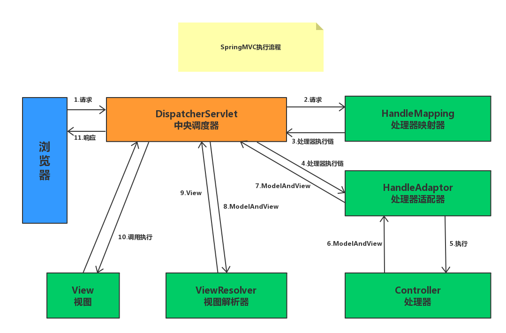
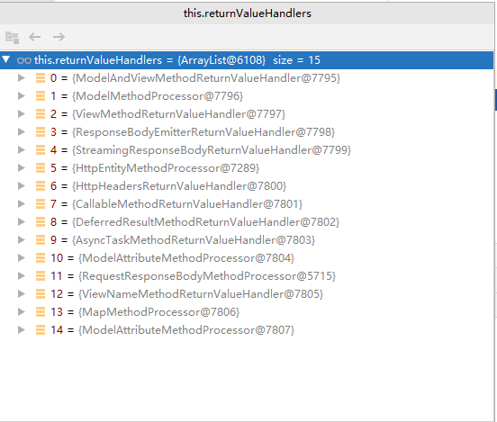
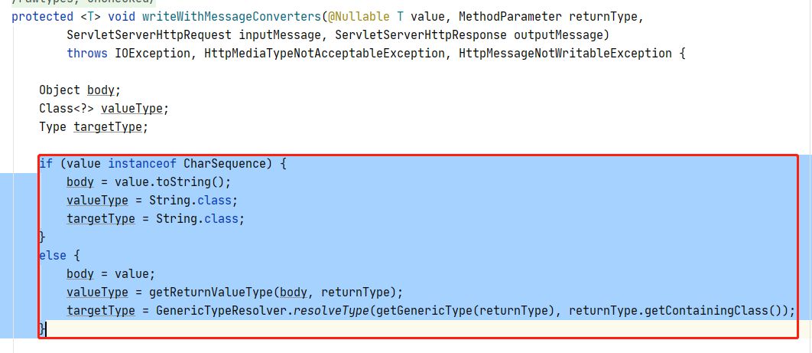
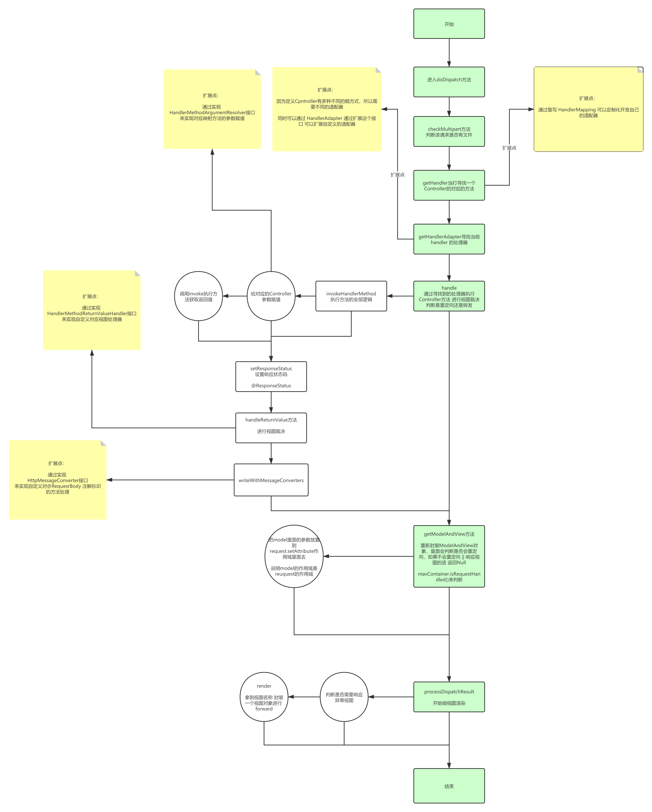

先上图：



上一篇文章，我将 Handler`处理器适配器`，`处理器`做了一个很详细流程分析，那么本篇文章会围绕`视图解析器`和`视图`两个流程来分析源码！

## 1. 视图推断源码分析

不知道大家对这一段代码是否熟悉！

```java
public void invokeAndHandle(ServletWebRequest webRequest, 
                    ModelAndViewContainer mavContainer,
					Object... providedArgs) throws Exception {
	
    //反射执行映射方法获取方法返回值
    Object returnValue = invokeForRequest(webRequest, mavContainer, providedArgs);
    setResponseStatus(webRequest);

    //......忽略无关代码
    try {
        //视图推断（到底是直接响应还是返回一个视图）
        this.returnValueHandlers.handleReturnValue(
            returnValue, getReturnValueType(returnValue), 
            mavContainer, webRequest);
    }
    catch (Exception ex) {
        //......忽略无关代码
    }
}
```

没错，这个正是上篇文章，[处理器](./SpringMVC之请求处理适配器与处理器源码分析.md)，里面分析的，反射执行映射方法的主逻辑，当方法返回结果之后，会根据返回值进行视图推断，推断该方法到底该以一个什么样的方式去返回给调用方！

我们进入到这个方法内部看一下

> ```java
> this.returnValueHandlers.handleReturnValue(returnValue, 
>                       getReturnValueType(returnValue), mavContainer, webRequest);
> ```

```java
@Override
public void handleReturnValue(@Nullable Object returnValue, MethodParameter returnType,                              ModelAndViewContainer mavContainer,                                                             NativeWebRequest webRequest) throws Exception {​    HandlerMethodReturnValueHandler handler = selectHandler(returnValue, returnType);    if (handler == null) {        throw new IllegalArgumentException("Unknown return value type: "                                                                                       + returnType.getParameterType().getName());    }    handler.handleReturnValue(returnValue, returnType, mavContainer, webRequest);}java
```

> HandlerMethodReturnValueHandler handler = selectHandler(returnValue, returnType);

这段代码逻辑主要是为了筛选出当前方法执行返回值所需的处理器，基于什么筛选呢？

先大概看一下有多少对应的处理器！



我们平常使用的注解`@RestController`,`@ResponseBody`等都是使用的 `RequestResponseBodyMethodProcessor`处理器


```java
@Override
public boolean supportsReturnType(MethodParameter returnType) {
    return (AnnotatedElementUtils.hasAnnotation(returnType.getContainingClass()
                                                , ResponseBody.class) ||
            returnType.hasMethodAnnotation(ResponseBody.class));
}
```

其实判断的逻辑很简单，就是判断方法上又没有增加`ResponseBody`注解罢了！

选择对应的处理器之后，开始使用对应的处理器处理方法的返回值！

>handler.handleReturnValue(returnValue, returnType, mavContainer, webRequest);

```java
@Override
public void handleReturnValue(@Nullable Object returnValue, MethodParameter returnType,
                              ModelAndViewContainer mavContainer, 
                              NativeWebRequest webRequest)
						    throws IOException, HttpMediaTypeNotAcceptableException,
														HttpMessageNotWritableException {

    mavContainer.setRequestHandled(true);
    //获取输入流
    ServletServerHttpRequest inputMessage = createInputMessage(webRequest);
    //获取输出流
    ServletServerHttpResponse outputMessage = createOutputMessage(webRequest);
    //开始判断视图并写出到页面
    writeWithMessageConverters(returnValue, returnType, inputMessage, outputMessage);
}
```

> writeWithMessageConverters(returnValue, returnType, inputMessage, outputMessage);



这里判断该方法的返回值，是String还是以个其他对象，其他对象要基于策略进行处理，如`JSON`化处理，而String则会直接返回给页面！因为这里使用的是`RequestResponseBodyMethodProcessor`所以他会直接将该值写到界面。

如果你再`Controllrt`中的某个方法返回了一个地址，比如`retunr index;`你的本意是要跳转到根目录下的 index页面，那么此时将会使用`ViewNameMethodReturnValueHandler`处理器，返回一个`ModelAndView`则使用`ModelAndViewMethodReturnValueHandler`处理器，诸如此类的处理器足足有15个另外还可以自己扩展，所以其他的我就不多说了，需要读者自己调试源码观看！而关于添加`@ResponseBody`的返回方式，其实上篇文章已经说过了，本篇文章以返回一个页面路径为例（即使用`ViewNameMethodReturnValueHandler`处理）

大概看一眼代码逻辑！

```java
@Override
public void handleReturnValue(@Nullable Object returnValue, MethodParameter returnType,
                              ModelAndViewContainer mavContainer, 
                              NativeWebRequest webRequest) throws Exception {

    if (returnValue instanceof CharSequence) {
        //首先获取方法的返回值，返回值即是将要跳转的路径
        String viewName = returnValue.toString();
        mavContainer.setViewName(viewName);
        //判断是否是重定向，如果是重定向会将下面这个属性设置为true 而判断是否重定向的逻辑也很简单
        if (isRedirectViewName(viewName)) {
            mavContainer.setRedirectModelScenario(true);
        }
    }
    else if (returnValue != null) {
        //返回值不是字符串，直接抛出异常
    }
}
```

> isRedirectViewName(viewName)

```java
protected boolean isRedirectViewName(String viewName) {
    return (PatternMatchUtils.simpleMatch(this.redirectPatterns, viewName) 
            || viewName.startsWith("redirect:"));
}
```

其实就是判断 返回值的前缀是不是以`redirect:`开头的！相信你们再使用mvc进行重定向操作的时候是不是这样写？`return "redirect:index";`,这里就是为什么要这样写的原因！

处理完成之后，返回到`org.springframework.web.servlet.mvc.method.annotation.RequestMappingHandlerAdapter#invokeHandlerMethod`方法的`org.springframework.web.servlet.mvc.method.annotation.RequestMappingHandlerAdapter#getModelAndView`方法内部！

```java
@Nullable
private ModelAndView getModelAndView(ModelAndViewContainer mavContainer,
                                     ModelFactory modelFactory, NativeWebRequest webRequest) throws Exception {

    modelFactory.updateModel(webRequest, mavContainer);
    if (mavContainer.isRequestHandled()) {
        return null;
    }
    //从容器里面获取model
    ModelMap model = mavContainer.getModel();
    //根据返回路径设置为modelandview的viewName,设置进model,和状态码
    ModelAndView mav = new ModelAndView(mavContainer.getViewName(), 
                                        model, mavContainer.getStatus());
    if (!mavContainer.isViewReference()) {
        mav.setView((View) mavContainer.getView());
    }
    if (model instanceof RedirectAttributes) {
        Map<String, ?> flashAttributes = 
            ((RedirectAttributes) model).getFlashAttributes();
        HttpServletRequest request = webRequest.
            								getNativeRequest(HttpServletRequest.class);
        if (request != null) {
            RequestContextUtils.getOutputFlashMap(request).putAll(flashAttributes);
        }
    }
    return mav;
}
```

封装成一个ModelAndView后，一路返回到`org.springframework.web.servlet.DispatcherServlet#processDispatchResult`

首先判断是否有异常，如果有异常会调用默认的错误视图解析器！

```java
if (exception != null) {
    if (exception instanceof ModelAndViewDefiningException) {
        logger.debug("ModelAndViewDefiningException encountered", exception);
        mv = ((ModelAndViewDefiningException) exception).getModelAndView();
    }
    else {
        Object handler = (mappedHandler != null ? mappedHandler.getHandler() : null);
        mv = processHandlerException(request, response, handler, exception);
        errorView = (mv != null);
    }
}
```

没有异常则进入`resolveViewName`方法  寻找视图解析器并返回视图解析器！

```java
@Nullable
protected View resolveViewName(String viewName, @Nullable Map<String, Object> model,
                               				Locale locale, HttpServletRequest request) 
    																throws Exception {

    if (this.viewResolvers != null) {
        //循环遍历视图解析器
        for (ViewResolver viewResolver : this.viewResolvers) {
            //寻找对应的视图解析器
            View view = viewResolver.resolveViewName(viewName, locale);
            if (view != null) {
                //返回对应的视图解析器
                return view;
            }
        }
    }
    return null;
}
```

一路返回到`org.springframework.web.servlet.DispatcherServlet#doDispatch`而后进入`org.springframework.web.servlet.view.AbstractView#render`方法

```java
@Override
public void render(@Nullable Map<String, ?> model, HttpServletRequest request,
                   HttpServletResponse response) throws Exception {

    if (logger.isDebugEnabled()) {
        logger.debug("View " + formatViewName() +
                     ", model " + (model != null ? model : Collections.emptyMap()) +
                     (this.staticAttributes.isEmpty() ? "" : ", static attributes " + 								this.staticAttributes));
    }

    Map<String, Object> mergedModel = createMergedOutputModel(model, request, response);
    //检测model有没有写出去
    prepareResponse(request, response);
    //准备开始响应页面
    renderMergedOutputModel(mergedModel, getRequestToExpose(request), response);
}
```

>renderMergedOutputModel

```java
// 获取目标资源 
RequestDispatcher rd = getRequestDispatcher(request, dispatcherPath);
if (rd == null) {
    throw new ServletException("Could not get RequestDispatcher for [" + getUrl() +
                               "]: Check that the corresponding file exists within your web application archive!");
}

// 不知道大家还记得进行servlet开发的时候，我们再将页面write回显之后需要cloes关闭Out资源，这里其实就是再作者判断，如果我么们手动关闭了，那么将会执行`rd.include(request, response);`负责执行rd.forward(request, response);方法 这个方法会包含关闭方法！
if (useInclude(request, response)) {
    response.setContentType(getContentType());
    if (logger.isDebugEnabled()) {
        logger.debug("Including [" + getUrl() + "]");
    }
    rd.include(request, response);
}
//这个方法会包含关闭方法！
else {
    if (logger.isDebugEnabled()) {
        logger.debug("Forwarding to [" + getUrl() + "]");
    }
    rd.forward(request, response);
}
```

将视图写出去之后，再将流关闭之后，讲道理整个流程就结束了！我们画个图总结一下全篇！

