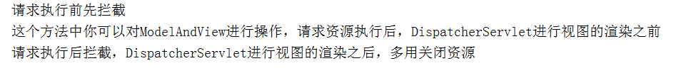

# SpringBoot拦截器的简单使用

Web开发中，我们除了使用 Filter 来过滤请web求外，还可以使用Spring提供的HandlerInterceptor（拦截器）。他和Filter(过滤器)类似，但是可以提供比**过滤器更加精准的控制**！拦截器可以在请求执行请求资源的  **前  中  后  三个时间段**进行处理！

## 一、代码实现

> SpringBoot所提供的的拦截器相对来说较为简单，只需要实现***`HandlerInterceptor`***这个接口就可以了

```java
package com.demo.interceptor;

import org.springframework.web.servlet.HandlerInterceptor;
import org.springframework.web.servlet.ModelAndView;

import javax.servlet.http.HttpServletRequest;
import javax.servlet.http.HttpServletResponse;

/**
 * @author huangfu
 */
public class TestInterceptor implements HandlerInterceptor {
    @Override
    public boolean preHandle(HttpServletRequest request, HttpServletResponse response, Object handler) throws Exception {
        System.out.println("请求执行前先拦截");
        return true;
    }

    @Override
    public void postHandle(HttpServletRequest request, HttpServletResponse response, Object handler, ModelAndView modelAndView) throws Exception {
        System.out.println("这个方法中你可以对ModelAndView进行操作，请求资源执行后，DispatcherServlet进行视图的渲染之前");
    }

    @Override
    public void afterCompletion(HttpServletRequest request, HttpServletResponse response, Object handler, Exception ex) throws Exception {
        System.out.println("请求执行后拦截，DispatcherServlet进行视图的渲染之后，多用关闭资源");
    }
}

```

> 然后将这个拦截器注册到配置类

```java
package com.demo.conf;

import com.demo.interceptor.TestInterceptor;
import org.springframework.context.annotation.Configuration;
import org.springframework.web.servlet.config.annotation.InterceptorRegistry;
import org.springframework.web.servlet.config.annotation.WebMvcConfigurer;

@Configuration
public class CorsConfig implements WebMvcConfigurer {
  
    @Override
    public void addInterceptors(InterceptorRegistry registry) {
        registry.addInterceptor(new TestInterceptor())
            	//这个会拦截所求的路径
                .addPathPatterns("/**");
        //.excludePathPatterns("/login")  排除某些路径
    }
}

```

> 运行结果：

