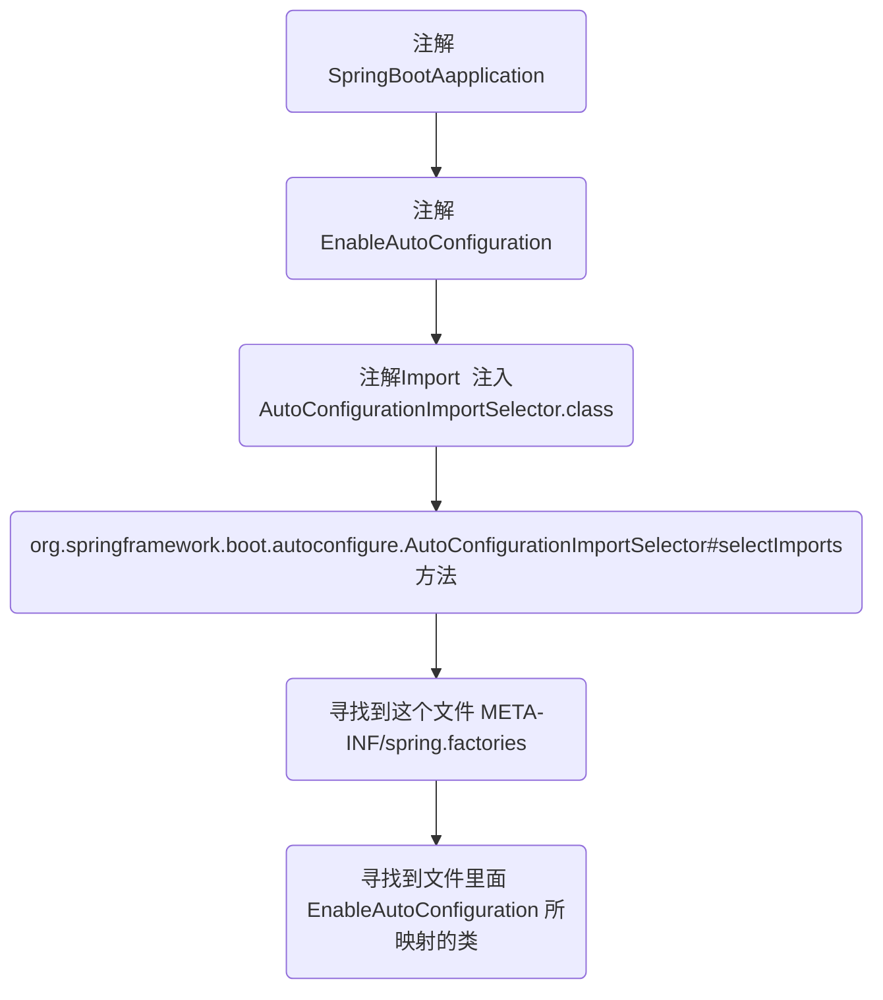
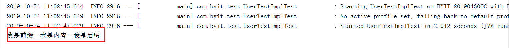

# SpringBoot的自动配置

## springBoot为什么能够0配置？

这个问题需要我们去看一下SpringBoot的源码,先看一下流程图：



==SpringBoot会自动扫描类路径下的 `META-INF/spring.factories` 文件，根据配置加载配置文件，完成自动配置==

spring.factories这个主要是提供了一个功能，就是自动配置，不需要使用@EnableXXX来开启，也就是说只要你用了springboot，并且依赖了一个jar包，这个jar包就会自动进行初始化 ，那么这个过程就是使用了spring.factories这个文件配置

## 为什么会有SrringBoot的自动配置？

举一个应用场景：有一个B项目引用A项目，但是默认情况下@SpringApplication只会扫描类路径下的bean所以A项目的注解就扫描不到！解决这个的办法一个是在B项目上配置扫描A的注解Scan 一种就是让A项目在B项目引用时，自动配置！

## 如何编写自动配置呢？

> pom资源

```xml
    <parent>
        <groupId>org.springframework.boot</groupId>
        <artifactId>spring-boot-starter-parent</artifactId>
        <version>2.1.1.RELEASE</version>
    </parent>

    <dependencies>
        <dependency>
            <groupId>org.springframework.boot</groupId>
            <artifactId>spring-boot-autoconfigure</artifactId>
        </dependency>

        <dependency>
            <groupId>org.springframework.boot</groupId>
            <artifactId>spring-boot-configuration-processor</artifactId>
        </dependency>
    </dependencies>
```


>1.编写配置类，用来映射application.yml里面的参数配置，使我们的自定义组件能够通过配置完成一些特定的功能

注意：@ConfigurationProperties 会飘红线  暂且不用管，是因为没有指定配置所导致的，后面会写

```java
package com.my.properties;


import org.springframework.boot.context.properties.ConfigurationProperties;

/**
 * 配置对应类
 * @author huangfu
 */
@ConfigurationProperties("example.service")
public class ExampleServiceProperties {
    private String prefix;
    private String suffix;

    public String getPrefix() {
        return prefix;
    }

    public void setPrefix(String prefix) {
        this.prefix = prefix;
    }

    public String getSuffix() {
        return suffix;
    }

    public void setSuffix(String suffix) {
        this.suffix = suffix;
    }

    public ExampleServiceProperties(String prefix, String suffix) {
        this.prefix = prefix;
        this.suffix = suffix;
    }

    public ExampleServiceProperties() {
    }
}
```

解释：==@ConfigurationProperties("example.service")== 对应 `application.yml`的前缀

==例如：==

```yaml
example:
  service:
    prefix: @@
    suffix: ##
```

以上这个配置就能对应上面的配置信息类

> 2.编写一个服务 完成我们所需要的功能

这个例子：功能是为在传入参数上面增加一个前缀和后缀！前缀和后缀可以通过yml来配置

```java
package com.my.service;

/**
 * 添加自定义前缀+后缀
 * @author huangfu
 */
public class ExampleService {

    private String prefix;
    private String suffix;

    public ExampleService(String prefix, String suffix) {
        this.prefix = prefix;
        this.suffix = suffix;
    }

    public String join(String content){
        return prefix + content + suffix;
    }
}

```

>3.编写配置类

```java
package com.my.conf;

import com.my.properties.ExampleServiceProperties;
import com.my.service.ExampleService;
import org.springframework.beans.factory.annotation.Autowired;
import org.springframework.boot.autoconfigure.condition.ConditionalOnMissingBean;
import org.springframework.boot.autoconfigure.condition.ConditionalOnProperty;
import org.springframework.boot.context.properties.EnableConfigurationProperties;
import org.springframework.context.annotation.Bean;
import org.springframework.context.annotation.Configuration;

/**
 * @EnableConfigurationProperties 当classpath下发现该类的情况下进行自动配置。
 * @author huangfu
 */
@Configuration
@EnableConfigurationProperties(ExampleServiceProperties.class)
public class ExampleAutoConfigure {

    @Autowired
    private ExampleServiceProperties exampleServiceProperties;

    @Bean
    /**
     * @ConditionalOnProperty 当yml 配置example.service.enabled=true 时，才会触发
     * 仅当 BeanFactory 中不包含指定的 bean class 和/或 name 时条件匹配
     */
    @ConditionalOnMissingBean
    @ConditionalOnProperty(prefix = "example.service" , value = "enabled" ,havingValue = "true")
    public ExampleService exampleService(){
        return new ExampleService(exampleServiceProperties.getPrefix(),exampleServiceProperties.getSuffix());
    }
}

```

> 4.最后一步

在==resources==目录下创建`META-INF/spring.factories文件`，并将配置类`ExampleAutoConfigure`配置进`spring.factories文件`

```properties
org.springframework.boot.autoconfigure.EnableAutoConfiguration=com.my.conf.ExampleAutoConfigure
```

## 引用

打包之后，在其他项目引用

```xml
<dependency>
    <groupId>com.example</groupId>
    <artifactId>example-spring-boot-starter</artifactId>
    <version>1.0-SNAPSHOT</version>
</dependency>

```

> 配置配置文件

```yaml
example:
  service:
    suffix: 我是后缀
    prefix: 我是前缀
    enabled: true
```

> 在使用的地方直接引用

```java
@Autowired
private ExampleService exampleService;

public String example(String content){
    return exampleService.join(content);
}
```


> 结果



