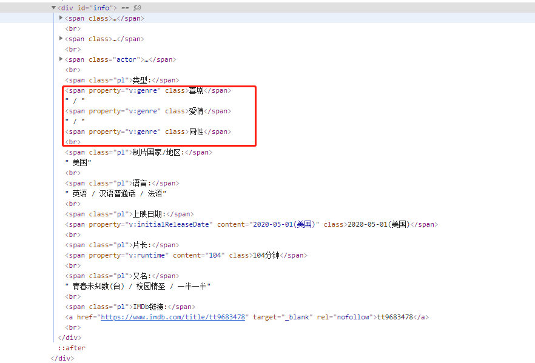
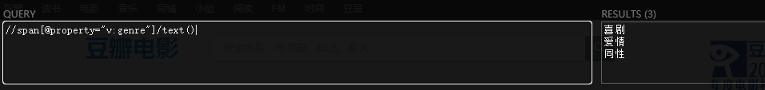
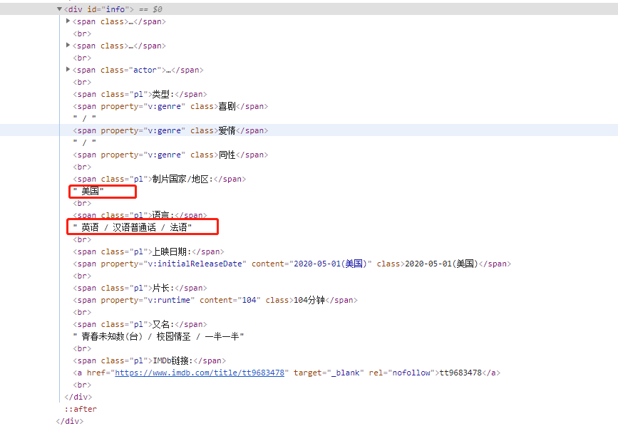
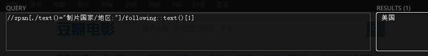
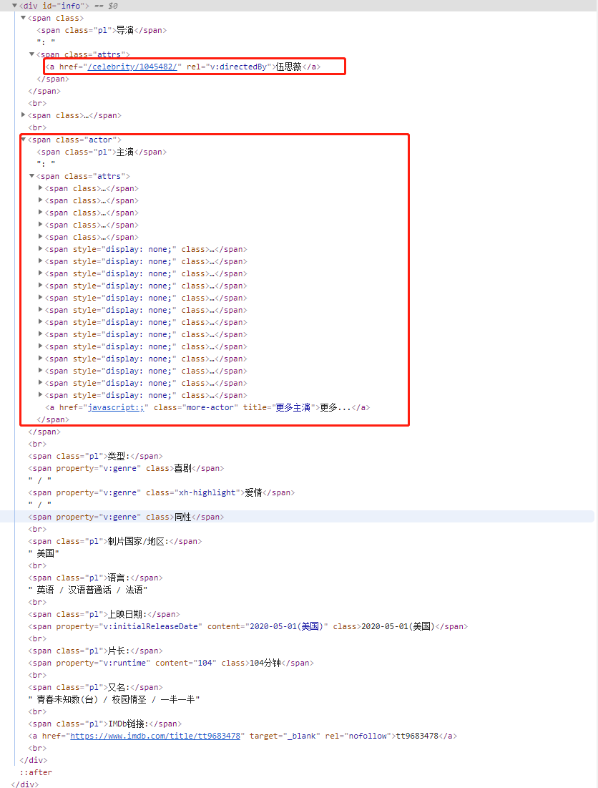

### 1.获取普通标签的文本数据



比如我们想获取这个电影的类型，类比观察，我么就可以看到每个类别前面都有`property="v:genre"`这个属性，所以我们应该将带有这个标签的文本值取出，就是我们想要的电影类型！

```python
//span[@property="v:genre"]/text()
```

这个语法的意思是从根目录寻找所有的 `property="v:genre"`带有这个属性的span标签，并获取里面的文本值。



### 2.xpath解析没有标签的文本数据



这类数据一般没有标签可供使用xpath语法来解析，但是xpath有一种特殊的语法可以解析这个文件！

我们拿获取指派你国家地区作为举例

```python
//span[./text()="制片国家/地区:"]/following::text()[1]
```

这个语法的意思是，解析所有span标签后面的text文本是`"制片国家/地区:"`的标签，取它后面的第一个文本。这样我们就拿到了。



### 3.python提取里面的数据

例如下面的一个格式的html，我们提取里面的部分数据



```python
import requests
from lxml import etree

headers = {
"User-Agent": "Mozilla/5.0 (Windows NT 10.0; Win64; x64) AppleWebKit/537.36 (KHTML, like Gecko) Chrome/83.0.4103.61 Safari/537.36",
"Referer": "https://book.douban.com/subject/33474397/?icn=index-latestbook-subject"
}
url = 'https://movie.douban.com/subject/33420285/?tag=%E7%83%AD%E9%97%A8&from=gaia'
r = requests.get(url,headers = headers).text
html = etree.HTML(r)
title = html.xpath('//span[@property="v:itemreviewed"]/text()')[0]
daoyan = html.xpath('//span[@class="attrs"]/a[@rel="v:directedBy"]/text()')[0]
zhuyans = html.xpath('//span[@class="actor"]/span[@class="attrs"]/a/text()')
zhuyan = "\n".join(zhuyans)
print("电影名:",title)
print("导演：",daoyan)
print("主演",zhuyan)
```

结果展示：

```tex
D:\python\python.exe "D:/project/python project/lxml_project/lxml1.py"
电影名: 真心半解 The Half of It
导演： 伍思薇
主演 莉娅·刘易斯
丹尼尔·迪默
艾丽克西斯·勒梅尔
沃尔夫冈·诺沃格拉茨
邹兆龙
贝琦·安·贝克
恩里克·穆西安诺
麦金太尔·狄克逊
凯瑟琳·科廷
亚历克·廷彻
邦妮·弗兰纳里
泰勒·克罗泽
斯潘塞·沃瓦克
帕特里克·约翰逊
加比·萨默斯
亚历山卓·巴格特
马克·德巴格
乔纳·福尔肯

Process finished with exit code 0
```

