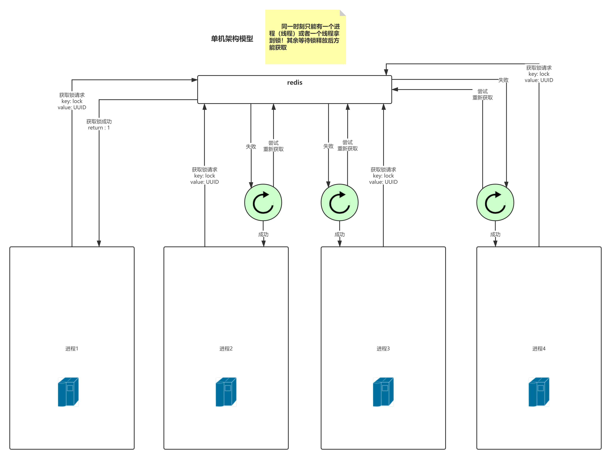
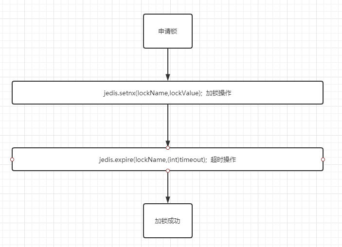
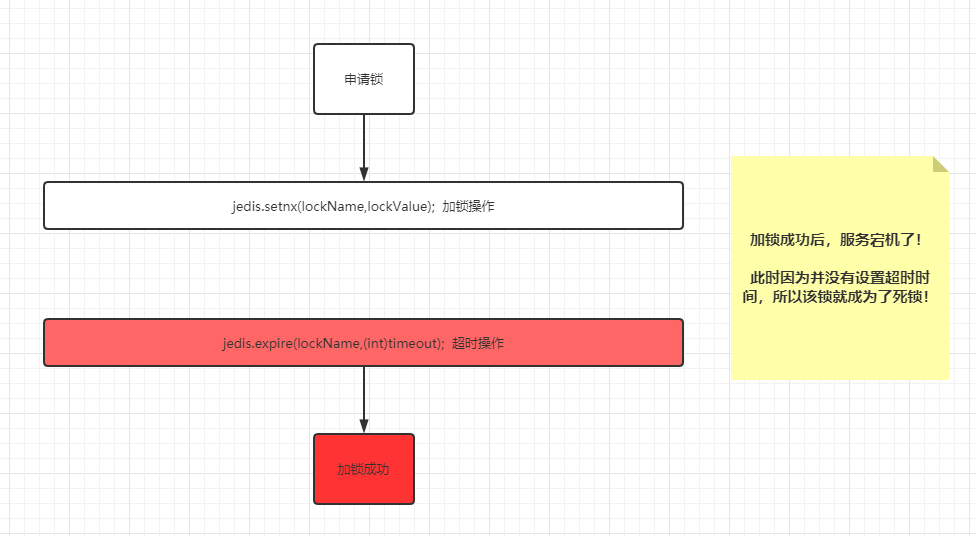
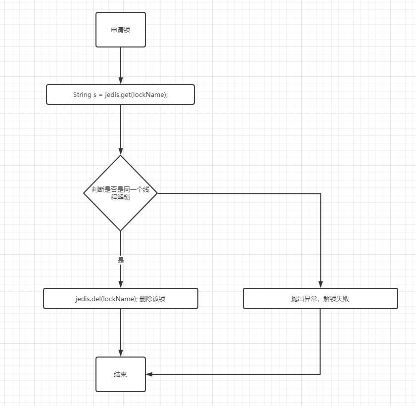
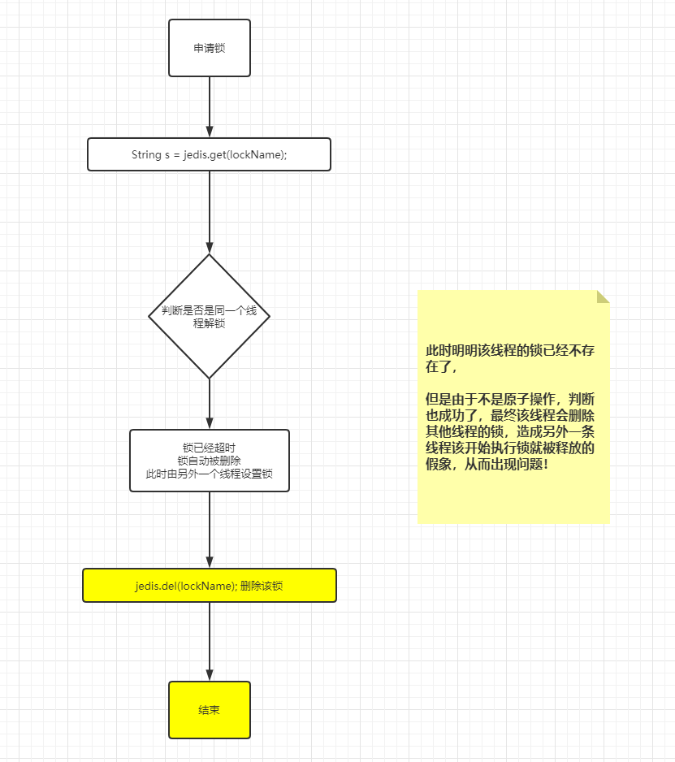

# redis分布式锁实现

随着业务越来越负责，现在的业务，能够支持分布式和高并发是基本的要求，涉及到高并发和分布式就一定会涉及到分布式锁机制，分布式锁就是为了保证分布式环境下，只有一个机器能够拿到锁对象，其余的都需等待该锁释放，再进行申请锁资源！

分布式锁必须遵循以下原则：

1. 同一时刻只能有一个`机器（进程或线程）`能够拿到锁对象！
2. 拥有过期机制，防止机器宕机没有释放锁的情况下造成死锁！
3. 加锁和解锁的必须是一个机器（线程、进程）！
4. 集群环境下，存活机器依旧何以做完整的加解锁操作！

## 一、思路图



## 二、思路图实现

### 1.正确实现

> 该实现由`Jedis`实现，模拟多线程环境下使用分布式锁

```xml
 <!-- https://mvnrepository.com/artifact/redis.clients/jedis -->
<dependency>
    <groupId>redis.clients</groupId>
    <artifactId>jedis</artifactId>
    <version>3.3.0</version>
</dependency>
```

定义接口

```java
package com.lock.jedis;

import java.util.concurrent.TimeUnit;

/**
 * 分布式锁
 * @author huangfu
 */
public interface DistributedLock {

    /**
     * 尝试给线程加锁
     * @param lockName 锁名称
     * @param lockValue 锁值
     * @param timeUnit 时间单位
     * @param time 时间
     * @return 是否加锁成功
     */
    boolean tryLock(String lockName, String lockValue, TimeUnit timeUnit, long time);

    /**
     * 上锁
     * @param lockName 锁名称
     * @param lockValue 锁值
     * @param timeUnit 时间单位
     * @param time 时间
     */
    void lock(String lockName, String lockValue, TimeUnit timeUnit, long time);
    /**
     * 线程解锁
     * @param lockName 即将解锁的锁名称
     */
    void unLock(String lockName);
}
```

Jedis实现分布式锁

```java
package com.lock.jedis.impl;

import com.lock.jedis.DistributedLock;
import redis.clients.jedis.Jedis;
import redis.clients.jedis.JedisPool;
import redis.clients.jedis.JedisPoolConfig;
import redis.clients.jedis.params.SetParams;

import java.util.Collections;
import java.util.concurrent.ThreadLocalRandom;
import java.util.concurrent.TimeUnit;

/**
 * jedis实现分布式锁
 * @author huangfu
 */
public class JedisDistributedLock implements DistributedLock {
    private final static String SCRIPT_UNLOCK_LUA = "if redis.call(\"get\",KEYS[1]) == 																			ARGV[1] then\n" +
                                                 "return redis.call(\"del\",KEYS[1])\n" +
                                             "else\n" +
                                                  "return 0\n" +
                                              "end";
    private final static ThreadLocal<String> THREAD_LOCAL = new ThreadLocal<String>();
    public static final String OK = "OK";
    JedisPool pool;
    public JedisDistributedLock() {
        JedisPoolConfig config = new JedisPoolConfig();
        config.setMaxIdle(8);
        config.setMaxTotal(18);
        pool = new JedisPool(config, "192.168.1.4", 6379, 2000);
    }


    @Override
    public boolean tryLock(String lockName, String lockValue, TimeUnit timeUnit, 
                           											long time) {
        Jedis jedis = pool.getResource();
        try {
            long timeout = timeUnit.toSeconds(time);
            SetParams setParams = new SetParams();
            setParams.nx();
            setParams.ex((int)timeout);
            String result = jedis.set(lockName, lockValue, setParams);
            if (OK.equals(result)) {
                THREAD_LOCAL.set(lockValue);
                return true;
            }else{
                return false;
            }
        }finally {
            jedis.close();
        }

    }

    @Override
    public void lock(String lockName, String lockValue, TimeUnit timeUnit, long time) {
        if (tryLock(lockName,lockValue,timeUnit,time)) {
            return;
        } else {
            try {
                Thread.sleep(ThreadLocalRandom.current().nextInt(2000,3000));
            } catch (InterruptedException e) {
                e.printStackTrace();
            }
            lock(lockName,lockValue,timeUnit,time);
        }
    }
    @Override
    public void unLock(String lockName) {
        Jedis jedis = pool.getResource();
        Object eval = jedis.eval(SCRIPT_UNLOCK_LUA, Collections.singletonList(lockName), 										Collections.singletonList(THREAD_LOCAL.get()));
        if(Integer.parseInt(eval.toString()) == 0){
            jedis.close();
            throw new RuntimeException("解锁失败!");
        }
        THREAD_LOCAL.remove();
    }
}
```

### 2. 代码注释

1. 为什么要设置过期时间
   - 保证再服务宕机时，锁依旧能够被正常释放！
2. 为什么删除锁的时候会进行判断值操作？
   - 多线程环境下，对于锁而言，本线程只能删除本线程加的锁，无法删除别的线程加的锁！这里举例用UUID来实现值的唯一性

3. `tryLock`方法中为什么要使用 `SetParams`承载 setnx参数？为很么删除锁时要使用`lua`脚本来实现？
   - 因为无论时加锁（setnx）操作，还是解锁(del)操作，都必须保证其代码的原子性

```java
SetParams setParams = new SetParams();
setParams.nx();
setParams.ex((int)timeout);
String result = jedis.set(lockName, lockValue, setParams);
```

这段文中的代码等价与

```java
jedis.setnx(lockName,lockValue);
jedis.expire(lockName,(int)timeout);
```

但是为什么不这样写呢？因为redis时单线程，同一时间只能执行一个命令，而这种写法再redis认为是两个命令，那么在多机或者多线程环境下执行时就可能出现问题！

我们看个图，正常情况：



但是，非正常情况下：



> 为很么删除锁时要使用`lua`脚本来实现？

文中代码

```lua
if redis.call("get",KEYS[1]) == ARGV[1] then
	return redis.call("del",KEYS[1])
else
	return 0
end
```

这段lua脚本等同于代码

```java
String s = jedis.get(lockName);
if(THREAD_LOCAL.get().equals(s)){
    jedis.del(lockName);
}
```

这段代码和上面的一样，都保证不了原子性！一起看个图！

`正常情况`



`异常情况`



好了，本期就是使用lua脚本来实现分布式锁的内容了，这个是分布式锁的基本实现的原理，但是再生产环境上使用会有很严重的问题！

1. 现代生产环境都是追求高可用，那么redis在集群环境和哨兵集群环境下如何保证分布式锁的高可用呢？
2. 当前问题并没有保证业务时间绝对小于锁的过期时间，但不确定的业务场景下，依旧会出现分布式锁失效的情况！

以上问题如何解决呢？这个就是明天的内容了！怕文章太长，你们看不下去！哈哈哈！