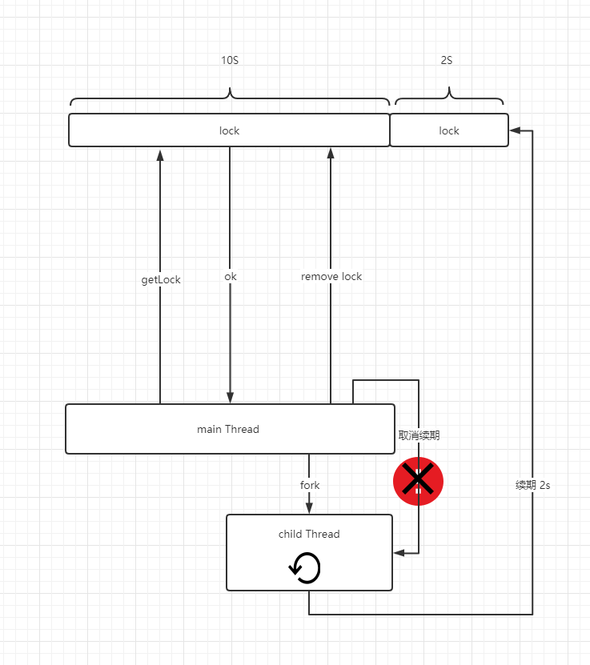

# RedLock究竟是不是Redis分布式锁分布式环境下的银弹？

## 一、概述

在这个技术不断更新迭代的情况下，分布式这个概念，在企业中的权重越来越高！谈及分布式时，不可避免一定会提到分布式锁，现阶段分布式锁的实现方式主流的有三种实现方式,` Zookeeper`、`DB`、`Redis`,我们本篇文章以Redis为例！

从我们的角度来看，这三个属性是有效使用分布式锁所需的最低保证。

1. 安全特性：互斥。在任何给定时刻，只有一个客户端可以持有锁。
2. 活力属性：无死锁。最终，即使锁定资源的客户端崩溃或分区，也始终可以获得锁。
3. 活动性：容错能力。只要大多数Redis节点都处于运行状态，客户端就可以获取和释放锁。

## 二、redis多节点实现分布式锁带来的挑战

我们使用Redis锁定资源的最简单方法是：

1. 在实例中创建锁。
2. 锁通常使用Redis过期功能在有限时间存在，因此最终将被释放，最终超过给定期限会被删除。
3. 当客户端需要释放资源时，它将删除锁。

乍一看，似乎并没有什么问题。但是不妨我们深究一下，这种实现方案在redis单机环境下似乎并没有什么问题！但是如果节点宕了呢？好吧，那么让我们添加一个`slave`节点！如果主服务器宕机了，就使用这个节点！但是我们不妨来看看她真的能保证可用吗？

在谈论这个的致命缺陷时，我们需要了解一个知识点，`Redis复制是异步的。`

1. 客户端A获取主服务器中的锁。
2. 在将锁复制传输到从机之前，主机崩溃。
3. `slave`晋升为`master`。
4. 客户端B获取锁，因为从机并没有该锁的对象，获取成功！

显然，这样是不对的，主节点因为没来得及同步数据就宕机了，所以从节点没有该数据，从而造成分布式锁的失效，那么作者`antirez`的观点是如何解决这个呢？

## 三、Redlock算法

作者认为，我们应该使用多个`Redis`,这些节点是完全独立的，不需要使用复制或者任何协调数据的系统，多个redis系统获取锁的过程就变成了如下步骤：

1. 以毫秒为单位获取当前的服务器时间
2. 尝试使用相同的key和随机值来获取锁，对每一个机器获取锁时都应该有一个超时时间，比如锁的过期时间为10s那么获取单个节点锁的超时时间就应该为5到50毫秒左右，他这样做的目的是为了保证客户端与故障的机器连接，耗费多余的时间！超时间时间内未获取数据就放弃该节点，从而去下一个节点获取，直至将所有节点全部获取一遍！
3. 获取完成后，获取当前时间减去步骤一获取的时间，当且仅当客户端半数以上获取成功且获取锁的时间小于锁额超时时间，则证明该锁生效！
4. 获取锁之后，锁的超时时间等于` 设置的有效时间-获取锁花费的时间 ` 
5. 如果 获取锁的机器不满足半数以上，或者锁的超时时间计算完毕后为负数 等异常操作，则系统会尝试解锁所有实例，即使有些实例没有获取锁成功，依旧会被尝试解锁！
6. 释放锁，只需在所有实例中释放锁，无论客户端是否认为它能够成功锁定给定的实例。

## 四、但是Redlock真能够解决问题吗？

Martin Kleppmann发表文章任务，Redlock并不能保证该锁的安全性！

他认为锁的用途无非两种

> 1. 提升效率，用锁来保证一个任务没有必要被执行两次。比如（很昂贵的计算）
> 2. 保证正确，使用锁来保证任务按照正常的步骤执行，防止两个节点同时操作一份数据，造成文件冲突，数据丢失。

对于第一种原因，我们对锁是有一定宽容度的，就算发生了两个节点同时工作，对系统的影响也仅仅是多付出了一些计算的成本，没什么额外的影响。这个时候 使用单点的 Redis 就能很好的解决问题，没有必要使用RedLock，维护那么多的Redis实例，提升系统的维护成本。

### 1.分布式锁的超时性，所带来的缺点

但是对于第二种场景来说，就比较慎重了，因为很可能涉及到一些金钱交易，如果锁定失败，并且两个节点同时处理同一数据，则结果将导致文件损坏，数据丢失，永久性不一致，或者金钱方面的损失！

我们假设一种场景，我们有两个客户端，每一个客户端必须拿到锁之后才能去保存数据到数据库，我们使用RedLock算法实现会出现什么问题呢？RedLock中，为了防止死锁，锁是具有过期时间的，但是`Martin `认为这是不安全的！该流程图类似于这样！

客户端1获取到锁成功后，开始执行，执行到一半系统发生Full GC ,系统服务被挂起，过段时间锁超时了。

客户端2等待客户端1的锁超时后，成功的获取到锁，开始执行入库操作，完成后，客户端1完成了Full GC,又做了一次入库操作！这是不安全的！如何解决呢？

`Martin `提出来一种类似乐观锁的实现机制，示例图如下：

客户端1长时间被挂起后，客户端2获取到锁，开始写库操作，同时携带令牌 `34`,写库完成后，客户端1苏醒，开始进行入库操作，但是因为携带的令牌为33 小于最新令牌，该次提交就被拒绝！

这个想法听起来似乎时很完备的思路，这样即使系统因为某些原因被挂起，数据也能够被正确的处理。但是仔细想一下：

- 如果仅当您的令牌大于所有过去的令牌时，数据存储区才能始终接受写入，则它是可线性化的存储区，相当与使用数据库来实现一个 分布式锁系统，那么RedLock的作用就变的微乎其微！甚至不在需要使用redis保证分布式锁！

### 2.RedLock对于系统时钟强依赖

回想一下`Redlock算法`获取锁的几个步骤，你会发现锁的有效性是与当前的系统时钟强依赖，我们假设：

我们有，A B C D E 五个redis节点：

1. 客户端1获取节点A，B，C的锁定。由于网络问题，无法访问D和E。
2. 节点C上的时钟向前跳，导致锁过期。
3. 客户端2获取节点C，D，E的锁定。由于网络问题，无法访问A和B。
4. 现在，客户1和2都认为他们持有该锁。

如果C在将锁持久保存到磁盘之前崩溃并立即重新启动，则可能会发生类似的问题。

Martin认为系统时间的阶跃主要来自两个方面（以及作者给出的解决方案）：

1. 人为修改。
   - 对于人为修改，能说啥呢？人要搞破坏没办法避免。
2. 从NTP服务收到了一个跳跃时时钟更新。
   - NTP受到一个阶跃时钟更新，对于这个问题，需要通过运维来保证。需要将阶跃的时间更新到服务器的时候，应当采取小步快跑的方式。多次修改，每次更新时间尽量小。

### 3.基于程序语言弥补分布式锁的超时性所带来的缺点

我们回顾 1 观点，深究抽象出现这个缺陷的根本原因，就是为了解决由于系统宕机带来的锁失效而给锁强加了一个失效时间，异常情况下，程序（业务）执行的时间大于锁失效时间从而造成的一系列的问题，我们能否从这方面去考虑，从而用程序来解决这个样一个死局 呢？

既然是因为锁的失效时间小于业务时间，那么我们想办法保证业务程序执行时间绝对小于锁超时时间不久解决了？

java语言中[`redisson`](https://redisson.org/)实现了一种保证锁失效时间绝对大于业务程序执行时间的机制。官方叫做看门狗机制（Watchdog），他的主要原理是，在程序成功获取锁之后，会fork一条子线程去不断的给该锁续期，直至该锁释放为止！他的原理图大概如下所示：

redisson使用守护线程来进行锁的续期，（守护线程的作用：当**主线程**销毁，会和**主线程**一起销毁。）防止程序宕机后，线程依旧不断续命，造成死锁！

另外，Redisson还实现并且优化了 RedLock算法、公平锁、可重入锁、连锁等操作，使Redis分布式锁的实现方式更加简便高效！