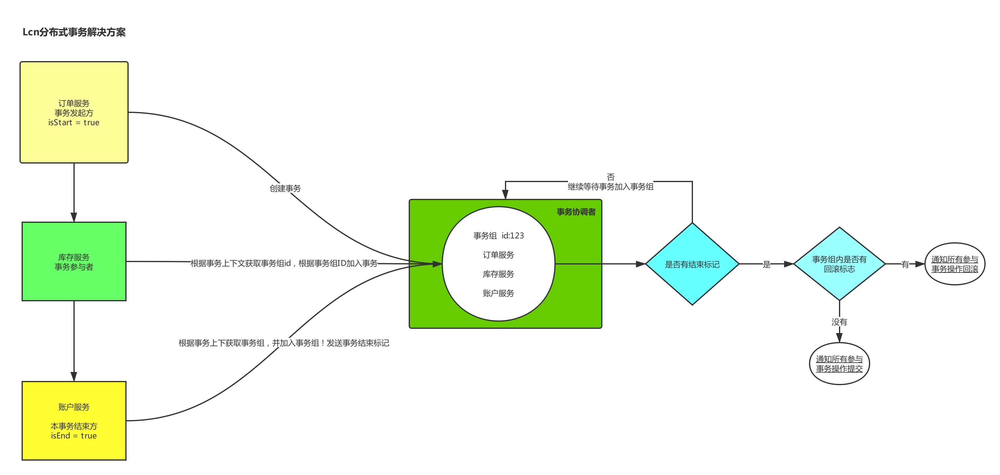
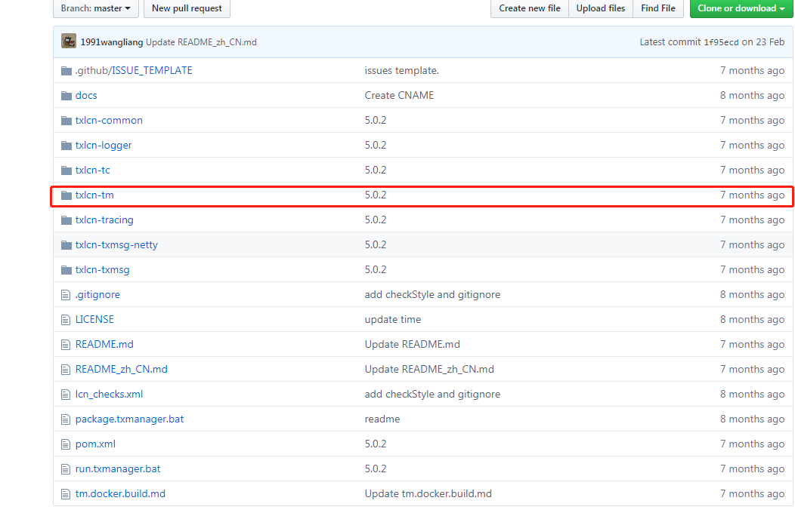
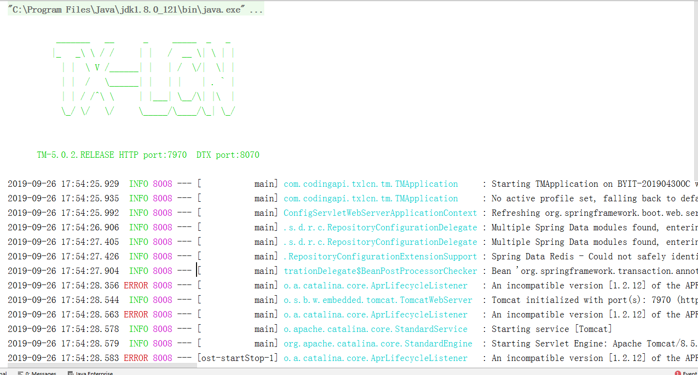

# Lcn分布式事务流程实现（启动事务协调者）


## 一、lcn流程图实现



##  二、Lcn介绍

### 1. tx-lcn

1.正如官网所说的：LCN并不生产事务，LCN只是本地事务的协调工！

Lcn本身不会产生事务，也不会涉及到某些业务代码！他对事务的操作本身就依赖一个事务协调者服务


**如上图所说的一样  他分为4个步骤**

1. 服务发起者 在事务协调者内创建事务组，并将本事务加入事务组
2. 事务参与者加入事务组，直到有结束标记出现
3. 事务协调者向所有的事务参与者发送询问，是否能够提交！全部提交则事务组提交！有一个回滚标记则事务组回滚！
4. 事务组执行操作之后，释放所有锁资源！

## 三、代码案例

### 1 创建数据库 tx-manager

> 创建表

```sql
CREATE TABLE `t_tx_exception`  (
  `id` bigint(20) NOT NULL AUTO_INCREMENT,
  `group_id` varchar(64) CHARACTER SET utf8mb4 COLLATE utf8mb4_general_ci NULL DEFAULT NULL,
  `unit_id` varchar(32) CHARACTER SET utf8mb4 COLLATE utf8mb4_general_ci NULL DEFAULT NULL,
  `mod_id` varchar(128) CHARACTER SET utf8mb4 COLLATE utf8mb4_general_ci NULL DEFAULT NULL,
  `transaction_state` tinyint(4) NULL DEFAULT NULL,
  `registrar` tinyint(4) NULL DEFAULT NULL,
  `remark` varchar(4096) NULL DEFAULT  NULL,
  `ex_state` tinyint(4) NULL DEFAULT NULL COMMENT '0 未解决 1已解决',
  `create_time` datetime(0) NULL DEFAULT NULL,
  PRIMARY KEY (`id`) USING BTREE
) ENGINE = InnoDB AUTO_INCREMENT = 1 CHARACTER SET = utf8mb4 COLLATE = utf8mb4_general_ci ROW_FORMAT = Dynamic;
```

### 

### 2.引入事务协调者，并启动

> github:https://github.com/codingapi/tx-lcn.git



将标记的项目加入IDEA，并修改配置文件

```properties
spring.application.name=tx-manager
server.port=7970

spring.datasource.driver-class-name=com.mysql.jdbc.Driver
spring.datasource.url=jdbc:mysql://127.0.0.1:3306/tx-manager?characterEncoding=UTF-8
spring.datasource.username=root
spring.datasource.password=root

mybatis.configuration.map-underscore-to-camel-case=true
mybatis.configuration.use-generated-keys=true

#tx-lcn.logger.enabled=true
# TxManager Host Ip
#tx-lcn.manager.host=127.0.0.1
# TxClient连接请求端口
#tx-lcn.manager.port=8070
# 心跳检测时间(ms)
#tx-lcn.manager.heart-time=15000
# 分布式事务执行总时间
#tx-lcn.manager.dtx-time=30000
#参数延迟删除时间单位ms
#tx-lcn.message.netty.attr-delay-time=10000
#tx-lcn.manager.concurrent-level=128
# 开启日志
#tx-lcn.logger.enabled=true
#logging.level.com.codingapi=debug
#redis 主机
#spring.redis.host=127.0.0.1
#redis 端口
#spring.redis.port=6379
#redis 密码
#spring.redis.password=
```

> 以上的配置详情介绍

```properties
spring.application.name=TransactionManager
server.port=7970

# JDBC 数据库配置
spring.datasource.driver-class-name=com.mysql.jdbc.Driver
spring.datasource.url=jdbc:mysql://127.0.0.1:3306/tx-manager?characterEncoding=UTF-8
spring.datasource.username=root
spring.datasource.password=123456

# 数据库方言
spring.jpa.database-platform=org.hibernate.dialect.MySQL5InnoDBDialect

# 第一次运行可以设置为: create, 为TM创建持久化数据库表
spring.jpa.hibernate.ddl-auto=validate

# TM监听IP. 默认为 127.0.0.1
tx-lcn.manager.host=127.0.0.1

# TM监听Socket端口. 默认为 ${server.port} - 100
tx-lcn.manager.port=8070

# 心跳检测时间(ms). 默认为 300000
tx-lcn.manager.heart-time=300000

# 分布式事务执行总时间(ms). 默认为36000
tx-lcn.manager.dtx-time=8000

# 参数延迟删除时间单位ms  默认为dtx-time值
tx-lcn.message.netty.attr-delay-time=${tx-lcn.manager.dtx-time}

# 事务处理并发等级. 默认为机器逻辑核心数5倍
tx-lcn.manager.concurrent-level=160

# TM后台登陆密码，默认值为codingapi
tx-lcn.manager.admin-key=codingapi

# 分布式事务锁超时时间 默认为-1，当-1时会用tx-lcn.manager.dtx-time的时间
tx-lcn.manager.dtx-lock-time=${tx-lcn.manager.dtx-time}

# 雪花算法的sequence位长度，默认为12位.
tx-lcn.manager.seq-len=12

# 异常回调开关。开启时请制定ex-url
tx-lcn.manager.ex-url-enabled=false

# 事务异常通知（任何http协议地址。未指定协议时，为TM提供内置功能接口）。默认是邮件通知
tx-lcn.manager.ex-url=/provider/email-to/***@**.com


# 开启日志,默认为false
tx-lcn.logger.enabled=true
tx-lcn.logger.enabled=false
tx-lcn.logger.driver-class-name=${spring.datasource.driver-class-name}
tx-lcn.logger.jdbc-url=${spring.datasource.url}
tx-lcn.logger.username=${spring.datasource.username}
tx-lcn.logger.password=${spring.datasource.password}

# redis 的设置信息. 线上请用Redis Cluster
spring.redis.host=127.0.0.1
spring.redis.port=6379
spring.redis.password=
```

### 3  启动事务协调者

