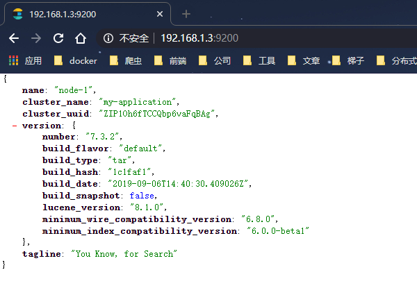
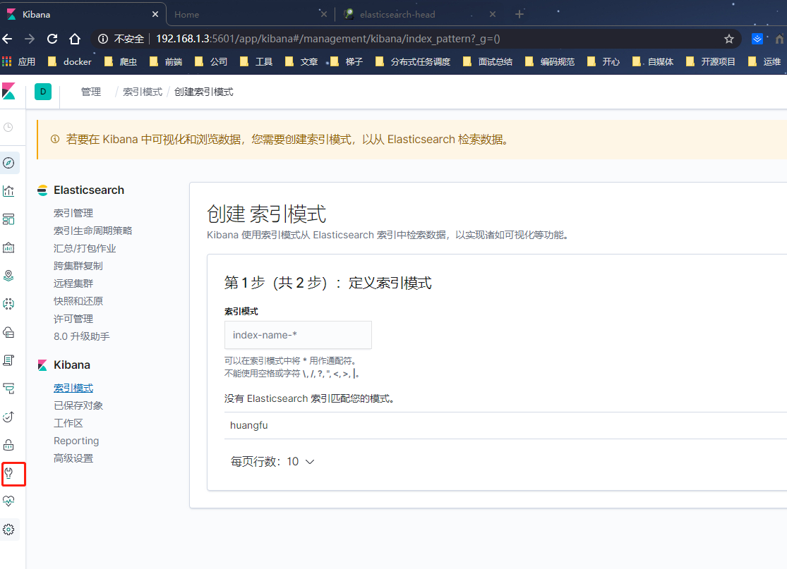

### 1.单机环境下es配置

```shell
[root@192 bin]# ./elasticsearch
future versions of Elasticsearch will require Java 11; your Java version from [/usr/java/jdk1.8.0_251-amd64/jre] does not meet this requirement
[2020-05-31T15:26:41,446][WARN ][o.e.b.ElasticsearchUncaughtExceptionHandler] [192.168.1.3] uncaught exception in thread [main]
org.elasticsearch.bootstrap.StartupException: java.lang.RuntimeException: can not run elasticsearch as root
	at org.elasticsearch.bootstrap.Elasticsearch.init(Elasticsearch.java:163) ~[elasticsearch-7.3.2.jar:7.3.2]
	at org.elasticsearch.bootstrap.Elasticsearch.execute(Elasticsearch.java:150) ~[elasticsearch-7.3.2.jar:7.3.2]
	at org.elasticsearch.cli.EnvironmentAwareCommand.execute(EnvironmentAwareCommand.java:86) ~[elasticsearch-7.3.2.jar:7.3.2]
	at org.elasticsearch.cli.Command.mainWithoutErrorHandling(Command.java:124) ~[elasticsearch-cli-7.3.2.jar:7.3.2]
	at org.elasticsearch.cli.Command.main(Command.java:90) ~[elasticsearch-cli-7.3.2.jar:7.3.2]
	at org.elasticsearch.bootstrap.Elasticsearch.main(Elasticsearch.java:115) ~[elasticsearch-7.3.2.jar:7.3.2]
	at org.elasticsearch.bootstrap.Elasticsearch.main(Elasticsearch.java:92) ~[elasticsearch-7.3.2.jar:7.3.2]
Caused by: java.lang.RuntimeException: can not run elasticsearch as root
	at org.elasticsearch.bootstrap.Bootstrap.initializeNatives(Bootstrap.java:105) ~[elasticsearch-7.3.2.jar:7.3.2]
	at org.elasticsearch.bootstrap.Bootstrap.setup(Bootstrap.java:172) ~[elasticsearch-7.3.2.jar:7.3.2]
	at org.elasticsearch.bootstrap.Bootstrap.init(Bootstrap.java:349) ~[elasticsearch-7.3.2.jar:7.3.2]
	at org.elasticsearch.bootstrap.Elasticsearch.init(Elasticsearch.java:159) ~[elasticsearch-7.3.2.jar:7.3.2]
	... 6 more
```

> es 6.x之后就不能使用root用户启动了，所以需要新建用户解决方案如下

```shell
# 创建用户组
[root@192 bin]# groupadd huangfu
# 将用户添加进用户组
[root@192 bin]# useradd huangfu -g huangfu
#切换用户
[root@192 bin]# su huangfu
[huangfu@192 bin]$ ./elasticsearch
```

> 创建用户后依旧启动报错

```shell
[huangfu@192 bin]$ ./elasticsearch
future versions of Elasticsearch will require Java 11; your Java version from [/usr/java/jdk1.8.0_251-amd64/jre] does not meet this requirement
Exception in thread "main" java.nio.file.AccessDeniedException: /opt/elasticsearch/elasticsearch-7.3.2/config/jvm.options
	at sun.nio.fs.UnixException.translateToIOException(UnixException.java:84)
	at sun.nio.fs.UnixException.rethrowAsIOException(UnixException.java:102)
	at sun.nio.fs.UnixException.rethrowAsIOException(UnixException.java:107)
	at sun.nio.fs.UnixFileSystemProvider.newByteChannel(UnixFileSystemProvider.java:214)
	at java.nio.file.Files.newByteChannel(Files.java:361)
	at java.nio.file.Files.newByteChannel(Files.java:407)
	at java.nio.file.spi.FileSystemProvider.newInputStream(FileSystemProvider.java:384)
	at java.nio.file.Files.newInputStream(Files.java:152)
	at org.elasticsearch.tools.launchers.JvmOptionsParser.main(JvmOptionsParser.java:61)
```

> 这是因为没有权限，所以需要将权限修改为新创建的那个用户

```shell
[root@192 elasticsearch]# chown -R huangfu:huangfu elasticsearch-7.3.2/
```

> 再次执行命令

```shell
#切换用户
[root@192 bin]# su huangfu
[huangfu@192 bin]$ ./elasticsearch
```

```shell
future versions of Elasticsearch will require Java 11; your Java version from 
...
[2020-05-31T15:36:49,118][INFO ][o.e.c.m.MetaDataIndexTemplateService] [192.168.1.3] adding template [.monitoring-beats] for index patterns [.monitoring-beats-7-*]
[2020-05-31T15:36:49,244][INFO ][o.e.c.m.MetaDataIndexTemplateService] [192.168.1.3] adding template [.monitoring-alerts-7] for index patterns [.monitoring-alerts-7]
[2020-05-31T15:36:49,379][INFO ][o.e.c.m.MetaDataIndexTemplateService] [192.168.1.3] adding template [.monitoring-kibana] for index patterns [.monitoring-kibana-7-*]
[2020-05-31T15:36:49,554][INFO ][o.e.x.i.a.TransportPutLifecycleAction] [192.168.1.3] adding index lifecycle policy [watch-history-ilm-policy]
[2020-05-31T15:36:50,007][INFO ][o.e.l.LicenseService     ] [192.168.1.3] license [6533531c-753a-4134-ad95-be1bb3e19cc1] mode [basic] - valid
[2020-05-31T15:36:50,008][INFO ][o.e.x.s.s.SecurityStatusChangeListener] [192.168.1.3] Active license is now [BASIC]; Security is disabled
```

> 启动成功了，但是此时外网是无法访问的，所以我们需要进行配置

```shell
# 修改 /elasticsearch-7.3.2/config/elasticsearch.yml文件

# ---------------------------------- Network -----------------------------------
#
# Set the bind address to a specific IP (IPv4 or IPv6):
#
network.host: 0.0.0.0
#
# Set a custom port for HTTP:
#
http.port: 9200
#
# For more information, consult the network module documentation.
#
# --------------------------------- Discovery ----------------------------------
```

> 再次启动依旧会报错

```shell
ERROR: [3] bootstrap checks failed
# 最大文件数太小了，需要增大最大文件数
[1]: max file descriptors [4096] for elasticsearch process is too low, increase to at least [65535]
# jvm的最大值也太小了，需要增加
[2]: max virtual memory areas vm.max_map_count [65530] is too low, increase to at least [262144]
# 没有启动引导
[3]: the default discovery settings are unsuitable for production use; at least one of [discovery.seed_hosts, discovery.seed_providers, cluster.initial_master_nodes] must be configured

```

> 一共是三个错，一口气改了

```shell
#--------------------------------------------------------
vim /etc/sysctl.conf
# 增加
vm.max_map_count = 655360
# 保存后执行刷新命令
[root@192 bin]# sysctl -p
vm.max_map_count = 655360
#--------------------------------------------------------
vim /etc/security/limits.conf
# 增加 注意不要写在最后一行   在 End of file之前
* soft nofile 65536
* hard nofile 131072
* soft nproc 2048
* hard nproc 4096
#--------------------------------------------------------
```

> 修改保存后 再次启动还会报错

```shell
...
ERROR: [1] bootstrap checks failed
[1]: the default discovery settings are unsuitable for production use; at least one of [discovery.seed_hosts, discovery.seed_providers, cluster.initial_master_nodes] must be configured
...
```

>修改 /elasticsearch-7.3.2/config/elasticsearch.yml文件

```shell
# 集群名称 这个很重要，集群环境下，他会一个集群的标识 
cluster.name: my-application
#
# ------------------------------------ Node ------------------------------------
#
# Use a descriptive name for the node:
# 节点名称 集群中每一个节点的名称
node.name: node-1
# 集群环境下有多少节点
cluster.initial_master_nodes: ["node-1"]
```

> 修改保存后，再次进入Bin目录启动，启动成功，单机环境配置成功

```shell
[huangfu@192 elasticsearch-7.3.2]$ cd bin/
[huangfu@192 bin]$ ./elasticsearch
```

> 浏览器访问 `http://192.168.1.3:9200/`



> 如上 启动成功，es单机环境配置成功

```shell
# 守护线程启动es
[huangfu@192 bin]$ ./elasticsearch -d
```

### 2. Kibana的安装

> 他默认也是不能用root启动的，我们修改下权限

```shell
[root@192 elasticsearch]# chown -R huangfu:huangfu kibana-7.3.2-linux-x86_64/
[root@192 elasticsearch]# cd kibana-7.3.2-linux-x86_64/
[root@192 kibana-7.3.2-linux-x86_64]# cd config/
[root@192 config]# vim kibana.yml
# ----------------------------------配置-------------------------------------------
server.port: 5601
server.host: "0.0.0.0"
elasticsearch.hosts: ["http://192.168.1.3:9200"]
# ------将语言修改为中文
i18n.locale: "zh-CN"
```

> 启动

```shell
[root@192 config]# cd ../bin/
[root@192 bin]# su huangfu
[huangfu@192 bin]$ ./kibana
# 后台启动
[huangfu@192 bin]$ nohup ./kibana &
```

> 访问`http://192.168.1.3:5601/`



启动成功 `9935`

