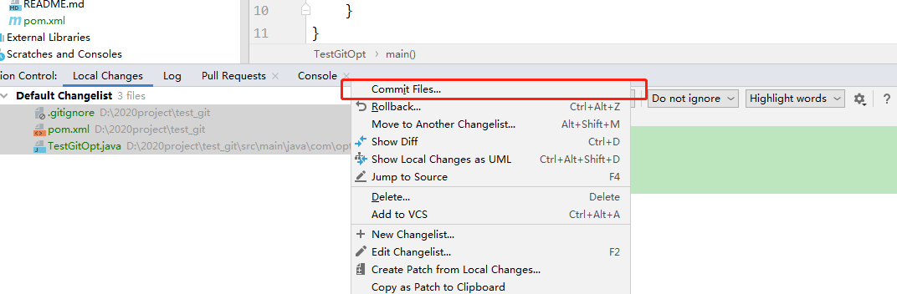
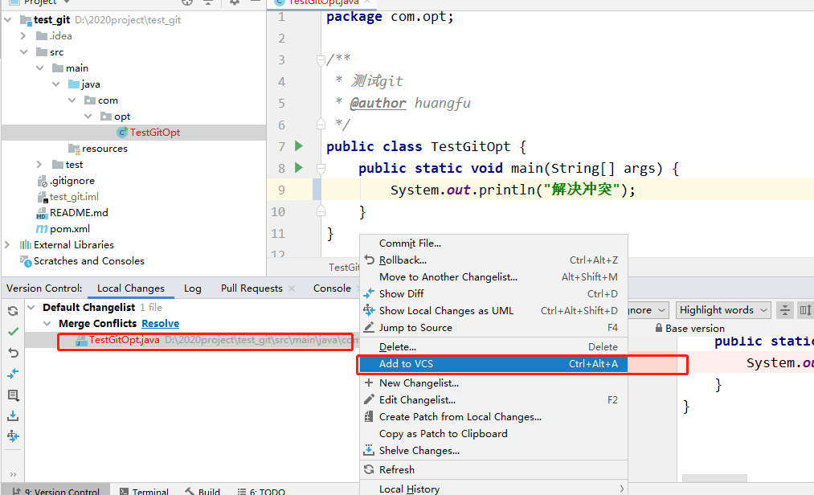

# IDEA快捷键

**Alt+7：查看当前类所有的方法**

**Ctrl+Z：撤销**

**Ctrl+Shift+Z：重做**

**Ctrl+X：剪贴**

**Ctrl+C：复制**

**Ctrl+V：粘贴**

**Ctrl+Y：删除当前行**

**Ctrl+D:复制当前行**

**Ctrl+Shift+J：将选中的行合并成一行**

**Ctrl+N：查找类文件**

**Ctrl+Shift+N：查找文件**

**Ctrl+G：定位到文件某一行**

**Alt+向左箭头：返回上次光标位置**

**Alt+向右箭头：返回至后一次光标位置**

**Ctrl+Shift+Backspace：返回上次编辑位置**

**Ctrl+Shift+反斜杠：返回后一次编辑位置**

**Ctrl+B：定位至变量定义的位置**

**Ctrl+Alt+B：定位至选中类或者方法的具体实现**

**Ctrl+Shift+B:直接定位至光标所在变量的类型定义**

**Ctrl+U：直接定位至当前方法override或者implements的方法定义处**

**Ctrl+F12：显示当前文件的文件结构**

**Ctrl+Alt+F12：显示当前文件的路径，并可以方便的将相关父路径打开**

**Ctrl+H：显示当前类的继承层次**

**Ctrl+Shift+H：显示当前方法的继承层次**

**Ctrl+Alt+H：显示当前方法的调用层次**

**F2：定位至下一个错误处**

**Shift+F2：定位至前一个错误处**

**Ctrl+Alt+向上箭头：查找前一个变量共现的地方**

**Ctrl+Alt+向下箭头：查找下一个变量共现的地方**

**Ctrl+=：展开代码**

**Ctrl+-：收缩代码**

**Ctrl+Alt+=：递归展开代码**

**Ctrl+Alt+-：递归收缩代码**

**Ctrl+Shift+=：展开所有代码**

**Ctrl+Shift+-：收缩所有代码**

**Ctrl+Shitft+向下箭头：将光标所在的代码块向下整体移动**

**Ctrl+Shift+向上箭头：将光标所在的代码块向上整体移动**

**Ctrl+Alt+Shift+向左箭头：将元素向左移动**

**Ctrl+Alt+Shift+向右箭头：将元素向右移动**

**Alt+Shift+向下箭头：将行向下移动**

**Alt+Shift+向上箭头：将行向上移动**

**Ctrl+F：在当前文件中查找**

**Ctrl+R：替换字符串**

**Ctrl+Shift+F:在全局文件中查找字符串**

**Ctrl+Shift+R：在全局中替换字符串**

**Alt+F7：查找当前变量的使用，并列表显示**

**Ctrl+Alt+F7：查找当前变量的使用，并直接对话框提示**

**Ctrl+F7：在文件中查找符号的使用**

**Ctrl+Shift+F7：在文件中高亮显示变量的使用**

**Ctrl+O：重写基类方法**

**Ctrl+I：实现基类或接口中的方法**

**Alt+Insert：产生构造方法，get/set方法等**

**Ctrl+Alt+T：将选中的代码使用if，while，try/catch等包装**

**Ctrl+Shitf+Delete：去除相关的包装代码**

**Alt+/：自动完成**

**Alt+Enter：自动提示完成，抛出异常**

**Ctrl+J：插入Live Template 快速插入一行或者多行代码**

**Ctrl+Alt+J：使用Live Template包装**

**Ctrl+/：使用//注释**

**Ctrl+Shift+/：使用/\**/注释**

**Ctrl+Alt+L：格式化代码**

**Ctrl+Alt+I：自动缩进行**

**Ctrl+Alt+O：优化import**

**Ctrl+]：快速跳转至诸如{}围起来的代码块的结尾处**

**Ctrl+[：快速跳转至诸如{}围起来的代码块的开头处**

**Ctrl+Shift+Enter：将输入的if，for，函数等等补上{}或者；使代码语句完整**

**Shift+Enter：在当前行的下方开始新行**

**Ctrl+Alt+Enter：在当前行的上方插入新行**

**Ctrl+Delete：删除光标所在至单词结尾处的所有字符**

**Ctrl+Backspace：删除光标所在至单词开头处的所有字符**

**Ctrl+向左箭头：将光标移至前一个单词**

**Ctrl+向右箭头：将光标移至后一个单词**

**Ctrl+向上箭头：向上滚动一行**

**Ctrl+向下箭头：向下滚动一行**

**Ctrl+W：选中整个单词**

**Ctrl+Shift+U：切换大小写**

**Shift+F6：重命名**

**Ctrl+F6：更改函数签名**

**Ctrl+Shift+F6：更改类型**

# 二、IDEA git操作

## 一、将文件添加到暂存区

**对应快捷键   ctrl+alt+a**

> 操作说明 ：
>
> ​	1.找到对应的文件，打开后按快捷键
>
> ​	2.在下方工具栏里找到`Local Changes(只有git项目才有这个选项)` 选中一个或多个文件右击  选择add to VCS添加到暂存区！

>**图一**

## 二、忽略文件

> 被红色实线框选的地方有两个文件夹：
>
> `Default Changelist:`文件夹是已经被添加到暂存区的文件（后续更改idea会自动完成添加暂存区的修改）
>
> `Unversioned Files:`文件夹是没有被添加到暂存区的文件，里面包含着我们不需要提交的idea配置文件，为了避免混淆，通常我们会把这个系统配置文件添加到忽略文件中！使其不再显示未提交，具体操作如下！
>
> ​	我的idea版本:`IntelliJ IDEA 2019.3.1 x64` 每个idea版本的操作方法不一致，如果实在找不到也可在git项目的根目录创建`.gitignore` 文件  在里面标注需要忽略的文件，具体操作百度！
>
> ​	使用idea工具操作的方式如下：
>
> ​		1.找到需要忽略的文件
>
> ​		2.右击需要忽略的文件，选择 `Add to .gitignore`   选项，具体操作看图二
>
> ​		3.然后你会在 `.gitignore` 文件里面看到你刚刚添加的忽略文件
>
> ​		4.将 `.gitignore`文件添加到暂存区  提交到远程（具体操作看后续）

>**图一**

>**图二**

>**图三**

## 三、取消添加到暂存区

> 如果我们想将已经添加到暂存区的文件移动出暂存区的话做如下操作
>
> 对应快捷键   **Ctrl+Alt+Z**  打开要移除的文件  按快捷键
>
> 		1. 在暂存区内找到该文件
>   		2. 右击选择该文件
>   		3. 选择 `Rollback` 操作看图一   结果看图二

> **图一**
>
> 

> **图二：**
>
> 

## 四、Commit 操作

> 如何进行 提交到本地仓库操作呢（Commit ）？
>
> 		1. 选中一个或者多个要提交的文件，右击选择`Commit Files` 具体操作看图一：（记得第一次提交要把`.gitignore`文件提交了，他是记录忽略文件的）
>   		2. 在弹出框里 `Commit Message`文本框里添加提交备注后点击`Commit` 具体操作看图二
>   		3. 提交完成后你会发现暂存区被清空了，这就是提交成功的信息 具体看图三

> **图一：**
>
> 

> **图二：**
>
> 

> **图三：**
>
> 

## 五、推送操作

> 如何将本地仓库的文件推送到远程仓库呢？
>
> 快捷键 ： Ctrl+Shift+K
>
> 		1. 右击项目 具体操作看图一
>   		2. 在弹出框里你会看到你到提交信息  选择 push操作就可以推送到远程仓库
>   		3. 第一次提交可能会让你输入 git的用户名和密码，输入即可  

> **图一：**
>
> 

> **图二**
>
> 

## 六、拉取操作

> 我们需要从远程仓库拉取代码
>
> 		1. 右击项目
>   		2. 选择git 具体看图一
>   		3. 或者看图二   也可以拉取

> **图一：**
>
> 

> 图二：
>
> 

## 七、解决冲突

> 如何解决冲突呢？
>
>   1. 在提交时发生了冲突 具体报错信息查看`图一`
>
>      I.选择`ReBase` 会将远程冲突代码与本地代码强行合并，通常会出现以下的情况  `图二`！红框是远程文件的内容  绿框是本地文件的内容，这种代码的处理模式就是与上次的代码的提交者一起商讨，去除冲突代码，重新提交!解决冲突后会发现冲突文件是发红的`图三`！重新添加到暂存区后既可解决！具体看 `图四和图五`!然后重新提交和push既可！push时会出现 `图6的状态`选择 `Merge`将代码合并上去即可！实际上我并不喜欢这种方式解决冲突
>
>      II.选择`Merge` 会出现`图7` 再次选择 `Merge` 会出现`图八` ！我们详细观看`图9`  1.代表是你自己本地的修改   2.代表是合并的结果   3.代表的是远程的文件    每一个框上都有一个移动的标签  点一下移动的标签就代表将该代码移动到结果`图10`框里面，`图11`是最终处理结果  最终处理完毕后  重新push即可解决！

> **图一：**
>
> 

> **图二：**
>
> 

> **图三:**
>
> 

> **图四：**
>
> 

> **图五**
>
> 

> 图六
>
> 

> 图7 
>
> 

> **图8**
>
> 

> 图9
>
> 

> 图10
>
> 

> 图11
>
> 