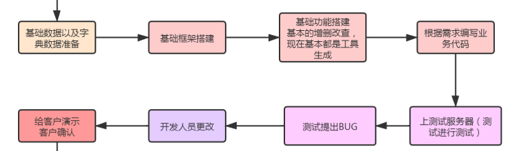
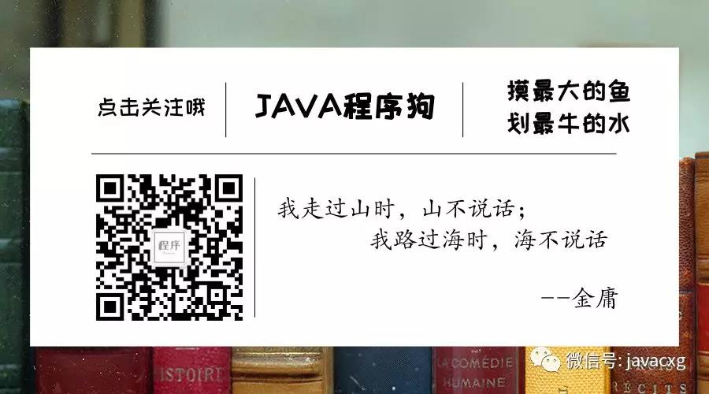

# 企业项目开发流程

对于还没有参与过项目的同学，大都与企业项目开发的流程都感到特别的好奇！项目对于程序员来说像是自己的孩子，自己看着一步一步成熟，完善！最后到独立的运行！然后大多数程序员都如含泪老母亲一样，看这自己的项目嫁出去，嫁到甲方！从此天各一方！咳咳，跑题了！

就我经验而谈，上一家公司是一个传统型企业公司！主要开发的是一些国企的信息管理系统，其实包括你们在内的很多小伙伴，毕业后会有一大部分进入到类似的项目中参与开发！比如银行项目组、中石油开发组、保险项目组等等！这类企业一般都以保守为主！项目开发的速度并不是他们所追求的根本！他们所追求的就是`稳`稳的一批，在一个项目准备开发前会做好各种各样的准备工作，包括项目人员确定，项目周期，项目里程碑等等条件，我们一会会具体说；

在一个就是我现在的一个公司，偏厂商型公司，主推数据中台！这类公司，追求的是对项目的高效开发以及对项目的更新迭代速度有很高的的要求！规定在几号上线，几号完成一个里程碑！完不成就加班加点！这列公司使用的技术，一般都是比较新颖的技术！开发团队一般都是年轻人！开发的步骤较传统型企业公司少！这类的开发模式叫做 `敏捷开发`

下面我们就以上两种公司，探讨一下他的具体流程：

## 一、传统型公司(瀑布式开发)

开发步骤：

传统型企业的开发步骤很麻烦，但是这么多步骤，真正让后台程序员操作的就是  

这几个步骤是后台程序员需要操心的！其中对于页面原型的勾画有时候也需要后台程序员来干，所以建议尽量恶补一下前端的知识！

> 中高级程序员在程序开发时，会参与一部分的数据库字段设计！这对程序员对于程序的整体把控要求很高，需要一定的开发经验，和业务经验，才能设计出比较好的库表结构！
>
> 当然，业务方面的数据库表，需要配合产品经理确定，他们比你更懂业务！

在开发过程中，前后端的数据结构的确认需要依据需求文档来确认！当然需求文档不是万能的，当需求文档设计的数据结构不能满足你的时候，你需要提出来，和前端开发对接；尽快决定你们双方都认同的交互数据结构！当然，如果你不确定，需要和你的老大说一声，以便于甩锅！嗯，就这样！

在传统型企业中，一般都有自己固定的框架体系，一旦你需要引入新颖的技术（你想玩个花样），你就必须和你的老大说一声，他同意后才能去搞！这种类型的公司，一般对于新兴框架极为排斥！特别是银行项目组！一定要等到各方确认后才能使用！务必牢记！我踩过坑，记忆尤深！

还有就是，有些公司会要求你去写前端，恶心不！哈哈；所以学点前端技术尤为重要！

## 二、中小公司、科技型公司、互联网公司

我只是说一下，我也没去过互联网公司，惭愧！但是据我了解，大致的开发流程是一致的！

> 现在对于这种公司，主推的是一种 `敏捷开发` 模型！具体的信息，需要你去百度查！大致的意思是省去了  `需求文档`、`原型勾画`、`客户确认`等步骤，所有的需求和所需的数据结构，皆由开发人员在一起进行商讨！

可以对比一下看到，省去了好多步骤！别抬杠，我们公司就这样！

敏捷开发提倡四点：

- 递增：测试工作不会等到完成后参会去测试！开发人员在完成整个大功能的一小部分时就会生成一个稳定版本，部署到测试服务器，由测试进行测试！开发和改BUG同步进行！
- 避免不必要的开销：全七八糟的文档全部没有，与其讨论要做什么然后在写下来，不如讨论完赶紧去做！他提倡团队一起讨论，邮件或面对面交流！所以一般这种模式都会有周例会，或者早会！总结一天或一周的工作量！
- 协作：根据需求，团队成员一直与其它人进行交互；真正的敏捷精神团队是自助的。他们分配需要做的工作。虽然每个成员承担的任务都在他们的专业技能范围内，他们还是需要与团队协作的；所以，协作共赢，你懂得！
- 说真话：既然敏捷开发，团队的老大就必须对整个项目的进度有一个整体的把控！所以，执行者在汇报时，务必说真话！你所遇到的问题可能会耽搁整个团队的进度！有问题说出来，一起解决！

这种类型的公司，你有什么好东西。好技术，在不影响项目整体进度和性能的情况下，尽管用！但是有个度，你所用的技术，要和项目团队的大部分成员的技术栈匹配；尽量不要出现你用的，其他人都不会！出问题，解决都没人帮你！（**我踩过的坑，惭愧!但是结果是好的，有点安慰！**）

虽然吧，我自己也经常甩锅，但是对于新入职和未来的程序员们！你们要记得，自己多做点，就会多学一点东西！这类公司，也需要你保持终身不断的学习！只会固定的技术栈，你在寒冬中活不下来！

**逐渐暴躁，哈哈哈哈哈！欢迎关注我的公众号！**

