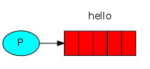

# RabbitMq

## 一、RabbitMq介绍

>**RabbitMQ**是实现了高级消息队列协议（AMQP）的开源消息代理软件（亦称面向消息的中间件）,RabbitMQ服务器是用**Erlang**语言编写的，所以想要使用 **RabbitMQ**就必须要安装**Erlang**语言！

## 二、RabbitMq之HelloWorld

> **RabbitMQ和一般的消息传递使用一些术语。**
>
> ​	**生产仅**：意味着发送。发送消息的程序是*生产者*！
>
> ​	**队列**： 消息从生产者产生后保存在队列内部！
>
> ​	**消费者**：与接收具有相似的含义。一个*消费者*是一个程序，主要是等待接收信息！

### 1.基本消息队列图示


> P是生产者  用户生产消息将消息放入消息队列，C是消费者 ，从队列里将消息取出

### 2.发送消息



> 代码实现如下：

**1.方便起见，首先我们写一个工具类用户获取连接**

```java
package com.util;

import com.rabbitmq.client.Connection;
import com.rabbitmq.client.ConnectionFactory;

import java.io.IOException;
import java.util.concurrent.TimeoutException;

/**
 * 获取MQ的连接
 * @author Administrator
 */
public class MqConnection {
    /**
     * 获取连接的方法
     * @return
     * @throws IOException
     * @throws TimeoutException
     */
    public static Connection getConnection() throws IOException, TimeoutException {
        //连接工厂
        ConnectionFactory connectionFactory = new ConnectionFactory();
        //设置服务地址
        connectionFactory.setHost("127.0.0.1");
        //设置服务端口
        connectionFactory.setPort(5672);
        //设置登录用户
        connectionFactory.setUsername("user");
        connectionFactory.setPassword("user");
        //设置VirtualHost  （相当于数据库  ）
        connectionFactory.setVirtualHost("/user");

        return connectionFactory.newConnection();
    }
}
```

**2.开始书写消息的发送方**

```java
package com.simp;

import com.rabbitmq.client.Channel;
import com.rabbitmq.client.Connection;
import com.util.MqConnection;

import java.io.IOException;
import java.util.concurrent.TimeoutException;

/**
 * 消息生产者
 * @author huangfu
 */
public class Producer {
    private static String QUEUE_NAME = "simp";

    public static void main(String[] args) throws IOException, TimeoutException {
        //获取连接
        Connection connection = MqConnection.getConnection();
        //从连接中获取一个通道
        Channel channel = connection.createChannel();
        /**
         *
         * 创建队列
         * 1.消息队列名
         * 2.是否队列持久化
         * 3.是否为排他队列
         * 4.是否队列自动删除
         * 5.配置项
         */

        channel.queueDeclare(QUEUE_NAME,false,false,false,null);
        /**
         * 发送消息
         * 1.交换机名字
         * 2.队列名字
         * 3.配置
         * 4.消息体
         */
        channel.basicPublish("",QUEUE_NAME,null,"醉卧沙场君莫笑".getBytes());

        channel.close();
        connection.close();
    }
}
```

至此，消息发送成功，我们需要一个消费者来消费

### 3.接收消息

```java
package com.simp;

import com.rabbitmq.client.*;
import com.util.MqConnection;

import java.io.IOException;
import java.util.concurrent.TimeoutException;

/**
 * 消费者
 * @author huangfu
 */
public class Coummer {
    private static String QUEUE_NAME = "simp";
    public static void main(String[] args) throws IOException, TimeoutException {
        //获取连接
        Connection connection = MqConnection.getConnection();
        //创建频道
        Channel channel = connection.createChannel();
        /**
         *
         * 创建队列
         * 1.消息队列名
         * 2.是否队列持久化
         * 3.是否为排他队列
         * 4.是否队列自动删除
         * 5.配置项
         */
        channel.queueDeclare(QUEUE_NAME,false,false,false,null);
        /**
         * 事件触发
         * 一旦有消息进入到队列就会触发这个
         */
        DefaultConsumer defaultConsumer = new DefaultConsumer(channel){
            @Override
            public void handleDelivery(String consumerTag, Envelope envelope, AMQP.BasicProperties properties, byte[] body) throws IOException {
                System.out.println(new String(body,"UTF-8"));
            }
        };
        /**
         * 监听队列
         * 1.要监听的队列名称
         * 2.是否自动应答 （自动确认消息） 确认后将从队列里删除该条消息
         * 3.回调函数
         */
        channel.basicConsume(QUEUE_NAME,true,defaultConsumer);

    }
}

```

