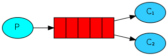
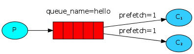

# rabbitmq 工作队列

## 一、rabbitmq 工作队列简介

> 在上一篇文章中，讲述了rabbitmq 消息队列的基本使用，属于一个队列值对应一个消费者，在处理耗时应用时，一个工人处理过慢的话，消息会整个堆积在队列里面，继而可能造成不可预测的影响！
>
> 工作队列又称之为任务队列，他主要就是为了解决在执行密集型耗时任务时，消息可以根据消费者的负荷进行合理的分配，从而不会形成一个消费者忙死，另外一个消费者闲死的情况！

**运行图例**



## 二、普通代码实现


下面 我们可以试着将多个消费者共同消费一个队列的情况！我们发送多条消息到消息队里中！

消费者模拟处理耗时消息，我们用Thread.sleep(2000);来模拟

**消息生产者**

```java
package com.work;

import com.rabbitmq.client.Channel;
import com.rabbitmq.client.Connection;
import com.util.MqConnection;

import java.io.IOException;
import java.util.concurrent.TimeoutException;

/**
 * @author huangfu
 * 工作队列 消息生产者
 * 可以看到一个现象   消费者1和2 虽然处理时间不同 但是处理的数量是一样的
 *
 *            --消费者
 *            =
 * 生产者-----=
 *            =
 *            --消费者
 */
public class WorkProducer {
    private static String QUEUE_NAME = "work";
    public static void main(String[] args) throws IOException, TimeoutException, InterruptedException {
        Connection connection = MqConnection.getConnection();

        Channel channel = connection.createChannel();
		//声明队列
        channel.queueDeclare(QUEUE_NAME,false,false,false,null);

        for (int i = 0; i < 50; i++) {
            String msg = "醉卧沙场君莫笑"+i;
            //生产50条消息，到消息队列
            channel.basicPublish("",QUEUE_NAME,null,msg.getBytes());
            System.out.println(msg);
            Thread.sleep(i*10);
        }

        channel.close();
        connection.close();
    }
}

```

**消费者1**

```java
package com.work;

import com.rabbitmq.client.*;
import com.util.MqConnection;

import java.io.IOException;
import java.util.concurrent.TimeoutException;

/**
 * @author Administrator
 */
public class WorkCoummer {
    private static String QUEUE_NAME = "work";
    public static void main(String[] args) throws IOException, TimeoutException {
        //获取连接
        Connection connection = MqConnection.getConnection();
        //创建频道
        Channel channel = connection.createChannel();
        //声明队列
        channel.queueDeclare(QUEUE_NAME,false,false,false,null);

        //定义一个消费者
        Consumer consumer = new DefaultConsumer(channel){
            @Override
            public void handleDelivery(String consumerTag, Envelope envelope, AMQP.BasicProperties properties, byte[] body) throws IOException {
                System.out.println(new String(body,"UTF-8"));
                try {
                    Thread.sleep(2000);
                } catch (InterruptedException e) {
                    e.printStackTrace();
                }finally {
                    System.out.println("[1] done");
                }
            }
        };

        channel.basicConsume(QUEUE_NAME,true,consumer);
    }
}

```

**消费者2**

```java
package com.work;

import com.rabbitmq.client.*;
import com.util.MqConnection;

import java.io.IOException;
import java.util.concurrent.TimeoutException;

/**
 * @author Administrator
 */
public class WorkCoummer2 {
    private static String QUEUE_NAME = "work";
    public static void main(String[] args) throws IOException, TimeoutException {
        //获取连接
        Connection connection = MqConnection.getConnection();
        //创建频道
        Channel channel = connection.createChannel();
        //声明队列
        channel.queueDeclare(QUEUE_NAME,false,false,false,null);

        //定义一个消费者
        Consumer consumer = new DefaultConsumer(channel){
            @Override
            public void handleDelivery(String consumerTag, Envelope envelope, AMQP.BasicProperties properties, byte[] body) throws IOException {
                System.out.println(new String(body,"UTF-8"));
                try {
                    Thread.sleep(1000);
                } catch (InterruptedException e) {
                    e.printStackTrace();
                }finally {
                    System.out.println("[2] done");
                }
            }
        };

        channel.basicConsume(QUEUE_NAME,true,consumer);
    }
}

```

> 结论：可以看出来，当多个消费者同时消费一个队列时，无论消费者处理多么慢，最终消费者都会处理相同数量的消息！
>
> 比如：上级领导分配任务给两个员工，一个员工分配的任务很麻烦处理的很慢，一个员工分配的任务很简单处理的很快！当依旧是平均分配任务时就会出现一个现象：一个员工累死，一个员工闲死！
>
> 发生这种情况是**因为RabbitMQ在消息进入队列时才调度消息。它不会查看使用者的未确认消息数。它只是盲目地将每第n条消息发送给第n个使用者**。

*请记住这个结论，为了解决这个问题，我们需要了解一个概念：消息确认*

## 三、消息确认

>执行任务可能需要几秒钟。您可能想知道，如果其中一个使用者开始一项漫长的任务而仅部分完成而死掉，会发生什么情况。使用我们当前的代码，RabbitMQ一旦向消费者发送了一条消息，便立即将其标记为删除。在这种情况下，如果您杀死一个工人，我们将丢失正在处理的消息。我们还将丢失所有发送给该特定工作人员但尚未处理的消息。
>
>但是我们不想丢失任何任务。如果一个工人死亡，我们希望将任务交付给另一个工人。
>
>为了确保消息永不丢失，RabbitMQ支持**消息确认**，消费者发送回一个确认（告知），告知RabbitMQ特定的消息已被接收，处理，并且RabbitMQ可以自由删除它。

*可以看出来，当消息队列接收到消息消费者成功接收处理消息之后，回向消息队列发送一个成功的回执，当消息队列接收了回执之后，则会直接删除该数据，当然我们默认是不会自动发送回执的`channel.basicConsume(QUEUE_NAME,true,consumer);`true就证明会默认发送回执，默认是false*


在了解了上面的消息确认之后  我们还需要了解一个概念，可能这个概念在这个位置讲不太合理，但是，这似乎是最好的时机，我们暂时将思绪定位到这个位置！

## 四、消息持久化1

**我们已经学会了如何确保即使消费者死亡，任务也不会丢失。但是，如果RabbitMQ服务器停止，我们的任务仍然会丢失。RabbitMQ退出或崩溃时，它将忘记队列和消息，除非您告知不要这样做。要确保消息不会丢失，需要做两件事：我们需要将队列和消息都标记为持久。**

>`channel.queueDeclare(QUEUE_NAME,true,false,false,null);` 这一行代码的第二个参数就是为了标记是否将消息队列里面的消息进行持久化的！  false不持久化  true持久化

*好了，这两个概念搞明白之后，我们将思绪飘回来，继续讨论一下一个员工累死，一个员工闲死的问题*

## 五、公平派遣

> 为了解决这种情况，我们可以使用mq的设置来解决！
>
> 1.每次让消息队列给一个消费者发送一条消息！
>
> 2.只有在接收到工人发送上一条消息执行完毕的回执之后才会再次分配任务
>
> 3.将自动发送回执，改为手动发送回执！



**所以，我们需要消息队列提供的basicQos（1）来解决这个问题**

## 六、代码实现

> **1.消息生产者**

```java
package com.qos;

import com.rabbitmq.client.Channel;
import com.rabbitmq.client.Connection;
import com.util.MqConnection;

import java.io.IOException;
import java.util.concurrent.TimeoutException;

/**
 * @author huangfu
 * 工作队列 消息生产者
 * 可以看到一个现象   消费者1和2 虽然处理时间不同 但是处理的数量是一样的
 * 这种状态属于轮训分发  公平分发必须关闭自动应答  ACK
 *
 *            --消费者
 *            =
 * 生产者-----=
 *            =
 *            --消费者
 *
 * 如果想要让处理速度快的处理多一点 需要使用basicQos(perfeth=1)
 * 每次只发送一条  只有你处理完成之后我才会给你发送下一条消息
 */
public class QosProducer {
    private static String QUEUE_NAME = "work";
    public static void main(String[] args) throws IOException, TimeoutException, InterruptedException {
        Connection connection = MqConnection.getConnection();

        Channel channel = connection.createChannel();

        channel.queueDeclare(QUEUE_NAME,true,false,false,null);

        /**
         * 告诉消费者每次只发一个给消费者
         * 必须消费者发送确认消息之后我才会发送下一条
         */
        channel.basicQos(1);

        for (int i = 0; i < 50; i++) {
            String msg = "醉卧沙场君莫笑"+i;
            channel.basicPublish("",QUEUE_NAME,null,msg.getBytes());
            System.out.println(msg);
            Thread.sleep(i*10);
        }

        channel.close();
        connection.close();
    }
}

```

> **2.消费者1**

```java
package com.qos;

import com.rabbitmq.client.*;
import com.util.MqConnection;

import java.io.IOException;
import java.util.concurrent.TimeoutException;

/**
 * @author Administrator
 */
public class QosCoummer {
    private static String QUEUE_NAME = "work";
    public static void main(String[] args) throws IOException, TimeoutException {
        //获取连接
        Connection connection = MqConnection.getConnection();
        //创建频道
        final Channel channel = connection.createChannel();
        //声明队列
        channel.queueDeclare(QUEUE_NAME,true,false,false,null);
        /**
         * 告诉消费者每次只发一个给消费者
         * 必须消费者发送确认消息之后我才会发送下一条
         */
        channel.basicQos(1);
        //定义一个消费者
        Consumer consumer = new DefaultConsumer(channel){
            @Override
            public void handleDelivery(String consumerTag, Envelope envelope, AMQP.BasicProperties properties, byte[] body) throws IOException {
                System.out.println(new String(body,"UTF-8"));
                try {
                    Thread.sleep(2000);
                } catch (InterruptedException e) {
                    e.printStackTrace();
                }finally {
                    System.out.println("[1] done");
                    //发送回执
                    channel.basicAck(envelope.getDeliveryTag(),false);
                }
            }
        };
        /**
         * 第二个参数
         *      true:自动确认
         *          一旦mq将消息分发给消费者  就会从内存中删除，会出现消息丢失
         *      false:手动确认（默认）
         *          如果消费者挂掉，我将此消息发送给其他消费者
         *          支持消息应答，当消费者处理完成后发送给生产者回执，删除消息
         *
         *
         *      当消息队列宕了  内存里的数据依旧会丢失，此时需要将数据持久化
         */
        channel.basicConsume(QUEUE_NAME,false,consumer);
    }
}

```

> **3.消费者2**

```java
package com.qos;

import com.rabbitmq.client.*;
import com.util.MqConnection;

import java.io.IOException;
import java.util.concurrent.TimeoutException;

/**
 * @author Administrator
 */
public class QosCoummer2 {
    private static String QUEUE_NAME = "work";
    public static void main(String[] args) throws IOException, TimeoutException {
        //获取连接
        Connection connection = MqConnection.getConnection();
        //创建频道
        final Channel channel = connection.createChannel();
        /**
         * 声明队列
         * 1：队里名字
         * 2：是否进行持久化   false不进行持久化   true进行持久化
         */
        channel.queueDeclare(QUEUE_NAME,true,false,false,null);
        /**
         * 告诉消费者每次只发一个给消费者
         * 必须消费者发送确认消息之后我才会发送下一条
         */
        channel.basicQos(1);
        //定义一个消费者
        Consumer consumer = new DefaultConsumer(channel){
            @Override
            public void handleDelivery(String consumerTag, Envelope envelope, AMQP.BasicProperties properties, byte[] body) throws IOException {
                System.out.println(new String(body,"UTF-8"));
                try {
                    Thread.sleep(1000);
                } catch (InterruptedException e) {
                    e.printStackTrace();
                }finally {
                    System.out.println("[2] done");
                    channel.basicAck(envelope.getDeliveryTag(),false);
                }
            }
        };
        /**
         * 第二个参数
         *      true:自动确认
         *          一旦mq将消息分发给消费者  就会从内存中删除，会出现消息丢失
         *      false:手动确认（默认）
         *          如果消费者挂掉，我将此消息发送给其他消费者
         *          支持消息应答，当消费者处理完成后发送给生产者回执，删除消息
         *
         *
         *      当消息队列宕了  内存里的数据依旧会丢失，此时需要将数据持久化
         */
        channel.basicConsume(QUEUE_NAME,false,consumer);
    }
}

```


**此时能够发现，消费者2处理的快，所以就会多承担一个工作，消费者1处理的慢，处理的工作就少，从而达到负载基本一致的情况！**

