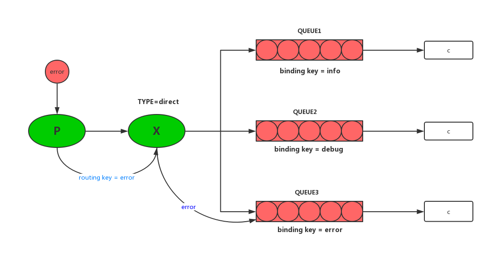

# rabbitmq路由

## 一、RabbitMq Routing 介绍

上一篇文章写到了消息在交换机内部进行广播式发送，每一个与其绑定的队列都会收到一个相同的消息，这就是`fanout `类型的交换机，那么早碰见类似这样一种场景的情况下：现在与交换机绑定的有三条队列，每一个队列都代表一个日志级别  `error`,`debug`,`info`   当只有error级别的错误被生产出来之后才会通知到 error 队列中，其他队列不推送！

有这样一个需求之后，我们就应该想到交换机的另外一个类型：**`direct `** *他的路由算法很简单，在消息被生产出来之后，会赋予一个路由秘钥，消息队列也会被赋予一个绑定秘钥*，***消息进入其绑定秘钥和消息的路由秘钥完全匹配的队列！***



上图就是路由的概览图，队列的绑定key是可以重复的   也就是说如上图 三个队列的绑定key**`都可以为error`**，如果三个队列的绑定key，那么他就是一个另类的`fanout `交换机类型了！

## 二、RabbitMq Routing代码实现

`消息生产者`**消息生产者，在创建交换机的时候需要指定交换机类型为`direct`**

```java
channel.exchangeDeclare(EXCHANGE_NAME,"direct");
```

`消息生产者`:**然后在发送消息的时候需要指定 `routingKey` 表名这个消息的类型 **

```java
String routingKey = "error";
channel.basicPublish(EXCHANGE_NAME,routingKey,null,msg.getBytes());
```

`消息消费者`:**消息消费者，在绑定交换机的时候需要指定 binding key**

```java
//绑定交换机
channel.queueBind(QUEUE_NAME,EXCHANGE_NAME,"error");
```

### 完整代码实现

**消息生产者**

```java
package com.routing;

import com.rabbitmq.client.Channel;
import com.rabbitmq.client.Connection;
import com.util.MqConnection;

import java.io.IOException;
import java.util.concurrent.TimeoutException;

/**
 * 路由  发布订阅模式
 * @author huangfu
 *
 * 路由转发
 * 根据  routingKey  进行转发
 *
 * 缺陷：路由表必须明确
 */
public class RoutingSend {
    private static String EXCHANGE_NAME = "routing";
    public static void main(String[] args) throws IOException, TimeoutException {
        Connection connection = MqConnection.getConnection();
        Channel channel = connection.createChannel();
        channel.exchangeDeclare(EXCHANGE_NAME,"direct");

        String msg = "醉卧沙场君莫笑";
        String routingKey = "error";
        channel.basicPublish(EXCHANGE_NAME,routingKey,null,msg.getBytes());
        System.out.println("send:"+msg);
        channel.close();
        connection.close();

    }
}

```

**消费者1**

```java
package com.routing;

import com.rabbitmq.client.*;
import com.util.MqConnection;

import java.io.IOException;
import java.util.concurrent.TimeoutException;

/**
 * 消费者
 * @author huangfu
 */
public class RoutingRecv {
    private static String EXCHANGE_NAME = "routing";
    private static String QUEUE_NAME = "routing";
    public static void main(String[] args) throws IOException, TimeoutException {
        Connection connection = MqConnection.getConnection();
        final Channel channel = connection.createChannel();
        //声明队列  不持久化
        channel.queueDeclare(QUEUE_NAME,false,false,false,null);
        //每次只发送一条
        channel.basicQos(1);
        //绑定交换机
        channel.queueBind(QUEUE_NAME,EXCHANGE_NAME,"error");

        Consumer consumer = new DefaultConsumer(channel) {
            @Override
            public void handleDelivery(String consumerTag, Envelope envelope, AMQP.BasicProperties properties, byte[] body) throws IOException {
                System.out.println(new String(body,"UTF-8"));
                System.out.println("[1] done");
                channel.basicAck(envelope.getDeliveryTag(),false);
            }
        };

        channel.basicConsume(QUEUE_NAME,false,consumer);
    }
}

```

**消费者2**

```java
package com.routing;

import com.rabbitmq.client.*;
import com.util.MqConnection;

import java.io.IOException;
import java.util.concurrent.TimeoutException;

/**
 * 消费者
 * @author huangfu
 */
public class RoutingRecv2 {
    private static String EXCHANGE_NAME = "routing";
    private static String QUEUE_NAME = "routing2";
    public static void main(String[] args) throws IOException, TimeoutException {
        Connection connection = MqConnection.getConnection();
        final Channel channel = connection.createChannel();
        //声明队列  不持久化
        channel.queueDeclare(QUEUE_NAME,false,false,false,null);
        //每次只发送一条
        channel.basicQos(1);
        //绑定交换机
        channel.queueBind(QUEUE_NAME,EXCHANGE_NAME,"error");
        channel.queueBind(QUEUE_NAME,EXCHANGE_NAME,"info");
        channel.queueBind(QUEUE_NAME,EXCHANGE_NAME,"debug");

        Consumer consumer = new DefaultConsumer(channel) {
            @Override
            public void handleDelivery(String consumerTag, Envelope envelope, AMQP.BasicProperties properties, byte[] body) throws IOException {
                System.out.println(new String(body,"UTF-8"));
                System.out.println("[2] done");
                channel.basicAck(envelope.getDeliveryTag(),false);
            }
        };

        channel.basicConsume(QUEUE_NAME,false,consumer);
    }
}

```

