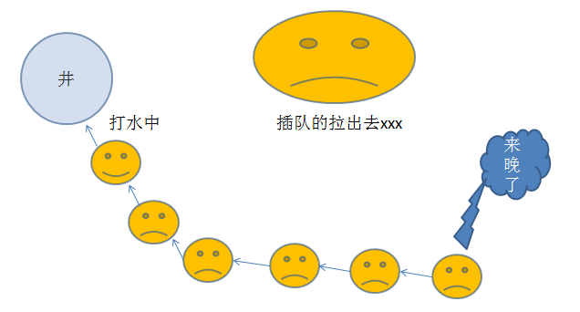
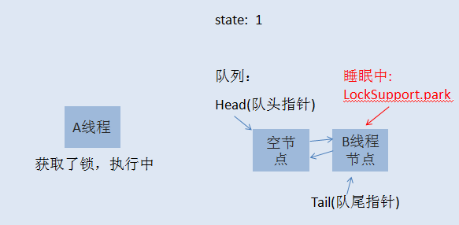

#                                            面试题库总结

--------------------------------------------------------------------

## 一.List相关面试题

> List是一个集合接口，分为AarrayList和LinkedList两个实现方式
>
> 1. **ArrayList:**底层实现就是数组，且ArrayList实现了RandomAccess，表示它能快速随机访问存储的元素，通过下标 `index` 访问，只是我们需要用 `get()` 方法的形式， 数组支持随机访问， 查询速度快， 增删元素慢；
>
> 2. **LinkdeList:**底层实现是链表， `LinkedList` 没有实现 `RandomAccess` 接口，链表支持顺序访问， 查询速度慢， 增删元素快

### ArrayList实现线程安全

>List<xxx> list = Collections.synchronizedList(new ArrayList<xxx>());

## 二.Map相关

### 1.你都知道哪些常用的Map集合?

> HashMap、HashTable、LinkedHashMap、ConcurrentHashMap。

### 2.Collection集合接口和Map接口有什么关系？

>没关系，Collection是List、Set父接口不是Map父接口

### 3.HashMap是线程安全的吗？线程安全的Map都有哪些？性能最好的是哪个？

>HashMap不是线程安全的。线程安全的有HashTable、ConcurrentHashMap、SynchronizedMap，性能最好的是ConcurrentHashMap。

### 4.使用HashMap有什么性能问题吗？

> 使用HashMap要注意避免集合的扩容，它会很耗性能，根据元素的数量给它一个初始大小的值。

### 5.HashMap的数据结构是怎样的？默认大小是多少？内部是怎么扩容的？

>HashMap是数组和链表组成的，默认大小为16，当hashmap中的元素个数超过数组大小**loadFactor（默认值为0.75）**时就会把数组的大小扩展为原来的两倍大小，然后重新计算每个元素在数组中的位置。

### 6.怎么按添加顺序存储元素？怎么按A-Z自然顺序存储元素？怎么自定义排序？

>按添加顺序使用LinkedHashMap,按自然顺序使用TreeMap,自定义排序TreeMap(Comparetor c)。

### 7.HashMap的链表结构设计是用来解决什么问题的？

> HashMap的链表结构设计是用来解决key的hash冲突问题的。

### 8.HashMap的键、值可以为NULL吗？HashTable呢？

>HashMap的键值都可以为NULL，HashTable不行。

### 9.HashMap使用对象作为key，如果hashcode相同会怎么处理？

>key的hash冲突，如果key equals一致将会覆盖值，不一致就会将值存储在key对应的链表中。

### 10.HashMap中的get操作是什么原理？

>先根据key的hashcode值找到对应的链表，再循环链表，根据key的hash是否相同且key的==或者equals比较操作找到对应的值。

### 11.HashMap中的put操作时什么原理


> 1. `hash(key)`，取key的hashcode进行高位运算，返回hash值
> 2. 如果hash数组为空，直接`resize()`（调整大小）
> 3. 对hash进行取模运算计算，得到key-value在数组中的存储位置i
>    1. 如果`table[i] == null`，直接插入`Node<key,value>`
>    2. 如果`table[i] != null`，判断是否为红黑树`p instanceof TreeNode`。
>    3. 如果是红黑树，则判断TreeNode是否已存在，如果存在则直接返回oldnode并更新；不存在则直接插入红黑树，`++size`，超出threshold容量就扩容
>    4. 如果是链表，则判断Node是否已存在，如果存在则直接返回oldnode并更新；不存在则直接插入链表尾部，判断链表长度，如果大于8则转为红黑树存储，`++size`，超出threshold容量就扩容

## 三、线程相关

### 1.什么是线程

>线程是操作系统能够进行运算调度的最小单位，它被包含在进程之中，是进程中的实际运作单位。程序员可以通过它进行多处理器编程，你可以使用多线程对 运算密集型任务提速。比如，如果一个线程完成一个任务要100毫秒，那么用十个线程完成改任务只需10毫秒。

### 2.线程和进程有什么区别？

>线程是进程的子集，一个进程可以有很多线程，每条线程并行执行不同的任务。不同的进程使用不同的内存空间，而所有的线程共享一片相同的内存空间。别把它和栈内存搞混，每个线程都拥有单独的栈内存用来存储本地数据。

### 3.如何在Java中实现线程？

>在语言层面有两种方式。java.lang.Thread 类的实例就是一个线程但是它需要调用java.lang.Runnable接口来执行，由于线程类本身就是调用的Runnable接口所以你可以继承 java.lang.Thread 类或者直接调用Runnable接口来重写run()方法实现线程。

### 4.用Runnable还是Thread？

>这个问题是上题的后续，大家都知道我们可以通过继承Thread类或者调用Runnable接口来实现线程，问题是，那个方法更好呢？什么情况下使 用它？这个问题很容易回答，如果你知道Java不支持类的多重继承，但允许你调用多个接口。所以如果你要继承其他类，当然是调用Runnable接口好 了。

### 5.Thread 类中的start() 和 run() 方法有什么区别？

>这个问题经常被问到，但还是能从此区分出面试者对Java线程模型的理解程度。start()方法被用来启动新创建的线程，而且start()内部 调用了run()方法，这和直接调用run()方法的效果不一样。当你调用run()方法的时候，只会是在原来的线程中调用，没有新的线程启 动，start()方法才会启动新线程。

### 6.Java中Runnable和Callable有什么不同？

>Runnable和Callable都代表那些要在不同的线程中执行的任务。Runnable从JDK1.0开始就有了，Callable是在 JDK1.5增加的。它们的主要区别是Callable的 call() 方法可以返回值和抛出异常，而Runnable的run()方法没有这些功能。Callable可以返回装载有计算结果的Future对象。

### 7.ava中CyclicBarrier 和 CountDownLatch有什么不同？

>CyclicBarrier 和 CountDownLatch 都可以用来让一组线程等待其它线程。与 CyclicBarrier 不同的是，CountdownLatch 不能重新使用。

### 8.Java 线程规则模型是什么？

>Java内存模型规定和指引Java程序在不同的内存架构、CPU和操作系统间有确定性地行为。它在多线程的情况下尤其重要。Java内存模型对一 个线程所做的变动能被其它线程可见提供了保证，它们之间是先行发生关系。这个关系定义了一些规则让程序员在并发编程时思路更清晰。比如，先行发生关系确保 了：
>
>- 线程内的代码能够按先后顺序执行，这被称为程序次序规则。
>- 对于同一个锁，一个解锁操作一定要发生在时间上后发生的另一个锁定操作之前，也叫做管程锁定规则。
>- 前一个对`volatile`的写操作在后一个`volatile`的读操作之前，也叫`volatile`变量规则。
>- 一个线程内的任何操作必需在这个线程的start()调用之后，也叫作线程启动规则。
>- 一个线程的所有操作都会在线程终止之前，线程终止规则。
>- 一个对象的终结操作必需在这个对象构造完成之后，也叫对象终结规则。
>- 可传递性

### 9.Java中的volatile 变量是什么？

>volatile是一个特殊的修饰符，只有成员变量才能使用它。在Java并发程序缺少同步类的情况下，多线程对成员变量的操作对其它线程是透明的。volatile变量可以保证下一个读取操作会在前一个写操作之后发生，就是上一题的volatile变量规则。

### 10.Java中如何停止一个线程

>Java提供了很丰富的API但没有为停止线程提供API。JDK 1.0本来有一些像stop(), suspend() 和 resume()的控制方法但是由于潜在的死锁威胁因此在后续的JDK版本中他们被弃用了，之后Java API的设计者就没有提供一个兼容且线程安全的方法来停止一个线程。当run() 或者 call() 方法执行完的时候线程会自动结束,如果要手动结束一个线程，你可以用volatile 布尔变量来退出run()方法的循环或者是取消任务来中断线程。

>Thread类提供了一个线程终止的方法stop()方法，但是现在在JDK源码中发现，stop（）方法已经被废弃。主要原因是：stop()方法太过暴力。强制终止一个正在执行的线程。这样的话会造成一些数据不一致的问题。
>
>```java
>public void Thread.interrupt()        //中断线程
>public boolean Thread.isInterrupted() //判断线程是否中断
>public static boolean Thread.interrupted() //判断是否被中断，并清除当前中断状态
>```
>
>Thread.interrupt()方法是一个实例方法，它通知目标线程中断，也是设置中断标志位。中断标志位表示当前线程已经被中断了。
>
>Thread.isInterrupted() 方法也是实例方法，主要是检查当前线程是否被中断（通过检查中断标志位），返回值是boolean类型。
>
>Thread.interrupted() 方法也是用来判断当前线程是否被中断，但同时清除当前线程的中断标志位状态。
>
>使用Thread.interrupt()方法处理现场中断，需要使用Thread.isInterrupted()判断线程是否被中断，然后进入中断处理逻辑代码。

### 11.一个线程运行时发生异常会怎样？

>如果异常没有被捕获该线程将会停止执行。Thread.UncaughtExceptionHandler是用于处理未捕获异常造成线程突然中 断情况的一个内嵌接口。当一个未捕获异常将造成线程中断的时候JVM会使用Thread.getUncaughtExceptionHandler()来 查询线程的UncaughtExceptionHandler并将线程和异常作为参数传递给handler的uncaughtException()方法 进行处理。

### 12.如何在两个线程间共享数据？

> 你可以通过共享对象来实现这个目的，或者是使用像阻塞队列这样并发的数据结构。
>
> 用wait和notify方法实现了生产者消费者模型。

### 13.Java中notify 和 notifyAll有什么区别？

>多线程可以等待单监控锁，Java API 的设计人员提供了一些方法当等待条件改变的时候通知它们，但是这些方法没有完全实现。notify()方法不能唤醒某个具体的线程，所以只有一个线程在等 待的时候它才有用武之地。而notifyAll()唤醒所有线程并允许他们争夺锁确保了至少有一个线程能继续运行。

### 14.为什么wait, notify 和 notifyAll这些方法不在thread类里面

>这是个设计相关的问题，它考察的是面试者对现有系统和一些普遍存在但看起来不合理的事物的看法。回答这些问题的时候，你要说明为什么把这些方法放在 Object类里是有意义的，还有不把它放在Thread类里的原因。一个很明显的原因是JAVA提供的锁是对象级的而不是线程级的，每个对象都有锁，通 过线程获得。如果线程需要等待某些锁那么调用对象中的wait()方法就有意义了。如果wait()方法定义在Thread类中，线程正在等待的是哪个锁 就不明显了。简单的说，由于wait，notify和notifyAll都是锁级别的操作，所以把他们定义在Object类中因为锁属于对象。

### 15.什么是ThreadLocal变量

> ThreadLocal是Java里一种特殊的变量。每个线程都有一个ThreadLocal就是每个线程都拥有了自己独立的一个变量，竞争条件被 彻底消除了。它是为创建代价高昂的对象获取线程安全的好方法，比如你可以用ThreadLocal让SimpleDateFormat变成线程安全的，因 为那个类创建代价高昂且每次调用都需要创建不同的实例所以不值得在局部范围使用它，如果为每个线程提供一个自己独有的变量拷贝，将大大提高效率。首先，通 过复用减少了代价高昂的对象的创建个数。其次，你在没有使用高代价的同步或者不变性的情况下获得了线程安全。线程局部变量的另一个不错的例子是 ThreadLocalRandom类，它在多线程环境中减少了创建代价高昂的Random对象的个数。

### 16.什么是FutureTask

>在Java并发程序中FutureTask表示一个可以取消的异步运算。它有启动和取消运算、查询运算是否完成和取回运算结果等方法。只有当运算完 成的时候结果才能取回，如果运算尚未完成get方法将会阻塞。一个FutureTask对象可以对调用了Callable和Runnable的对象进行包 装，由于FutureTask也是调用了Runnable接口所以它可以提交给Executor来执行。可以设置时间来控制一个超时任务。

### 17.为什么wait和notify方法要在同步块中调用？

>主要是因为Java API强制要求这样做，如果你不这么做，你的代码会抛出IllegalMonitorStateException异常。还有一个原因是为了避免wait和notify之间产生竞态条件。

### 18.如何写代码来解决生产者消费者问题？

>在现实中你解决的许多线程问题都属于生产者消费者模型，就是一个线程生产任务供其它线程进行消费，你必须知道怎么进行线程间通信来解决这个问题。比 较低级的办法是用wait和notify来解决这个问题，比较赞的办法是用Semaphore 或者 BlockingQueue来实现生产者消费者模型;

### 19.Thread类中的yield方法有什么作用？

>Yield方法可以暂停当前正在执行的线程对象，让其它有相同优先级的线程执行。它是一个静态方法而且只保证当前线程放弃CPU占用而不能保证使其它线程一定能占用CPU，执行yield()的线程有可能在进入到暂停状态后马上又被执行。

### 20. Java多线程中调用wait() 和 sleep()方法有什么不同？

>Java程序中wait 和 sleep都会造成某种形式的暂停，它们可以满足不同的需要。wait()方法用于线程间通信，如果等待条件为真且其它线程被唤醒时它会释放锁，而 sleep()方法仅仅释放CPU资源或者让当前线程停止执行一段时间，但不会释放锁。

## 三、JVM相关

### 1.JVM运行时数据区包含哪些？

>程序计数器：行号指示器，通过改变该值，以选取下一步的指令
>Java虚拟机栈：局部变量、方法出口等，为JVM服务
>本地方法栈：局部变量、方法出口等，为本地Native方法服务
>堆区：内存最大的一块，所有的对象实例都在这里分配内存
>方法区：常量、静态变量等

### 2.JVM的主要组成部分及其作用？

>类加载器 ClassLoader：Java代码 -----> 字节码 的编译过程
>运行时数据区：把上一步编译得到的字节码加载到内存中
>执行引擎：命令解析器，解析上一步加载而来的字节码，翻译成为系统指令，交由CPU执行
>本地库接口 Native Interface：诸如IO之类的由其他语言写成的本地库接口

### 3.堆栈的区别

>功能方面：堆存放对象，栈执行程序。
>共享性：堆全线程可见，栈线程私有。
>空间大小：堆内存远大于栈内存。

### 4.队列和栈的定义？以及区别？

>预存储数据的一种数据结构。
>队列先进先出：FIFO
>栈后进先出：LIFO

### 5.双亲委派模型

>如果一个类加载器收到了类加载的请求，它首先不会自己去加载这个类，而是把这个请求委派给父类加载器去完成，每一层的类加载器都是如此，这样所有的加载请求都会被传送到顶层的启动类加载器中，只有当父加载无法完成加载请求（它的搜索范围中没找到所需的类）时，子加载器才会尝试去加载类。
>加载器的顺序(先从下到上，再从上到下)：
>
>1. 启动类加载器：JVM的一部分，加载JAVA_HOME/lib目录下的类，或者是被-Xbootclasspath指定的类路径
>2. 扩展类加载器：负责加载JAVA_HOME/lib/ext目录下的类，或者是被java.ext.dirs指定的类路径
>3. 程序类加载器：负责加载classpath里的类。
### 6.每个ClassLoader加载Class的过程是

>1.检测此Class是否载入过（即在cache中是否有此Class），如果有到8,如果没有到2
>2.如果parent classloader不存在（没有parent，那parent一定是bootstrap classloader了），到4
>3.请求parent classloader载入，如果成功到8，不成功到5
>4.请求jvm从bootstrap classloader中载入，如果成功到8
>5.寻找Class文件（从与此classloader相关的类路径中寻找）。如果找不到则到7.
>6.从文件中载入Class，到8.
>7.抛出ClassNotFoundException.
>8.返回Class.

### 7.类装载的执行过程

>1.加载：加载class文件到内存中
>
>2.检查：检查class文件有无错误
>
>3.准备：静态变量分配内存空间
>
>4.解析：静态变量的引用指向内存地址
>
>5.初始化：初始化成员变量等....

### 8.判断对象可回收

>1. 引用计数法：被引用，则计数器+1，当计数器为0时，回收对象。
>2. 可达性分析：从当前对象到GC Root，没有任何引用链时，该对象即可回收。

### 9.Java中都有哪些引用类型

>强引用：发生gc时不会被回收
>软引用：有用但不是必须的，内存溢出时会被清理
>弱引用：有用但不是必须的，下次gc时会被清理
>虚引用：无法通过虚引用获得对象，用 PhantomReference 实现虚引用，虚引用的用途是在 gc 时返回一个通知。

### 10.JVM的垃圾回收算法

>1. 标记-清除：无用对象全部干掉
>2. 标记-整理：有用对象都向一边移动，边界以外的全部干掉
>3. 复制算法：左边内存快满时，将其中要保留的对象复制到右边内存中，然后整体干掉左边内存。右边同理，内存利用率仅有一半
>4. 分代算法：根据对象存活周期的不同将内存划分为几块，一般是新生代和老年代，新生代基本采用复制算法，老年代采用标记整理算法

### 11.**JVM的垃圾回收器**

>CMS：一种以获得最短停顿时间为目标的收集器，非常适用 B/S 系统。
>G1：一种兼顾吞吐量和停顿时间的 GC 实现，是 JDK 9 以后的默认 GC 选项。

### 12.CMS垃圾回收器

>牺牲吞吐量为代价，获得最短的回收停顿时间。
>要求服务器响应速度额应用上，最为适合。常用于B/S架构。
>采用标记-清除算法实现，剩余内存无法满足要求时，会出现“Concurrent Mode Failure”，并采用Serial Old来单线程回收老年代内存。
>解决和避免“Concurrent Mode Failure”的方法如下：
>调小年轻代，适当调整老年代的回收阈值和GC频次，以保证年轻代数据置入过来时有足够空间可用。

### 13.**新生代垃圾回收器和老生代垃圾回收器都有哪些？有什么区别？**

>• 新生代回收器： Serial、 ParNew、 Parallel Scavenge
>• 老年代回收器： Serial Old、 Parallel Old、 CMS
>• 整堆回收器： G1
>新生代垃圾回收器一般采用的是复制算法，复制算法的优点是效率高，缺点是内存利用率低；
>老年代回收器一般采用的是标记-整理的算法进行垃圾回收。

### 14.**简述分代垃圾回收器是怎么工作的？**

>分代回收器有两个分区：老生代和新生代，新生代默认的空间占比总空间的 1/3，老生代的默认占比是 2/3。
>新生代使用的是复制算法，新生代里有 3 个分区： Eden、 To Survivor、 From Survivor，它们的默认占比是 8:1:1，它的执行流程如下：
>• 把 Eden + From Survivor 存活的对象放入 To Survivor 区；
>• 清空 Eden 和 From Survivor 分区；
>• From Survivor 和 To Survivor 分区交换， From Survivor 变 To Survivor， To Survivor 变 From Survivor。
>每次在 From Survivor 到 To Survivor 移动时都存活的对象，年龄就 +1，当年龄到达 15（默认配置是 15）时，升级为老生代。大对象也会直接进入老生代。
>老生代当空间占用到达某个值之后就会触发全局垃圾收回，一般使用标记整理的执行算法。以上这些循环往复就构成了整个分代垃圾回收的整体执行流程。


### 15.**JVM 调优的工具？**

>JDK 自带了很多监控工具，都位于 JDK 的 bin 目录下，其中最常用的是 jconsole 和 jvisualvm 这两款视图监控工具。
>• jconsole：用于对 JVM 中的内存、线程和类等进行监控；
>• jvisualvm： JDK 自带的全能分析工具，可以分析：内存快照、线程快照、程序死锁、监控内存的变化、 gc 变化等。

## 四、JAVA 锁相关

### 1.悲观锁

> 悲观锁在修改整个过程中保持对修改数据的加锁，一直到修改结束，防止其它线程或者进程对数据修改。
>
> 悲观锁适用于**写多读少**的情况下，技术实现上**依赖数据库的锁机制实**现，保证最大程度的独占性。
>
> 常用select for update，进行加锁，并且取消事务的自动提交，在修改之后其它事务请求才可以修改数据，其间，select from只读操作是可以进行的。

### 2.乐观锁

>分为三个阶段：数据读取、写入校验、数据写入。
>
>假设数据一般情况下不会造成冲突，只有在数据进行提交更新时，才会正式对数据的冲突与否进行检测，如果发现冲突了，则返回错误信息，让用户决定如何去做。fail-fast机制
>
>乐观锁在适用于读多写少的情况下；常见的就是增加verson字段进行乐观锁控制。

### 3.利用缓存实现分布式锁

> 利用缓存的某些原子特性实现分布式锁，关键在于原子性操作，比如redis的setnx操作，当然需要优化，可能面临key在主从切换时丢失的问题，即使增加超时设置。官方推荐的redission lock可以解决这个问题。

### 4.Redisson实现Redis分布式锁的底层原理

> redisson 是 redis 官方推荐的 java 语言实现分布式锁的项目。该项目在基于 netty 框架的基础上提供了一系列分布式特性的工具类。下面我们来使用 Redisson 实现分布式锁。
>
> 在Redisson中，使用key来作为是否上锁的标志，当通过getLock(String key)方法获得相应的锁之后，这个key即作为一个锁存储到Redis集群中，在接下来如果有其他的线程尝试获取名为key的锁时，便会向集群中进行查询，如果能够查到这个锁并发现相应的value的值不为0，则表示已经有其他线程申请了这个锁同时还没有释放，则当前线程进入阻塞，否则由当前线程获取这个锁并将value值加一，如果是可重入锁的话，则当前线程每获得一个自身线程的锁，就将value的值加一，而每释放一个锁则将value值减一，直到减至0，完全释放这个锁。因为底层是基于分布式的Redis集群，所以Redisson实现了分布式的锁机制。
>
> 设置锁的超时时间，是为了防止死锁
>
> Redisson 默认的 CommandExecutor 实现是通过 eval 命令来执行 Lua 脚本，所以要求 Redis 的版本必须为 2.6 或以上，否则可能要自己来实现

### 5.可重入锁的理解

#### 1) 举个例子

>在一个村子里面，有一口井水，水质非常的好，村民们都想打井里的水。这井只有一口，村里的人那么多，所以得出个打水的规则才行。村长绞尽脑汁，最终想出了一个比较合理的方案，咱们来仔细的看看聪明的村长大人的智慧。
>
>井边安排一个看井人，维护打水的秩序。
>
>打水时，以家庭为单位，哪个家庭任何人先到井边，就可以先打水，而且如果一个家庭占到了打水权，其家人这时候过来打水不用排队。而那些没有抢占到打水权的人，一个一个挨着在井边排成一队，先到的排在前面。打水示意图如下 ：



>是不是感觉很和谐，如果打水的人打完了，他会跟看井人报告，看井人会让第二个人接着打水。这样大家总都能够打到水。是不是看起来挺公平的，先到的人先打水，当然不是绝对公平的，自己看看下面这个场景 :


>看着，一个有娃的父亲正在打水，他的娃也到井边了，所以女凭父贵直接排到最前面打水，羡煞旁人了。 
>以上这个故事模型就是所谓的公平锁模型，当一个人想到井边打水，而现在打水的人又不是自家人，这时候就得乖乖在队列后面排队。
>
>事情总不是那么一帆风顺的，总会有些人想走捷径，话说看井人年纪大了，有时候，眼力不是很好，这时候，人们开始打起了新主意。新来打水的人，他们看到有人排队打水的时候，他们不会那么乖巧的就排到最后面去排队，反之，他们会看看现在有没有人正在打水，如果有人在打水，没辄了，只好排到队列最后面，但如果这时候前面打水的人刚刚打完水，正在交接中，排在队头的人还没有完成交接工作，这时候，新来的人可以尝试抢打水权，如果抢到了，呵呵，其他人也只能睁一只眼闭一只眼，因为大家都默认这个规则了。这就是所谓的非公平锁模型。新来的人不一定总得乖乖排队，这也就造成了原来队列中排队的人可能要等很久很久。 

#### 2) java可重入锁-ReentrantLock实现细节 (公平锁)

> ReentrantLock支持两种获取锁的方式，一种是公平模型，一种是非公平模型。在继续之前，咱们先把故事元素转换为程序元素。


>咱们先来说说公平锁模型：
>
>初始化时， state=0，表示无人抢占了打水权。这时候，村民A来打水(A线程请求锁)，占了打水权，把state+1，如下所示：


> 线程A取得了锁，把 state原子性+1,这时候state被改为1，A线程继续执行其他任务，然后来了村民B也想打水（线程B请求锁），线程B无法获取锁，生成节点进行排队，如下图所示：



> 初始化的时候，会生成一个空的头节点，然后才是B线程节点，这时候，如果线程A又请求锁，是否需要排队？答案当然是否定的，否则就直接死锁了。当A再次请求锁，就相当于是打水期间，同一家人也来打水了，是有特权的，这时候的状态如下图所示：


> 可重入锁就是一个线程在获取了锁之后，再次去获取了同一个锁，这时候仅仅是把状态值进行累加。如果线程A释放了一次锁仅仅是把状态值减了，只有线程A把此锁全部释放了，状态值减到0了，其他线程才有机会获取锁。当A把锁完全释放后，state恢复为0，然后会通知队列唤醒B线程节点，使B可以再次竞争锁。当然，如果B线程后面还有C线程，C线程继续休眠，除非B执行完了，通知了C线程。注意，当一个线程节点被唤醒然后取得了锁，对应节点会从队列中删除。

#### 3) java可重入锁-ReentrantLock实现细节 (非公平锁)

>当线程A执行完之后，要唤醒线程B是需要时间的，而且线程B醒来后还要再次竞争锁，所以如果在切换过程当中，来了一个线程C，那么线程C是有可能获取到锁的，如果C获取到了锁，B就只能继续乖乖休眠了。

#### 4) 为什么使用可重入锁？

>ReentrantLock 是一个**可重入的互斥（/独占）锁**，又称为“独占锁”。
>
>ReentrantLock通过自定义队列同步器（AQS-AbstractQueuedSychronized，是实现锁的关键）来实现锁的获取与释放。
>
>其可以完全替代 synchronized 关键字。JDK 5.0 早期版本，其性能远好于 synchronized，但 JDK 6.0 开始，JDK 对 synchronized 做了大量的优化，使得两者差距并不大。
>
>**“独占”**，就是在同一时刻只能有一个线程获取到锁，而其它获取锁的线程只能处于同步队列中等待，只有获取锁的线程释放了锁，后继的线程才能够获取锁。
>
>**“可重入”**，就是支持重进入的锁，它表示该锁能够支持一个线程对资源的重复加锁。该锁还支持获取锁时的**公平和非公平性**选择。“公平”是指“不同的线程获取锁的机制是公平的”，而“不公平”是指“不同的线程获取锁的机制是非公平的”。

[$本可重入锁资料引用自这里，点击跳转$](https://www.cnblogs.com/gxyandwmm/p/9387833.html)

### 6.synchronized锁

>synchronized是通过互斥来保证并发的正确性的问题，synchronized经过编译后，会在同步块前后形成**`monitorenter`**和**`monitorexit`**这两个字节码，其中`monitorenter`指令指向同步代码块的开始位置，`monitorexit`指令则指明同步代码块的结束位置，当执行`monitorenter`指令的时，首先尝试获取对象的锁，如果当前对象没有被锁定，或者当前对象已经拥有对象的锁，那么就把锁的计数器加1，相应的在执行`monitorexit`的时候会将锁的计数器减1，当计数器为0的时候，锁就被释放，如果获取锁的对象失败，则当前线程就要阻塞等待，直到对象锁被另外一个线程锁释放为止
>
>正如上面所说  synchronized也是`可重入锁`

### 7.synchronized与Lock的区别

>两者区别：
>
>1.首先synchronized是java内置关键字，在jvm层面，Lock是个java类；
>
>2.synchronized无法判断是否获取锁的状态，Lock可以判断是否获取到锁；
>
>3.synchronized会自动释放锁(a 线程执行完同步代码会释放锁 ；b 线程执行过程中发生异常会释放锁)，Lock需在finally中手工释放锁（unlock()方法释放锁），否则容易造成线程死锁；
>
>4.用synchronized关键字的两个线程1和线程2，如果当前线程1获得锁，线程2线程等待。如果线程1阻塞，线程2则会一直等待下去，而Lock锁就不一定会等待下去，如果尝试获取不到锁，线程可以不用一直等待就结束了；
>
>5.synchronized的锁可重入、不可中断、非公平，而Lock锁可重入、可判断、可公平（两者皆可）
>
>6.Lock锁适合大量同步的代码的同步问题，synchronized锁适合代码少量的同步问题。

## 五、Spring Cloud 相关

### 1.springcloud包含的组件

>1. 服务发现——Netflix Eureka
>2. 服务调用——Netflix Feign
>3. 负载均衡—— Netflix Ribbon
>4. 熔断器——Netflix Hystrix
>5. 服务网关——Spring Cloud Gateway
>6. 分布式配置——Spring Cloud Config
>7. 消息总线 —— Spring Cloud Bus

### 2.Eureka

> Eureka Client：负责将这个服务的信息注册到Eureka Server中
>
> Eureka Server:注册中心，里面有一个注册表，保存了各个服务所在的机器和端口号

### 3.Feign

> 是一个http请求调用的轻量级框架，可以以Java接口注解的方式调用Http请求，而不用像Java中通过封装HTTP请求报文的方式直接调用。Feign通过处理注解，将请求模板化，当实际调用的时候，传入参数，根据参数再应用到请求上，进而转化成真正的请求，这种请求相对而言比较直观。
>
> 1.feign采用的是基于接口的注解
> 2.feign整合了ribbon，具有负载均衡的能力
> 3.整合了Hystrix，具有熔断的能力

### 4.Netflix Ribbon

>Spring Cloud Ribbon是一个基于HTTP和TCP的客户端负载均衡工具，它基于Netflix Ribbon实现

### 5.Netflix Hystrix

>服务的熔断和降级

### 6.Spring Cloud Config

>为分布式系统外部化配置提供了支持

### 7.Spring Cloud Bus

>Spring cloud bus通过轻量消息代理连接各个分布的节点。这会用在广播状态的变化（例如配置变化）或者其他的消息指令。Spring bus的一个核心思想是通过分布式的启动器对spring boot应用进行扩展，也可以用来建立一个多个应用之间的通信频道。目前唯一实现的方式是用AMQP消息代理作为通道，同样特性的设置（有些取决于通道的设置）在更多通道的文档中。
>
>大家可以将它理解为管理和传播所有分布式项目中的消息既可，其实本质是利用了MQ的广播机制在分布式的系统中传播消息，目前常用的有Kafka和RabbitMQ。利用bus的机制可以做很多的事情，其中配置中心客户端刷新就是典型的应用场景之一!

### 8.Spring Cloud Gateway

>Spring Cloud Gateway是Spring Cloud官方推出的第二代网关框架，取代Zuul网关。网关作为流量的，在微服务系统中有着非常作用，网关常见的功能有路由转发、权限校验、限流控制等作用。
>
>使用了一个RouteLocatorBuilder的bean去创建路由，除了创建路由RouteLocatorBuilder可以让你添加各种predicates和filters，predicates断言的意思，顾名思义就是根据具体的请求的规则，由具体的route去处理，filters是各种过滤器，用来对请求做各种判断和修改。

[$以下Springcloud资料来自 酷酷的韩$](https://blog.csdn.net/hjq_ku/article/details/89504229)

### 8.**微服务的优点缺点?**

>优点:
>
>1.每个服务直接足够内聚，代码容易理解
>2.开发效率高，一个服务只做一件事，适合小团队开发
>3.松耦合，有功能意义的服务。
>4.可以用不同语言开发，面向接口编程。
>5.易于第三方集成
>6.微服务只是业务逻辑的代码，不会和HTML,CSS或其他界面结合.
>7.可以灵活搭配，连接公共库/连接独立库
>
>缺点:
>1.分布式系统的责任性
>2.多服务运维难度加大。
>3.系统部署依赖，服务间通信成本，数据一致性，系统集成测试，性能监控。

### 9.**spring cloud 和dubbo区别?**

>1.服务调用方式 dubbo是RPC springcloud Rest Api
>2.注册中心,dubbo 是zookeeper springcloud是eureka，也可以是zookeeper
>3.服务网关,dubbo本身没有实现，只能通过其他第三方技术整合，springcloud有Zuul路由网关，作为路由服务器，进行消费者的请求分发,springcloud支持断路器，与git完美集成配置文件支持版本控制，事物总线实现配置文件的更新与服务自动装配等等一系列的微服务架构要素。

### 10.**REST 和RPC对比**

>1.RPC主要的缺陷是服务提供方和调用方式之间的依赖太强，需要对每一个微服务进行接口的定义，并通过持续继承发布，严格版本控制才不会出现冲突。
>2.REST是轻量级的接口，服务的提供和调用不存在代码之间的耦合，只需要一个约定进行规范。

### 11.**负载均衡的意义是什么?**

>在计算中，负载均衡可以改善跨计算机，计算机集群，网络链接，中央处理单元或磁盘驱动器等多种计算资源的工作负载分布。负载均衡旨在优化资源使用，最大吞吐量，最小响应时间并避免任何单一资源的过载。使用多个组件进行负载均衡而不是单个组件可能会通过冗余来提高可靠性和可用性。负载平衡通常涉及专用软件或硬件，例如多层交换机或域名系统服务进程。

### 12.**微服务之间是如何独立通讯的?**

>1.远程调用，比如feign调用，直接通过远程过程调用来访问别的service。
>2.消息中间件

### 13.**Eureka和Zookeeper区别**

>1.Eureka取CAP的AP，注重可用性，Zookeeper取CAP的CP注重
>一致性。
>2.Zookeeper在选举期间注册服务瘫痪，虽然服务最终会恢复，但选举期间不可用。
>3.eureka的自我保护机制，会导致一个结果就是不会再从注册列表移除因长时间没收到心跳而过期的服务。依然能接受新服务的注册和查询请求，但不会被同步到其他节点。不会服务瘫痪。
>4.Zookeeper有Leader和Follower角色，Eureka各个节点平等。
>5.Zookeeper采用过半数存活原则，Eureka采用自我保护机制解决分区问题。
>6.eureka本质是一个工程，Zookeeper只是一个进程。

### 14.**eureka自我保护机制是什么?**

>1.当Eureka Server 节点在短时间内丢失了过多实例的连接时（比如网络故障或频繁启动关闭客户端）节点会进入自我保护模式，保护注册信息，不再删除注册数据，故障恢复时，自动退出自我保护模式。

### 15.**什么是服务熔断？什么是服务降级?**

>服务直接的调用，比如在高并发情况下出现进程阻塞，导致当前线程不可用，慢慢的全部线程阻塞，导致服务器雪崩。
>服务熔断：相当于保险丝，出现某个异常，直接熔断整个服务，而不是一直等到服务超时。通过维护一个自己的线程池，当线程到达阈值的时候就启动服务降级，如果其他请求继续访问就直接返回fallback的默认值。

## 六、Netty相关

> 后续待补充，随意发挥......

### 1.NIO相关

#### ① 什么是多路复用模型

#### ② 什么是零拷贝

#### ③ BIO缺陷

> 后续待补充，随意发挥......

## 七、Dubbo相关

> 后续待补充，随意发挥......

## 八、Zookeeper相关

> 后续待补充，随意发挥......

## 九、Redis相关

> 后续待补充，随意发挥......

## 十、发挥题

### 1.设计一个RPC框架模型，你应该注意的是什么！他至少应该有哪些组件？

### 2.设计一个任务队列，java原生语法编写;注意事项是什么？

